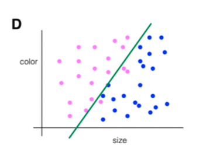
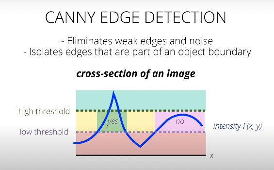
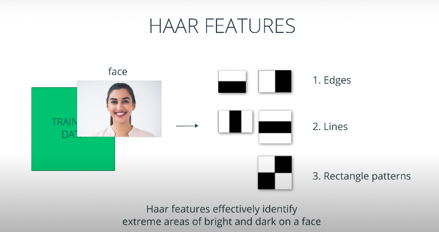

# Udacity Computer Vision Nanodegree: Introduction

These are my personal notes taken while following the [Udacity Computer Vision Nanodegree](https://www.udacity.com/course/computer-vision-nanodegree--nd891).

The nanodegree is composed of six modules:

1. Introduction to Computer Vision
2. Cloud Computing (Optional)
3. Advanced Computer Vision and Deep Learning
4. Object Tracking and Localization
5. Extra Topics: C++ Programming

Each module has a folder with its respective notes.
This folder/file refers to the **first** module: **Introduction to Computer Vision**.

Note that:

- I made many hand-written nortes, which I will scan and push to this repostory.
- I forked the Udacity repositors for the exercises; all the material and  notebooks are there:
	- [CVND_Exercises](https://github.com/mxagar/CVND_Exercises)
	- [DL_PyTorch](https://github.com/mxagar/DL_PyTorch)

Mikel Sagardia, 2022.
No guarantees.

## Practical Installation Notes

I basically followed the installation & setup guide from [CVND_Exercises](https://github.com/mxagar/CVND_Exercises), which can be summarized with the following commands:

```bash
# Create new conda environment to be used for the nanodegree
conda create -n cvnd python=3.6
conda activate cvnd
conda install pytorch torchvision -c pytorch
conda install pip
#conda install -c conda-forge jupyterlab
# Go to the folder where the Udacity DL exercises are cloned, after forking the original repo
cd ~/git_repositories/CVND_Exercises
pip install -r requirements.txt
```

## Overview of Contents

1. Image Representation & Classification (Lesson 4)
	- CV Pipeline
	- Training a model
	- Separating data: Basic classification idea
	- Pixelmaps
	- **Notebook**: `1_1_Image_Representation` / `1. Images as Numerical Data.ipynb`
	- Color images
	- **Notebook**: `1_1_Image_Representation` / `2. Visualizing RGB Channels.ipynb`
	- **Notebook**: `1_1_Image_Representation` / `3. Blue Screen.ipynb`
	- Color Spaces and Transforms
	- **Notebook**: `1_1_Image_Representation` / `5_1. HSV Color Space, Balloons.ipynb`
	- **Notebook**: Day & Night Classifier: `1_1_Image_Representation` / `6_1. Visualizing the Data.ipynb`
	- Labelled Data and Accuracy
	- Features
	- Standardizing Output
	- **Notebook**: Day & Night Classifier: `1_1_Image_Representation` / `6_2. Standardizing the Data.ipynb`
	- **Notebook**: Day & Night Classifier: `1_1_Image_Representation` / `6_3. Average Brightness.ipynb`
	- **Notebook**: Day & Night Classifier: `1_1_Image_Representation` / `6_4. Classification.ipynb`
	- Evaluation Metrics#
	- **Notebook**: Day & Night Classifier: `1_1_Image_Representation` / `6_5. Accuracy and Misclassification.ipynb`
2. Convolutional Filters and Edge Detection (Lesson 5)
3. Types of Features and Image Segmentation (Lesson 6)
4. Feature Vectors
5. CNN Layers and Feature Visualization
6. Project 1: Facial Keypoint Detection
7. Project 2: Github
8. Extra modules
	- 8.1 Review on Neural Networks
	- 8.2 Applying Deep Learning Modelss
	- 8.3 Github
	- 8.4 Skin Cancer Detection

## 1. Image Representation & Classification (Lesson 4)

Since I know many concepts already, I will just jot down the keywords most of the time.

### CV Pipeline

Example: Detect human emotions (Affectiva)

1. Input: sequence of images
2. Pre-processing: reduce noise, scaling
3. Select ROIs: object detection, image segmentation
4. Feature extraction: eyebrows, etc
5. Classification: Prediction/Recognition: object recognition, feaures matching -> determine emotion


### Training a model

- Labelled images fed to a CNN
- Features learned iteratively by optimizing the predeiction error thanks to labelled data
- Gradient descend is used to minimize error

### Separating data: Basic classification idea
	
- Object samples defined as vectors of features: color, size, etc
- Samples are labelled and plotted / represented in a multi-dimensional feature space
- Lines (hyperplanes) are drawn (computed) to separate regions that contain one or the other class




### Pixelmaps
	
- Image formation: pin-hole camera model
- Pixelmaps:
	- width x height, X x Y, row & column
	- pixel values: 0 (dark/black) - 255 (light/white) = `2**8` = `int8
	- 3 channels

### **Notebook**: `1_1_Image_Representation` / `1. Images as Numerical Data.ipynb`

```python
import numpy as np
import matplotlib.image as mpimg  # for reading in images
import matplotlib.pyplot as plt
import cv2  # computer vision library
%matplotlib inline

# Read in the image
image = mpimg.imread('images/waymo_car.jpg')
# Print out the image dimensions
print('Image dimensions:', image.shape)
# Change from color to grayscale
gray_image = cv2.cvtColor(image, cv2.COLOR_RGB2GRAY)

plt.imshow(gray_image, cmap='gray')
# Print specific grayscale pixel values
# What is the pixel value at x = 400 and y = 300 (on the body of the car)?
x = 400
y = 300
print(gray_image[y,x])

#Find the maximum and minimum grayscale values in this image
max_val = np.amax(gray_image)
min_val = np.amin(gray_image)
print('Max: ', max_val)
print('Min: ', min_val)

# Create a 5x5 image using just grayscale, numerical values
tiny_image = np.array([[0, 20, 30, 150, 120],
                      [200, 200, 250, 70, 3],
                      [50, 180, 85, 40, 90],
                      [240, 100, 50, 255, 10],
                      [30, 0, 75, 190, 220]])

# To show the pixel grid, use matshow
plt.matshow(tiny_image, cmap='gray')
```

### Color images
	
- width x height x DEPTH
- DEPTH: channels: RGB -> depth = 3
- Intuitive notion: Color is necessary whenever we humans use the color cue to process images

### **Notebook**: `1_1_Image_Representation` / `2. Visualizing RGB Channels.ipynb`

```python
import matplotlib.pyplot as plt
import matplotlib.image as mpimg
%matplotlib inline

# Read in the image
image = mpimg.imread('images/wa_state_highway.jpg')
plt.imshow(image)

# Isolate RGB channels
r = image[:,:,0]
g = image[:,:,1]
b = image[:,:,2]

# Visualize the individual color channels
f, (ax1, ax2, ax3) = plt.subplots(1, 3, figsize=(20,10))
ax1.set_title('R channel')
ax1.imshow(r, cmap='gray')
ax2.set_title('G channel')
ax2.imshow(g, cmap='gray')
ax3.set_title('B channel')
ax3.imshow(b, cmap='gray')
```

### **Notebook**: `1_1_Image_Representation` / `3. Blue Screen.ipynb`

The color can be detected and used for thresholding. This, way, we can select regions of an image.

```python
import matplotlib.pyplot as plt
import numpy as np
import cv2
%matplotlib inline

# Read in the image
image = cv2.imread('images/pizza_bluescreen.jpg')

# Print out the type of image data and its dimensions (height, width, and color)
print('This image is:', type(image), ' with dimensions:', image.shape)
# Make a copy of the image
image_copy = np.copy(image)

# Change color to RGB (from BGR)
image_copy = cv2.cvtColor(image_copy, cv2.COLOR_BGR2RGB)
# Display the image copy
plt.imshow(image_copy)

## TODO: Define the color selection boundaries in RGB values
# play around with these values until you isolate the blue background
lower_blue = np.array([0,0,220]) 
upper_blue = np.array([220,220,255])

# Define the masked area
mask = cv2.inRange(image_copy, lower_blue, upper_blue)
# Vizualize the mask
plt.imshow(mask, cmap='gray')
# Mask the image to let the pizza show through
# IMPORTANT: BEFORE APPLYING ANY MASK, COPY IMAGE!
masked_image = np.copy(image_copy)
masked_image[mask != 0] = [0, 0, 0]
# Display it!
plt.imshow(masked_image)

# Load in a background image, and convert it to RGB 
background_image = cv2.imread('images/space_background.jpg')
background_image = cv2.cvtColor(background_image, cv2.COLOR_BGR2RGB)
# Crop it to the right size (514x816)
crop_background = background_image[0:514, 0:816]
# Mask the cropped background so that the pizza area is blocked
crop_background[mask == 0] = [0, 0, 0]
# Display the background
plt.imshow(crop_background)

# Add the two images together to create a complete image!
complete_image = masked_image + crop_background
# Display the result
plt.imshow(complete_image)

```

### Color Spaces and Transforms

- There are several color spaces
- RGB: 3D cube
- HSV: Hue - Saturation - Value
- HLS: Hue - Lightness - Saturation

A useful/intuitive color map is HSV:

- Hue: color rainbow! it's the most reliable value for color detection
- Value: it's the value that most changes under different lightning conditions (-> brightness/shadow!)
- Note: V & S in [0,255]; Hue is in degrees -> [0,180]

### **Notebook**: `1_1_Image_Representation` / `5_1. HSV Color Space, Balloons.ipynb`

```python
import numpy as np
import matplotlib.pyplot as plt
import cv2
%matplotlib inline

# Read in the image
image = cv2.imread('images/water_balloons.jpg')

# Change color to RGB (from BGR)
image = cv2.cvtColor(image, cv2.COLOR_BGR2RGB)

plt.imshow(image)

# RGB channels
r = image[:,:,0]
g = image[:,:,1]
b = image[:,:,2]
f, (ax1, ax2, ax3) = plt.subplots(1, 3, figsize=(20,10))
ax1.set_title('Red')
ax1.imshow(r, cmap='gray')
ax2.set_title('Green')
ax2.imshow(g, cmap='gray')
ax3.set_title('Blue')
ax3.imshow(b, cmap='gray')

# Convert from RGB to HSV
hsv = cv2.cvtColor(image, cv2.COLOR_RGB2HSV)
# HSV channels
h = hsv[:,:,0]
s = hsv[:,:,1]
v = hsv[:,:,2]
f, (ax1, ax2, ax3) = plt.subplots(1, 3, figsize=(20,10))
ax1.set_title('Hue')
ax1.imshow(h, cmap='gray')
ax2.set_title('Saturation')
ax2.imshow(s, cmap='gray')
ax3.set_title('Value')
ax3.imshow(v, cmap='gray')

# Define our color selection criteria in HSV values
# Recall: H channels is until 180 degrees
# S, V: we allow them to have any value
lower_hue = np.array([160,0,0]) 
upper_hue = np.array([180,255,255])
# Define our color selection criteria in RGB values
# It is more difficult and imprecise!
lower_pink = np.array([180,0,100]) 
upper_pink = np.array([255,255,230])

# Define the masked area in RGB space
mask_rgb = cv2.inRange(image, lower_pink, upper_pink)
# mask the image
masked_image = np.copy(image)
masked_image[mask_rgb==0] = [0,0,0]
# Vizualize the mask
plt.imshow(masked_image)

# Now try HSV!
# Define the masked area in HSV space
mask_hsv = cv2.inRange(hsv, lower_hue, upper_hue)
# mask the image
masked_image = np.copy(image)
masked_image[mask_hsv==0] = [0,0,0]
# Vizualize the mask
plt.imshow(masked_image)
```

### **Notebook**: Day & Night Classifier: `1_1_Image_Representation` / `6_1. Visualizing the Data.ipynb`

I drew a histogram to observe the difference between day & night images

```python
color = ('r','g','b')
for i,col in enumerate(color):
    hist = cv2.calcHist([selected_image],channels=[i],mask=None,histSize=[256],ranges=[0,256])
    plt.plot(hist,col)
    plt.xlim([0,256])
```

My observations:

- Day images have a pronounced peak around 250 in all RGB channels
- Night images have a peak around 250 (lights) but most of the pixels are below 180

Other observations:

- Day images are expected to have more colors


### Labelled Data and Accuracy

Labels can be:

- ground truth: used for training
- predicted

Accuracy = correctly predicted (ground truth label = predicted label) / total num of images.

Good practice to use number classes, because they're easier to track:

- day: 1
- night: 0

### Features
	
Feautures are reconizable properties ideally even under varying conditions they are like measurable traits.

### Standardizing Output

Usual labelling:

- integer
	- 1 = cat
	- 2 = tiger
	- 3 = cow
	- 4 = mouse
	- image label: 3 -> cow
- one-hot encoding
	- [cat, tiger, cow, mouse]
	- image label: [0,0,1,0] -> cow 

Size of the images: Should be the same for all!

### **Notebook**: Day & Night Classifier: `1_1_Image_Representation` / `6_2. Standardizing the Data.ipynb`

Basically, the images needed to be resized and their labels casted to ints.

```python	
def standardize_input(image):
    new_img = cv2.resize(image, (1100,600))
    standard_im = new_img
    return standard_im

def encode(label):
    labels = ["day", "night"]
    values = [1,0]    
    for i in range(len(labels)):
        if label == labels[i]:
            numerical_val = values[i]
    return numerical_val

def standardize(image_list):
    standard_list = []
    for item in image_list:
        image = item[0]
        label = item[1]
        standardized_im = standardize_input(image)
        binary_label = encode(label)    
        standard_list.append((standardized_im, binary_label))
    return standard_list

STANDARDIZED_LIST = standardize(IMAGE_LIST)
```

### **Notebook**: Day & Night Classifier: `1_1_Image_Representation` / `6_3. Average Brightness.ipynb`

Basically, the average brightness is computed by averaging the pixel value of the V channel.

```python
def avg_brightness(rgb_image):
    hsv = cv2.cvtColor(rgb_image, cv2.COLOR_RGB2HSV)
    sum_brightness = np.sum(hsv[:,:,2])
    num_pixels = hsv.shape[0]*hsv.shape[1]
    avg = sum_brightness / num_pixels
    return avg
```

I additionally computed the histograms of day & night image brightness values

```python
def compute_average_brightness(list_images):
brightness = []
for i in range(len(list_images)):
    brightness_value = avg_brightness(list_images[i][0])
    label = list_images[i][1]
    brightness.append((label,brightness_value))
return brightness
brightness = compute_average_brightness(STANDARDIZED_LIST)
brightness_day = list(filter((lambda lst: lst[0]==1),brightness))
brightness_night = list(filter((lambda lst: lst[0]==0),brightness))
brightness_day = list(map((lambda lst: lst[1]),brightness_day))
brightness_night = list(map((lambda lst: lst[1]),brightness_night))

plt.hist(brightness_day, alpha = 0.5)
plt.hist(brightness_night, alpha = 0.5)
```

Visual histogram inspection: average brightness 110 seems to be a threshold.

### **Notebook**: Day & Night Classifier: `1_1_Image_Representation` / `6_4. Classification.ipynb`

A threshold on the feature value is defined for selecting between two classess.
After visual inspection of the histograms, I select `threshold_value = 110`.

```python
def estimate_label(rgb_image):
    brightness_value = avg_brightness(rgb_image)
    predicted_label = 0
    threshold_value = 110
    if brightness_value > threshold_value:
        predicted_label = 1
    return predicted_label
```

Although not asked, I evaluated the accuracy of the classifier:

```python
def evaluate_dataset(dataset):
    evaluation_list = []
    for i in range(len(dataset)):
        predicted_label = estimate_label(dataset[i][0])
        evaluation_list.append((dataset[i][1],predicted_label))
    correct_predictions = len(list(filter((lambda lst: lst[0]==lst[1]),evaluation_list)))
    accuracy = correct_predictions / len(dataset)
    return accuracy

print(evaluate_dataset(STANDARDIZED_LIST))
```

### Evaluation Metrics

Accuracy = # correctly classified / # all images.

We differentiate between:

- training dataset: used for learning;
- test dataset: images unseen by the classifier to test how it would work in real world.

Missclassified images: it's key to filter them and analyze them separately to see how to improve classifier; which additional features to the average brightness could be considered?

### **Notebook**: Day & Night Classifier: `1_1_Image_Representation` / `6_5. Accuracy and Misclassification.ipynb`

We had to measure the accuracy and analyze the missclassified images.

The day images with many shadows have a brightness close to the threshold. The same happens with the night images with strong night illumination. Observation: the Hue histogram of the night images contains almost 100% of the distribution between values 5-30. For day images, the distribution is more spread. Possible improvement: add a second feature which accounts for the relative distribution area in the Hue value region 5-30 -> similarly as before identify threshold between day & night images.

So I wrote two new functions for that:

```python
def night_illumination_weight(rgb_image):
    hsv = cv2.cvtColor(rgb_image, cv2.COLOR_RGB2HSV)
    hist = cv2.calcHist([hsv],channels=[0],mask=None,histSize=[180],ranges=[0,180])
    area_pixels = hsv.shape[0]*hsv.shape[1]
    min_h = 5
    max_h = 30
    illumination_weight = 0.0
    for i in range(min_h,max_h):
        illumination_weight = illumination_weight + (hist[i][0]/area_pixels)
    return illumination_weight
illumination_value = night_illumination_weight(MISCLASSIFIED[1][0])
print(illumination_value)

def estimate_label_extended(rgb_image):
    brightness = avg_brightness(rgb_image)
    threshold_brightness_low = 100
    threshold_brightness_high = 115    
    threshold_illumination_weight = 0.5    
    if (brightness > threshold_brightness_high):
        predicted_label = 1
    elif (brightness < threshold_brightness_low):
        predicted_label = 0
    else:
        illumination_value = night_illumination_weight(rgb_image)
        if (illumination_value < threshold_illumination_weight):
            predicted_label = 1
        else:
            predicted_label = 0
    return predicted_label 
```

## 2. Convolutional Filters and Edge Detection (Lesson 5)

### Filters

Filters look at groups of pixels; these can be used to for example detect edges.

### Frequency in Images

- Fequency in images is rate of change
	- High frequency: brightness or intensity changes a lot from one pixel to another; high fequency components are related to edges also
	- Low frequency: few intensity changes between pixels

- Images have usually both components: parts with high and low frequency

- Fourier Transform
	- Image decomposed into its frequency components
	- Input of FT: image in spatial domain (x,y)
	- Output of FT: image in frquency domain: each point is a frequency value for the pixel

- Bandpass filters can be used: image thresholded according to frequencies which are not too low and too high

### Fourier Transform

See handwritten notes after article: [Fourier transforms of images, by Rachel Thomas](https://plus.maths.org/content/fourier-transforms-images).

Image represented as `z = sum(a_i * sin(h_i*x + k_i*y)), i: 0 -> inf`:

- `z`: gray value function, image
- `x, y`: pixel coordinates
- `h_i, k_i`: frequencies of wave `i`;
	- `h/k`: slope of wave front
	- the higher `h` or `k`, the higher the frequency
	- `h` and `k` can be only `>= 0`
- `a_i`: amplitude of wave `i`

The image/plane of the fourier decomposition is the plane `(h, k, a)`:

- Typically bright center: `(h,k) = 0, a high` = averga value of brighteness in image
- Horizontal bright `h` axis: `k = 0, a high` = image with vertical structures (note it's contrary)
- Vertical bright `k` axis: `h = 0, a high` = image with horizontal structures

Notes:

- Bright center in Fourier: solid colors in image, less change
- More change and varying texture in the image: more noise in Fourier, brighter
- Each pixel is not related to an image pixel!

### **Notebook**: Fourier Transforms: `1_2_Convolutional_Filters_Edge_Detection` / `1. Fourier Transform.ipynb`

Basically, this important function is used:

```python
	def ft_image(norm_image):
	    '''This function takes in a normalized, grayscale image
	       and returns a frequency spectrum transform of that image. '''
	    f = np.fft.fft2(norm_image)
	    fshift = np.fft.fftshift(f)
	    frequency_tx = 20*np.log(np.abs(fshift)) 
	    return frequency_tx
```

The passed image needs to be normalized grayscale!
Returned image is the FT: intensity amplitudes in spatial 2D frequency domain

```python
image = cv2.imread('images/birds.jpg')
image = cv2.cvtColor(image, cv2.COLOR_BGR2RGB)
gray = cv2.cvtColor(image, cv2.COLOR_RGB2GRAY)
norm_image = gray/255.0

f_image = ft_image(norm_image)

f, (ax1,ax2) = plt.subplots(1, 2, figsize=(20,10))
ax1.imshow(image)
ax2.imshow(f_image, cmap='gray')
```

Interpretation notes

- Bright point in center or brightest around center: image mostly solid colors, few texture, low frequencies.
- If FT image has a horizontal bright line -> vertical structures in image, eg human beings.
- If FT image has a vertical bright line -> horizontal structures in image.

### High-Pass Filters & Convolution

See handwritten notes.

Filters used for either

- removing unwanted features;
- amplifying desired features.

Filters usually use grayscale images.

High-pass filters sharpen images, ie., enhance high frequency features, eg., edeges; edges are indeed areas where intensity changes very quickly.

Convolution:

- Kernel with weights passed through all pixel is image.
- Weights multiplied to image patch and added to output center pixel value.
- The higher the weight relative value, the bigger its relevance.
- The spatial distribution of weight values in kernel defines the feature we want to enhance/remove.

Image borders/edges can be handled in different ways:

- Extend: las gray value extended
- Padding: image padded with black pixels (grayvalue 0)
- Cropping: output imgae is cropped


### Gradients and Sobel Filters

Important OpenCV functions: 

- `filter2D()`: to apply a custom kernel to an image
- `threshold()`: to convert the output to a binary image (0/255) using the appropriate threshold values

Applying filters:

- first apply lowpass filter to remove noise
- then apply highpass filter to enhance features we want, eg vertical/horizontal edges

Gradients are the image derivative, they measure intensity change.
	
Sobel filters = approximation of image intensity gradient

```
	sobel_x (X derivative for vertical lines)

		-1 0 1
		-2 0 2
		-1 0 1
	
	sobel_y (Y derivative for horizontal lines)

		-1 -2 -1
		0 0 0
		1 2 1

	Magnitude: strongest lines found with magnitude

		abs_sobel_x = sqrt(sobel_x^2)
		abs_sobel_y = sqrt(sobel_y^2)
		abs_sobel_xy = sqrt(sobel_x^2 + sobel_y^2) -> magnitude in both directions

	Direction: angle of lines can be interesting to filter lines with an inclination bigger than a threshold

		angle = atan(sobel_y / sobel_x)

```

### **Notebook**: Creating a Filter, Edge Detection: `1_2_Convolutional_Filters_Edge_Detection` / `2. Finding Edges and Custom Kernels.ipynb`

A custom kernel is defined and filter/convolution applied with it.

```python
# Convert to grayscale
gray = cv2.cvtColor(image, cv2.COLOR_RGB2GRAY)
# Define custom filter kernel
sobel_y = np.array([[ -1, -2, -1], 
               [ 0, 0, 0], 
               [ 1, 2, 1]])
# Apply convolution with custom kernel
filtered_image_y = cv2.filter2D(gray, -1, sobel_y)
# -1: ddepth; -1 means same bit-depth as input image
```

### Lowpass Filters: Gausssian Blur

Usual procedure:

1. Apply lowpass filters for removing noise
2. Apply highpass filters to enhance features

Lowpass kernels sum the neighboring pixels and the kernel sum must be 1!

```
Averaging filter

	1 1 1
	1 1 1 -> x (1/9) -> sum = 1
	1 1 1

Gaussian Blur: exponentially weighted sum; it removes high frequencies BUT preserves edges!

	1 2 1
	2 4 2 -> x (1/16) -> sum = 1
	1 2 1

```

### **Notebook**: Gaussian Blur, Medical Images: `1_2_Convolutional_Filters_Edge_Detection` / `3. Gaussian Blur.ipynb`

```python
gray = cv2.cvtColor(image_copy, cv2.COLOR_RGB2GRAY)
# 1. Apply lowpass filter: Gaussian blur
# Kernel size: 9x9
# Std deviation: 0 -> we can put it to 0, since it's computed internally
gray_blur = cv2.GaussianBlur(gray, (9, 9), 0)
# 2. Apply highpass filter: Sobel
sobel_y = np.array([[ -1, -2, -1], 
               [ 0, 0, 0], 
               [ 1, 2, 1]])
filtered_blurred = cv2.filter2D(gray_blur, -1, sobel_y)
# Finally, we binarize image with appropriate thesholds
retval, binary_image = cv2.threshold(filtered_blurred, 50, 255, cv2.THRESH_BINARY)
```

### **Notebook**: High and Low Pass Filters: `1_2_Convolutional_Filters_Edge_Detection` / `4. Fourier Transform on Filters.ipynb`

Fourier Transform (FT) is applied on filters: the frequency ddecomposition of kernels is visualized.

Additionally, FT applied on the original and filtered image; observations:

- if image is blurred, FT image is bright in center; high frequencies are darker;
- the bigger the kernel, the larger the filtering.

### Convolutional Layer

Convolutional Neural Networks (CNNs) can have several concolutional layers. See handwritten notes & images.

A convolutional layer is a stack of `n` images product of `n` convolutions with `n` filters; `n` = depth of convoutional layer.

The weights of the kernels are learned during training, but they converge to be:

- lowpass filters, eg., for filtering out irrelevant info and compress image
- highpass filters, eg., for enhancing relevant features like edges

Other layers appear also in CNNs:

- (convolutional)
- pooling
- fully connected
- finally, class is predicted

### Canny Edge Detector

Algorithm for robustly detecting most important edges no matter how thick they are.

Four steps internally

1. Gaussian blur for removing noise
2. Sobel X & Y for detecting strength and direction of edges
3. Strongest edges selected and thinned
4. Hysteresis thresholding applied: thresholding with 2 values and 3 region
	- above: strong edges, taken
	- -- high threshold: recommended 1x-3x lower
	- between: candidate edges -> taken only if they are connected to a strong edge
	- -- low threshold: the lower, the more edges taken; eg, start with middle of grayscale range
	- below: not taken



### **Notebook**: Canny Edge Detection: `1_2_Convolutional_Filters_Edge_Detection` / `5. Canny Edge Detection.ipynb`

Canny operator/function is applied to a gray image.  
Low & high thresholds can be manually tuned.  
A histogram of the gray image helps to see where to set the thresholds.

```python
gray = cv2.cvtColor(image, cv2.COLOR_RGB2GRAY)
max_gray = np.amax(gray)
min_gray = np.amin(gray)
lower = 60
upper = 180
edges = cv2.Canny(gray, lower, upper) # A binary image returned
```

### Shape Detection

We go beyond edges and start identifying shapes like lines or circles.
The **Hough Transformation** makes that possible.

### Hough Transform for Line Detection

See handwritten notes.

Hough transform transforms analytical shapes from image space into parameter or Hough space.

It can be used to detect line segments and circles after edge detection was performed.

Example: Line

- Image space: (x,y): y = mx +b
- Parameter space: (m,b)
- A better parameter space: Polar (r,theta): xcos(theta)+ysin(theta)=r -> (r,theta)

Main ideas:

- points in Hough space are lines in image space
- intersecting points in Hough space are discontinuous line segments in image space

Internal computation:

- Hough space is divided in cells
- Image is processed with edge detector (eg, Canny), and each point (x,y) is transformed in (r,theta)
- Cells that have many counts contain likely a discontinuous line

```python
cv2.HoughLinesP()
# Parameters:
# rho = 1 # Hough space discretization resolution
# theta = np.pi/180 # Hough space discretization resolution
# threshold = 60 # Minimum cell counts to consider point as discontinued line segment
# min_line_length = 50 # min line length
# max_line_gap = 5 # max gap between discontinuities
```

### **Notebook**: `1_2_Convolutional_Filters_Edge_Detection` / `Hough lines.ipynb`, `Hough circles, agriculture.ipynb`

Application example of the Hough transform using OpenCV.

```python
# 1. Corvert image to grayscale and apply Canny
gray = cv2.cvtColor(image, cv2.COLOR_RGB2GRAY)
low_threshold = 50
high_threshold = 100
edges = cv2.Canny(gray, low_threshold, high_threshold) # binary image returned

# 2. Apply Hough: note that the binary Cannied image is passed
rho = 1
theta = np.pi/180
threshold = 60
min_line_length = 50
max_line_gap = 5
line_image = np.copy(image)
lines = cv2.HoughLinesP(edges, rho, theta, threshold, np.array([]),
                        min_line_length, max_line_gap)

# 3. Display
for line in lines:
    for x1,y1,x2,y2 in line:
        cv2.line(line_image,(x1,y1),(x2,y2),(255,0,0),5)        
plt.imshow(line_image)
```

For circles, no Cannied images are passed, but the gray blurred image!

```python
circles = cv2.HoughCircles(gray_blur,
					   cv2.HOUGH_GRADIENT, # detection method (Hough gradient)
					   1, # resolution factor between the detection and image
                       minDist=40, # the minimum distance between circles
                       param1=70, # the higher value for performing Canny edge detection
                       param2=11, # threshold for circle detection, smaller value more circles
                       minRadius=25,
                       maxRadius=30)
```

### Object Detection

We've seen how to detect: Edges -> Shapes: Lines & Circles. Now, we can start combining that detected information to detect corners or even objects.

### Object Recognition: Haar Cascades

See handwritten notes.

Several specific Kernels are defined which target relevant features and the following steps are followed:

- The image is convouted with these Kernels one after the other, in a cascade.
- After applying a kernel, a classifier is applied to select and reject regions that might contain the searched object, eg., a face.
- The selected region is convoluted with the next Kernel and the process repeats.

The difference with CNNs is that we pass few large and pre-defined kernels to the image, we compute the features extracted by each kernel and apply a classifier. Additionally, after passing a kernel, a decission is taken: does the region contain a face or not. if not, the are is not further processed!



The classifiers are trained with yes/no images beforehand: faces and no-faces.

The approach is typical for face detection; see the original paper by LaViola & Jones.

The trained classifiers are available as XML in OpenCV.

The algorithm has realtime (video, 30Hz) performance, because regions are discarded very fast.

### **Notebook**: Face Detection Using OpenCV: `1_2_Convolutional_Filters_Edge_Detection` / `7. Haar Cascade, Face Detection.ipynb`

Image with people looking at the camera in which faces are detected.

```python
# Convert to grayscale
gray = cv2.cvtColor(image, cv2.COLOR_BGR2GRAY)
# Trained classifier is loaded
face_cascade = cv2.CascadeClassifier('detector_architectures/haarcascade_frontalface_default.xml')
# Haar Cascades, parameters:
# image (must be gray)
# scaleFactor -> if smaller, more faces
# minNeighbors -> raising this, usually better results
faces = face_cascade.detectMultiScale(gray, 4, 6)
img_with_detections = np.copy(image)
# Draw face rectangles
for (x,y,w,h) in faces:
    cv2.rectangle(img_with_detections,(x,y),(x+w,y+h),(255,0,0),5)  
plt.imshow(img_with_detections)
```

### Bias

[Gender Shades: Intersectional Accuracy Disparities in Commercial Gender Classification, by Buolamwini and Gebru](https://video.udacity-data.com/topher/2018/June/5b2c01ba_gender-shades-paper/gender-shades-paper.pdf)

How data is labelled influences the quality of the prediction.  
Our biases go into the data and the labelling, therefore the prediction is biased.  
We need to be critical with our decissions.

### Features
	
We want to detect the smallest set of features which help us classify our images.

Most features can be classified as (1) color or (2) shape.

Example of how to combine features: [Teaching Cars To See — Advanced Lane Detection Using Computer Vision, Blog Post](https://towardsdatascience.com/teaching-cars-to-see-advanced-lane-detection-using-computer-vision-87a01de0424f). This is a Project 4 of Term 1 of Udacity Self-Driving Car Engineer Nanodegree: Advanced Lane Detection Using Computer Vision.

## 3. Types of Features and Image Segmentation (Lesson 6)

