# Udacity Computer Vision Nanodegree: Introduction

These are my personal notes taken while following the [Udacity Computer Vision Nanodegree](https://www.udacity.com/course/computer-vision-nanodegree--nd891).

The nanodegree is composed of six modules:

1. Introduction to Computer Vision
2. Cloud Computing (Optional)
3. Advanced Computer Vision and Deep Learning
4. Object Tracking and Localization
5. Extra Topics: C++ Programming

Each module has a folder with its respective notes.
This folder/file refers to the **first** module: **Introduction to Computer Vision**.

Note that:

- I made many hand-written nortes, which I will scan and push to this repostory.
- I forked the Udacity repositors for the exercises; all the material and  notebooks are there:
	- [CVND_Exercises](https://github.com/mxagar/CVND_Exercises)
	- [DL_PyTorch](https://github.com/mxagar/DL_PyTorch)

Mikel Sagardia, 2022.
No guarantees.

## Practical Installation Notes

I basically followed the installation & setup guide from [CVND_Exercises](https://github.com/mxagar/CVND_Exercises), which can be summarized with the following commands:

```bash
# Create new conda environment to be used for the nanodegree
conda create -n cvnd python=3.6
conda activate cvnd
conda install pytorch torchvision -c pytorch
conda install pip
#conda install -c conda-forge jupyterlab
# Go to the folder where the Udacity DL exercises are cloned, after forking the original repo
cd ~/git_repositories/CVND_Exercises
pip install -r requirements.txt
# I had some issues with numpy and torch
pip uninstall numpy
pip uninstall mkl-service
pip install numpy
pip install mkl-service
```

## Overview of Contents

1. Image Representation & Classification (Lesson 4)
	- CV Pipeline
	- Training a model
	- Separating data: Basic classification idea
	- Pixelmaps
	- **Notebook**: `1_1_Image_Representation` / `1. Images as Numerical Data.ipynb`
	- Color images
	- **Notebook**: `1_1_Image_Representation` / `2. Visualizing RGB Channels.ipynb`
	- **Notebook**: `1_1_Image_Representation` / `3. Blue Screen.ipynb`
	- Color Spaces and Transforms
	- **Notebook**: `1_1_Image_Representation` / `5_1. HSV Color Space, Balloons.ipynb`
	- **Notebook**: Day & Night Classifier: `1_1_Image_Representation` / `6_1. Visualizing the Data.ipynb`
	- Labelled Data and Accuracy
	- Features
	- Standardizing Output
	- **Notebook**: Day & Night Classifier: `1_1_Image_Representation` / `6_2. Standardizing the Data.ipynb`
	- **Notebook**: Day & Night Classifier: `1_1_Image_Representation` / `6_3. Average Brightness.ipynb`
	- **Notebook**: Day & Night Classifier: `1_1_Image_Representation` / `6_4. Classification.ipynb`
	- Evaluation Metrics#
	- **Notebook**: Day & Night Classifier: `1_1_Image_Representation` / `6_5. Accuracy and Misclassification.ipynb`

2. Convolutional Filters and Edge Detection (Lesson 5)
	- Filters
	- Frequency in Images
	- Fourier Transform
	- **Notebook**: Fourier Transforms: `1_2_Convolutional_Filters_Edge_Detection` / `1. Fourier Transform.ipynb`
	- High-Pass Filters & Convolution
	- Gradients and Sobel Filters
	- **Notebook**: Creating a Filter, Edge Detection: `1_2_Convolutional_Filters_Edge_Detection` / `2. Finding Edges and Custom Kernels.ipynb`
	- Lowpass Filters: Gausssian Blur
	- **Notebook**: Gaussian Blur, Medical Images: `1_2_Convolutional_Filters_Edge_Detection` / `3. Gaussian Blur.ipynb`
	- **Notebook**: High and Low Pass Filters: `1_2_Convolutional_Filters_Edge_Detection` / `4. Fourier Transform on Filters.ipynb`
	- Convolutional Layer
	- Canny Edge Detector
	- **Notebook**: Canny Edge Detection: `1_2_Convolutional_Filters_Edge_Detection` / `5. Canny Edge Detection.ipynb`
	- Shape Detection
	- Hough Transform for Line Detection
	- **Notebook**: `1_2_Convolutional_Filters_Edge_Detection` / `Hough lines.ipynb`, `Hough circles, agriculture.ipynb`
	- Object Detection
	- Object Recognition: Haar Cascades
	- **Notebook**: Face Detection Using OpenCV: `1_2_Convolutional_Filters_Edge_Detection` / `7. Haar Cascade, Face Detection.ipynb`
	- Bias
	- Features
	
3. Types of Features and Image Segmentation (Lesson 6)
	- Types of Features
	- Corner Detectors: Harris Corner detector
	- **Notebook**: `1_3_Types_of_Features_Image_Segmentation` / `1. Harris Corner Detection.ipynb`
	- Morphological operations: Dilation, Erosion, Opening, Closing
	- Contours
	- **Notebook**: `1_3_Types_of_Features_Image_Segmentation` / `2. Contour detection and features.ipynb`
	- Contour Features
	- K-Means Segmentation
	- **Notebook**: `1_3_Types_of_Features_Image_Segmentation` / `3. K-means.ipynb`

4. Feature Vectors (Lesson 7)
	- ORB = Oriented FAST and rotated BRIEF
	- FAST = Features from Accelerated Segment Test
	- BRIEF = Binary Robust Independent Elementary Features
	- Scale and rotation invariance
	- Forum Question: ORB
	- **Notebook**: `1_4_Feature_Vectors` / `1. Image Pyramids.ipynb`
	- Feature Matching
	- ORB in video
	- **Notebook**: `1_4_Feature_Vectors` / `2. ORB.ipynb`
	- HOG = Histogram of Oriented Gradients
	- **Notebook**: `1_4_Feature_Vectors` / `3_1. HOG.ipynb`

5. CNN Layers and Feature Visualization (Lesson 8)

	- Convolutional Layers
	- Defining Layers in Pytorch
	- **Notebook**: `1_5_CNN_Layers` / `1. Conv Layer Visualization.ipynb`
	- Pooling layers
	- Fully Connected Layers
	- **Notebook**: `1_5_CNN_Layers` / `2. Pool Visualization.ipynb`
	- **Notebook**: `1_5_CNN_Layers` / `3. Load and Visualize FashionMNIST.ipynb`
	- Training
	- **Notebook**: `1_5_CNN_Layers` / `4_1. Classify FashionMNIST, exercise.ipynb`, `4_2. Classify FashionMNIST, solution 1.ipynb`, `4_3. Classify FashionMNIST, solution 2.ipynb`
		1. Load and visualize the dataset
		2. Define the network
		3. Training and validation
		4. Evaluate the network
		5. Inference
		6. Saving and loading the weights
	- Network structure: How to decide leayers, etc?
	- Feature Visualization
	- **Notebook**: `1_5_CNN_Layers` / `5_1. Feature viz for FashionMNIST`
	- Last Feature Vector, Dimensionality Reduction
	- Occlusion, Saliency, Guided Backpropagation
	- Some Applications with Feature Maps
	- Popular Networks (my notes, not in Udacity)
		- LeNet (1989-1998)
		- AlexNet (2012)
		- VGG-16 (2014)
		- ResNet (2015)
		- Inception v3 (2015)
		- DenseNet (2018)
	- Summary Examples (my notebooks, not in Udacity)

6. Project 1: Facial Keypoint Detection
	- Important Learnings: Filter sizes & Co.
	- Forum Question: Project 1: Face Keypoint Detection - Losses Not Decreasing

7. Project 2: Github: Done, nothing special

## 1. Image Representation & Classification (Lesson 4)

Since I know many concepts already, I will just jot down the keywords most of the time.

### CV Pipeline

Example: Detect human emotions (Affectiva)

1. Input: sequence of images
2. Pre-processing: reduce noise, scaling
3. Select ROIs: object detection, image segmentation
4. Feature extraction: eyebrows, etc
5. Classification: Prediction/Recognition: object recognition, feaures matching -> determine emotion


### Training a model

- Labelled images fed to a CNN
- Features learned iteratively by optimizing the predeiction error thanks to labelled data
- Gradient descend is used to minimize error

### Separating data: Basic classification idea
	
- Object samples defined as vectors of features: color, size, etc
- Samples are labelled and plotted / represented in a multi-dimensional feature space
- Lines (hyperplanes) are drawn (computed) to separate regions that contain one or the other class


### Pixelmaps
	
- Image formation: pin-hole camera model
- Pixelmaps:
	- width x height, X x Y, row & column
	- pixel values: 0 (dark/black) - 255 (light/white) = `2**8` = `int8`
	- 3 channels

### **Notebook**: `1_1_Image_Representation` / `1. Images as Numerical Data.ipynb`

```python
import numpy as np
import matplotlib.image as mpimg  # for reading in images
import matplotlib.pyplot as plt
import cv2  # computer vision library
%matplotlib inline

# Read in the image
image = mpimg.imread('images/waymo_car.jpg')
# Print out the image dimensions
print('Image dimensions:', image.shape)
# Change from color to grayscale
gray_image = cv2.cvtColor(image, cv2.COLOR_RGB2GRAY)

plt.imshow(gray_image, cmap='gray')
# Print specific grayscale pixel values
# What is the pixel value at x = 400 and y = 300 (on the body of the car)?
x = 400
y = 300
print(gray_image[y,x])

#Find the maximum and minimum grayscale values in this image
max_val = np.amax(gray_image)
min_val = np.amin(gray_image)
print('Max: ', max_val)
print('Min: ', min_val)

# Create a 5x5 image using just grayscale, numerical values
tiny_image = np.array([[0, 20, 30, 150, 120],
                      [200, 200, 250, 70, 3],
                      [50, 180, 85, 40, 90],
                      [240, 100, 50, 255, 10],
                      [30, 0, 75, 190, 220]])

# To show the pixel grid, use matshow
plt.matshow(tiny_image, cmap='gray')
```

### Color images
	
- width x height x DEPTH
- DEPTH: channels: RGB -> depth = 3
- Intuitive notion: Color is necessary whenever we humans use the color cue to process images

### **Notebook**: `1_1_Image_Representation` / `2. Visualizing RGB Channels.ipynb`

```python
import matplotlib.pyplot as plt
import matplotlib.image as mpimg
%matplotlib inline

# Read in the image
image = mpimg.imread('images/wa_state_highway.jpg')
plt.imshow(image)

# Isolate RGB channels
r = image[:,:,0]
g = image[:,:,1]
b = image[:,:,2]

# Visualize the individual color channels
f, (ax1, ax2, ax3) = plt.subplots(1, 3, figsize=(20,10))
ax1.set_title('R channel')
ax1.imshow(r, cmap='gray')
ax2.set_title('G channel')
ax2.imshow(g, cmap='gray')
ax3.set_title('B channel')
ax3.imshow(b, cmap='gray')
```

### **Notebook**: `1_1_Image_Representation` / `3. Blue Screen.ipynb`

The color can be detected and used for thresholding. This, way, we can select regions of an image.

```python
import matplotlib.pyplot as plt
import numpy as np
import cv2
%matplotlib inline

# Read in the image
image = cv2.imread('images/pizza_bluescreen.jpg')

# Print out the type of image data and its dimensions (height, width, and color)
print('This image is:', type(image), ' with dimensions:', image.shape)
# Make a copy of the image
image_copy = np.copy(image)

# Change color to RGB (from BGR)
image_copy = cv2.cvtColor(image_copy, cv2.COLOR_BGR2RGB)
# Display the image copy
plt.imshow(image_copy)

## TODO: Define the color selection boundaries in RGB values
# play around with these values until you isolate the blue background
lower_blue = np.array([0,0,220]) 
upper_blue = np.array([220,220,255])

# Define the masked area
mask = cv2.inRange(image_copy, lower_blue, upper_blue)
# Vizualize the mask
plt.imshow(mask, cmap='gray')
# Mask the image to let the pizza show through
# IMPORTANT: BEFORE APPLYING ANY MASK, COPY IMAGE!
masked_image = np.copy(image_copy)
masked_image[mask != 0] = [0, 0, 0]
# Display it!
plt.imshow(masked_image)

# Load in a background image, and convert it to RGB 
background_image = cv2.imread('images/space_background.jpg')
background_image = cv2.cvtColor(background_image, cv2.COLOR_BGR2RGB)
# Crop it to the right size (514x816)
crop_background = background_image[0:514, 0:816]
# Mask the cropped background so that the pizza area is blocked
crop_background[mask == 0] = [0, 0, 0]
# Display the background
plt.imshow(crop_background)

# Add the two images together to create a complete image!
complete_image = masked_image + crop_background
# Display the result
plt.imshow(complete_image)

```

### Color Spaces and Transforms

- There are several color spaces
- RGB: 3D cube
- HSV: Hue - Saturation - Value
- HLS: Hue - Lightness - Saturation

A useful/intuitive color map is HSV:

- Hue: color rainbow! it's the most reliable value for color detection
- Value: it's the value that most changes under different lightning conditions (-> brightness/shadow!)
- Note: V & S in [0,255]; Hue is in degrees -> [0,180]

### **Notebook**: `1_1_Image_Representation` / `5_1. HSV Color Space, Balloons.ipynb`

```python
import numpy as np
import matplotlib.pyplot as plt
import cv2
%matplotlib inline

# Read in the image
image = cv2.imread('images/water_balloons.jpg')

# Change color to RGB (from BGR)
image = cv2.cvtColor(image, cv2.COLOR_BGR2RGB)

plt.imshow(image)

# RGB channels
r = image[:,:,0]
g = image[:,:,1]
b = image[:,:,2]
f, (ax1, ax2, ax3) = plt.subplots(1, 3, figsize=(20,10))
ax1.set_title('Red')
ax1.imshow(r, cmap='gray')
ax2.set_title('Green')
ax2.imshow(g, cmap='gray')
ax3.set_title('Blue')
ax3.imshow(b, cmap='gray')

# Convert from RGB to HSV
hsv = cv2.cvtColor(image, cv2.COLOR_RGB2HSV)
# HSV channels
h = hsv[:,:,0]
s = hsv[:,:,1]
v = hsv[:,:,2]
f, (ax1, ax2, ax3) = plt.subplots(1, 3, figsize=(20,10))
ax1.set_title('Hue')
ax1.imshow(h, cmap='gray')
ax2.set_title('Saturation')
ax2.imshow(s, cmap='gray')
ax3.set_title('Value')
ax3.imshow(v, cmap='gray')

# Define our color selection criteria in HSV values
# Recall: H channels is until 180 degrees
# S, V: we allow them to have any value
lower_hue = np.array([160,0,0]) 
upper_hue = np.array([180,255,255])
# Define our color selection criteria in RGB values
# It is more difficult and imprecise!
lower_pink = np.array([180,0,100]) 
upper_pink = np.array([255,255,230])

# Define the masked area in RGB space
mask_rgb = cv2.inRange(image, lower_pink, upper_pink)
# mask the image
masked_image = np.copy(image)
masked_image[mask_rgb==0] = [0,0,0]
# Vizualize the mask
plt.imshow(masked_image)

# Now try HSV!
# Define the masked area in HSV space
mask_hsv = cv2.inRange(hsv, lower_hue, upper_hue)
# mask the image
masked_image = np.copy(image)
masked_image[mask_hsv==0] = [0,0,0]
# Vizualize the mask
plt.imshow(masked_image)
```

### **Notebook**: Day & Night Classifier: `1_1_Image_Representation` / `6_1. Visualizing the Data.ipynb`

I drew a histogram to observe the difference between day & night images

```python
color = ('r','g','b')
for i,col in enumerate(color):
    hist = cv2.calcHist([selected_image],channels=[i],mask=None,histSize=[256],ranges=[0,256])
    plt.plot(hist,col)
    plt.xlim([0,256])
```

My observations:

- Day images have a pronounced peak around 250 in all RGB channels
- Night images have a peak around 250 (lights) but most of the pixels are below 180

Other observations:

- Day images are expected to have more colors


### Labelled Data and Accuracy

Labels can be:

- ground truth: used for training
- predicted

Accuracy = correctly predicted (ground truth label = predicted label) / total num of images.

Good practice to use number classes, because they're easier to track:

- day: 1
- night: 0

### Features
	
Feautures are reconizable properties ideally even under varying conditions they are like measurable traits.

### Standardizing Output

Usual labelling:

- integer
	- 1 = cat
	- 2 = tiger
	- 3 = cow
	- 4 = mouse
	- image label: 3 -> cow
- one-hot encoding
	- [cat, tiger, cow, mouse]
	- image label: [0,0,1,0] -> cow 

Size of the images: Should be the same for all!

### **Notebook**: Day & Night Classifier: `1_1_Image_Representation` / `6_2. Standardizing the Data.ipynb`

Basically, the images needed to be resized and their labels casted to ints.

```python	
def standardize_input(image):
    new_img = cv2.resize(image, (1100,600))
    standard_im = new_img
    return standard_im

def encode(label):
    labels = ["day", "night"]
    values = [1,0]    
    for i in range(len(labels)):
        if label == labels[i]:
            numerical_val = values[i]
    return numerical_val

def standardize(image_list):
    standard_list = []
    for item in image_list:
        image = item[0]
        label = item[1]
        standardized_im = standardize_input(image)
        binary_label = encode(label)    
        standard_list.append((standardized_im, binary_label))
    return standard_list

STANDARDIZED_LIST = standardize(IMAGE_LIST)
```

### **Notebook**: Day & Night Classifier: `1_1_Image_Representation` / `6_3. Average Brightness.ipynb`

Basically, the average brightness is computed by averaging the pixel value of the V channel.

```python
def avg_brightness(rgb_image):
    hsv = cv2.cvtColor(rgb_image, cv2.COLOR_RGB2HSV)
    sum_brightness = np.sum(hsv[:,:,2])
    num_pixels = hsv.shape[0]*hsv.shape[1]
    avg = sum_brightness / num_pixels
    return avg
```

I additionally computed the histograms of day & night image brightness values

```python
def compute_average_brightness(list_images):
brightness = []
for i in range(len(list_images)):
    brightness_value = avg_brightness(list_images[i][0])
    label = list_images[i][1]
    brightness.append((label,brightness_value))
return brightness
brightness = compute_average_brightness(STANDARDIZED_LIST)
brightness_day = list(filter((lambda lst: lst[0]==1),brightness))
brightness_night = list(filter((lambda lst: lst[0]==0),brightness))
brightness_day = list(map((lambda lst: lst[1]),brightness_day))
brightness_night = list(map((lambda lst: lst[1]),brightness_night))

plt.hist(brightness_day, alpha = 0.5)
plt.hist(brightness_night, alpha = 0.5)
```

Visual histogram inspection: average brightness 110 seems to be a threshold.

### **Notebook**: Day & Night Classifier: `1_1_Image_Representation` / `6_4. Classification.ipynb`

A threshold on the feature value is defined for selecting between two classess.
After visual inspection of the histograms, I select `threshold_value = 110`.

```python
def estimate_label(rgb_image):
    brightness_value = avg_brightness(rgb_image)
    predicted_label = 0
    threshold_value = 110
    if brightness_value > threshold_value:
        predicted_label = 1
    return predicted_label
```

Although not asked, I evaluated the accuracy of the classifier:

```python
def evaluate_dataset(dataset):
    evaluation_list = []
    for i in range(len(dataset)):
        predicted_label = estimate_label(dataset[i][0])
        evaluation_list.append((dataset[i][1],predicted_label))
    correct_predictions = len(list(filter((lambda lst: lst[0]==lst[1]),evaluation_list)))
    accuracy = correct_predictions / len(dataset)
    return accuracy

print(evaluate_dataset(STANDARDIZED_LIST))
```

### Evaluation Metrics

Accuracy = # correctly classified / # all images.

We differentiate between:

- training dataset: used for learning;
- test dataset: images unseen by the classifier to test how it would work in real world.

Missclassified images: it's key to filter them and analyze them separately to see how to improve classifier; which additional features to the average brightness could be considered?

### **Notebook**: Day & Night Classifier: `1_1_Image_Representation` / `6_5. Accuracy and Misclassification.ipynb`

We had to measure the accuracy and analyze the missclassified images.

The day images with many shadows have a brightness close to the threshold. The same happens with the night images with strong night illumination. Observation: the Hue histogram of the night images contains almost 100% of the distribution between values 5-30. For day images, the distribution is more spread. Possible improvement: add a second feature which accounts for the relative distribution area in the Hue value region 5-30 -> similarly as before identify threshold between day & night images.

So I wrote two new functions for that:

```python
def night_illumination_weight(rgb_image):
    hsv = cv2.cvtColor(rgb_image, cv2.COLOR_RGB2HSV)
    hist = cv2.calcHist([hsv],channels=[0],mask=None,histSize=[180],ranges=[0,180])
    area_pixels = hsv.shape[0]*hsv.shape[1]
    min_h = 5
    max_h = 30
    illumination_weight = 0.0
    for i in range(min_h,max_h):
        illumination_weight = illumination_weight + (hist[i][0]/area_pixels)
    return illumination_weight
illumination_value = night_illumination_weight(MISCLASSIFIED[1][0])
print(illumination_value)

def estimate_label_extended(rgb_image):
    brightness = avg_brightness(rgb_image)
    threshold_brightness_low = 100
    threshold_brightness_high = 115    
    threshold_illumination_weight = 0.5    
    if (brightness > threshold_brightness_high):
        predicted_label = 1
    elif (brightness < threshold_brightness_low):
        predicted_label = 0
    else:
        illumination_value = night_illumination_weight(rgb_image)
        if (illumination_value < threshold_illumination_weight):
            predicted_label = 1
        else:
            predicted_label = 0
    return predicted_label 
```

## 2. Convolutional Filters and Edge Detection (Lesson 5)

### Filters

Filters look at groups of pixels; these can be used to for example detect edges.

### Frequency in Images

- Fequency in images is rate of change
	- High frequency: brightness or intensity changes a lot from one pixel to another; high fequency components are related to edges also
	- Low frequency: few intensity changes between pixels

- Images have usually both components: parts with high and low frequency

- Fourier Transform
	- Image decomposed into its frequency components
	- Input of FT: image in spatial domain (x,y)
	- Output of FT: image in frquency domain: each point is a frequency value for the pixel

- Bandpass filters can be used: image thresholded according to frequencies which are not too low and too high

### Fourier Transform

See handwritten notes after article: [Fourier transforms of images, by Rachel Thomas](https://plus.maths.org/content/fourier-transforms-images).

Image represented as `z = sum(a_i * sin(h_i*x + k_i*y)), i: 0 -> inf`:

- `z`: gray value function, image
- `x, y`: pixel coordinates
- `h_i, k_i`: frequencies of wave `i`;
	- `h/k`: slope of wave front
	- the higher `h` or `k`, the higher the frequency
	- `h` and `k` can be only `>= 0`
- `a_i`: amplitude of wave `i`

The image/plane of the fourier decomposition is the plane `(h, k, a)`:

- Typically bright center: `(h,k) = 0, a high` = averga value of brighteness in image
- Horizontal bright `h` axis: `k = 0, a high` = image with vertical structures (note it's contrary)
- Vertical bright `k` axis: `h = 0, a high` = image with horizontal structures

Notes:

- Bright center in Fourier: solid colors in image, less change
- More change and varying texture in the image: more noise in Fourier, brighter
- Each pixel is not related to an image pixel!

### **Notebook**: Fourier Transforms: `1_2_Convolutional_Filters_Edge_Detection` / `1. Fourier Transform.ipynb`

Basically, this important function is used:

```python
	def ft_image(norm_image):
	    '''This function takes in a normalized, grayscale image
	       and returns a frequency spectrum transform of that image. '''
	    f = np.fft.fft2(norm_image)
	    fshift = np.fft.fftshift(f)
	    frequency_tx = 20*np.log(np.abs(fshift)) 
	    return frequency_tx
```

The passed image needs to be normalized grayscale!
Returned image is the FT: intensity amplitudes in spatial 2D frequency domain

```python
image = cv2.imread('images/birds.jpg')
image = cv2.cvtColor(image, cv2.COLOR_BGR2RGB)
gray = cv2.cvtColor(image, cv2.COLOR_RGB2GRAY)
norm_image = gray/255.0

f_image = ft_image(norm_image)

f, (ax1,ax2) = plt.subplots(1, 2, figsize=(20,10))
ax1.imshow(image)
ax2.imshow(f_image, cmap='gray')
```

Interpretation notes

- Bright point in center or brightest around center: image mostly solid colors, few texture, low frequencies.
- If FT image has a horizontal bright line -> vertical structures in image, eg human beings.
- If FT image has a vertical bright line -> horizontal structures in image.

### High-Pass Filters & Convolution

See handwritten notes.

Filters used for either

- removing unwanted features;
- amplifying desired features.

Filters usually use grayscale images.

High-pass filters sharpen images, ie., enhance high frequency features, eg., edeges; edges are indeed areas where intensity changes very quickly.

Convolution:

- Kernel with weights passed through all pixel is image.
- Weights multiplied to image patch and added to output center pixel value.
- The higher the weight relative value, the bigger its relevance.
- The spatial distribution of weight values in kernel defines the feature we want to enhance/remove.

Image borders/edges can be handled in different ways:

- Extend: las gray value extended
- Padding: image padded with black pixels (grayvalue 0)
- Cropping: output imgae is cropped


### Gradients and Sobel Filters

Important OpenCV functions: 

- `filter2D()`: to apply a custom kernel to an image
- `threshold()`: to convert the output to a binary image (0/255) using the appropriate threshold values

Applying filters:

- first apply lowpass filter to remove noise
- then apply highpass filter to enhance features we want, eg vertical/horizontal edges

Gradients are the image derivative, they measure intensity change.
	
Sobel filters = approximation of image intensity gradient

```
	sobel_x (X derivative for vertical lines)

		-1 0 1
		-2 0 2
		-1 0 1
	
	sobel_y (Y derivative for horizontal lines)

		-1 -2 -1
		0 0 0
		1 2 1

	Magnitude: strongest lines found with magnitude

		abs_sobel_x = sqrt(sobel_x^2)
		abs_sobel_y = sqrt(sobel_y^2)
		abs_sobel_xy = sqrt(sobel_x^2 + sobel_y^2) -> magnitude in both directions

	Direction: angle of lines can be interesting to filter lines with an inclination bigger than a threshold

		angle = atan(sobel_y / sobel_x)

```

### **Notebook**: Creating a Filter, Edge Detection: `1_2_Convolutional_Filters_Edge_Detection` / `2. Finding Edges and Custom Kernels.ipynb`

A custom kernel is defined and filter/convolution applied with it.

```python
# Convert to grayscale
gray = cv2.cvtColor(image, cv2.COLOR_RGB2GRAY)
# Define custom filter kernel
sobel_y = np.array([[ -1, -2, -1], 
               [ 0, 0, 0], 
               [ 1, 2, 1]])
# Apply convolution with custom kernel
filtered_image_y = cv2.filter2D(gray, -1, sobel_y)
# -1: ddepth; -1 means same bit-depth as input image
```

### Lowpass Filters: Gausssian Blur

Usual procedure:

1. Apply lowpass filters for removing noise
2. Apply highpass filters to enhance features

Lowpass kernels sum the neighboring pixels and the kernel sum must be 1!

```
Averaging filter

	1 1 1
	1 1 1 -> x (1/9) -> sum = 1
	1 1 1

Gaussian Blur: exponentially weighted sum; it removes high frequencies BUT preserves edges!

	1 2 1
	2 4 2 -> x (1/16) -> sum = 1
	1 2 1

```

### **Notebook**: Gaussian Blur, Medical Images: `1_2_Convolutional_Filters_Edge_Detection` / `3. Gaussian Blur.ipynb`

```python
gray = cv2.cvtColor(image_copy, cv2.COLOR_RGB2GRAY)
# 1. Apply lowpass filter: Gaussian blur
# Kernel size: 9x9
# Std deviation: 0 -> we can put it to 0, since it's computed internally
gray_blur = cv2.GaussianBlur(gray, (9, 9), 0)
# 2. Apply highpass filter: Sobel
sobel_y = np.array([[ -1, -2, -1], 
               [ 0, 0, 0], 
               [ 1, 2, 1]])
filtered_blurred = cv2.filter2D(gray_blur, -1, sobel_y)
# Finally, we binarize image with appropriate thesholds
retval, binary_image = cv2.threshold(filtered_blurred, 50, 255, cv2.THRESH_BINARY)
```

### **Notebook**: High and Low Pass Filters: `1_2_Convolutional_Filters_Edge_Detection` / `4. Fourier Transform on Filters.ipynb`

Fourier Transform (FT) is applied on filters: the frequency ddecomposition of kernels is visualized.

Additionally, FT applied on the original and filtered image; observations:

- if image is blurred, FT image is bright in center; high frequencies are darker;
- the bigger the kernel, the larger the filtering.

### Convolutional Layer

Convolutional Neural Networks (CNNs) can have several concolutional layers. See handwritten notes & images.

A convolutional layer is a stack of `n` images product of `n` convolutions with `n` filters; `n` = depth of convoutional layer.

The weights of the kernels are learned during training, but they converge to be:

- lowpass filters, eg., for filtering out irrelevant info and compress image
- highpass filters, eg., for enhancing relevant features like edges

Other layers appear also in CNNs:

- (convolutional)
- pooling
- fully connected
- finally, class is predicted

### Canny Edge Detector

Algorithm for robustly detecting most important edges no matter how thick they are.

Four steps internally

1. Gaussian blur for removing noise
2. Sobel X & Y for detecting strength and direction of edges
3. Strongest edges selected and thinned
4. Hysteresis thresholding applied: thresholding with 2 values and 3 region
	- above: strong edges, taken
	- -- high threshold: recommended 1x-3x lower
	- between: candidate edges -> taken only if they are connected to a strong edge
	- -- low threshold: the lower, the more edges taken; eg, start with middle of grayscale range
	- below: not taken


### **Notebook**: Canny Edge Detection: `1_2_Convolutional_Filters_Edge_Detection` / `5. Canny Edge Detection.ipynb`

Canny operator/function is applied to a gray image.  
Low & high thresholds can be manually tuned.  
A histogram of the gray image helps to see where to set the thresholds.

```python
gray = cv2.cvtColor(image, cv2.COLOR_RGB2GRAY)
max_gray = np.amax(gray)
min_gray = np.amin(gray)
lower = 60
upper = 180
edges = cv2.Canny(gray, lower, upper) # A binary image returned
```

### Shape Detection

We go beyond edges and start identifying shapes like lines or circles.
The **Hough Transformation** makes that possible.

### Hough Transform for Line Detection

See handwritten notes.

Hough transform transforms analytical shapes from image space into parameter or Hough space.

It can be used to detect line segments and circles after edge detection was performed.

Example: Line

- Image space: (x,y): y = mx +b
- Parameter space: (m,b)
- A better parameter space: Polar (r,theta): xcos(theta)+ysin(theta)=r -> (r,theta)

Main ideas:

- points in Hough space are lines in image space
- intersecting points in Hough space are discontinuous line segments in image space

Internal computation:

- Hough space is divided in cells
- Image is processed with edge detector (eg, Canny), and each point (x,y) is transformed in (r,theta)
- Cells that have many counts contain likely a discontinuous line

```python
cv2.HoughLinesP()
# Parameters:
# rho = 1 # Hough space discretization resolution
# theta = np.pi/180 # Hough space discretization resolution
# threshold = 60 # Minimum cell counts to consider point as discontinued line segment
# min_line_length = 50 # min line length
# max_line_gap = 5 # max gap between discontinuities
```

### **Notebook**: `1_2_Convolutional_Filters_Edge_Detection` / `Hough lines.ipynb`, `Hough circles, agriculture.ipynb`

Application example of the Hough transform using OpenCV.

```python
# 1. Corvert image to grayscale and apply Canny
gray = cv2.cvtColor(image, cv2.COLOR_RGB2GRAY)
low_threshold = 50
high_threshold = 100
edges = cv2.Canny(gray, low_threshold, high_threshold) # binary image returned

# 2. Apply Hough: note that the binary Cannied image is passed
rho = 1
theta = np.pi/180
threshold = 60
min_line_length = 50
max_line_gap = 5
line_image = np.copy(image)
lines = cv2.HoughLinesP(edges, rho, theta, threshold, np.array([]),
                        min_line_length, max_line_gap)

# 3. Display
for line in lines:
    for x1,y1,x2,y2 in line:
        cv2.line(line_image,(x1,y1),(x2,y2),(255,0,0),5)        
plt.imshow(line_image)
```

For circles, no Cannied images are passed, but the gray blurred image!

```python
circles = cv2.HoughCircles(gray_blur,
					   cv2.HOUGH_GRADIENT, # detection method (Hough gradient)
					   1, # resolution factor between the detection and image
                       minDist=40, # the minimum distance between circles
                       param1=70, # the higher value for performing Canny edge detection
                       param2=11, # threshold for circle detection, smaller value more circles
                       minRadius=25,
                       maxRadius=30)
```

### Object Detection

We've seen how to detect: Edges -> Shapes: Lines & Circles. Now, we can start combining that detected information to detect corners or even objects.

### Object Recognition: Haar Cascades

See handwritten notes.

Several specific Kernels are defined which target relevant features and the following steps are followed:

- The image is convouted with these Kernels one after the other, in a cascade.
- After applying a kernel, a classifier is applied to select and reject regions that might contain the searched object, eg., a face.
- The selected region is convoluted with the next Kernel and the process repeats.

The difference with CNNs is that we pass few large and pre-defined kernels to the image, we compute the features extracted by each kernel and apply a classifier. Additionally, after passing a kernel, a decission is taken: does the region contain a face or not. if not, the are is not further processed!


The classifiers are trained with yes/no images beforehand: faces and no-faces.

The approach is typical for face detection; see the original paper by LaViola & Jones.

The trained classifiers are available as XML in OpenCV.

The algorithm has realtime (video, 30Hz) performance, because regions are discarded very fast.

### **Notebook**: Face Detection Using OpenCV: `1_2_Convolutional_Filters_Edge_Detection` / `7. Haar Cascade, Face Detection.ipynb`

Image with people looking at the camera in which faces are detected.

```python
# Convert to grayscale
gray = cv2.cvtColor(image, cv2.COLOR_BGR2GRAY)
# Trained classifier is loaded
face_cascade = cv2.CascadeClassifier('detector_architectures/haarcascade_frontalface_default.xml')
# Haar Cascades, parameters:
# image (must be gray)
# scaleFactor -> if smaller, more faces
# minNeighbors -> raising this, usually better results
faces = face_cascade.detectMultiScale(gray, 4, 6)
img_with_detections = np.copy(image)
# Draw face rectangles
for (x,y,w,h) in faces:
    cv2.rectangle(img_with_detections,(x,y),(x+w,y+h),(255,0,0),5)  
plt.imshow(img_with_detections)
```

### Bias

[Gender Shades: Intersectional Accuracy Disparities in Commercial Gender Classification, by Buolamwini and Gebru](https://video.udacity-data.com/topher/2018/June/5b2c01ba_gender-shades-paper/gender-shades-paper.pdf)

How data is labelled influences the quality of the prediction.  
Our biases go into the data and the labelling, therefore the prediction is biased.  
We need to be critical with our decissions.

### Features
	
We want to detect the smallest set of features which help us classify our images.

Most features can be classified as (1) color or (2) shape.

Example of how to combine features: [Teaching Cars To See — Advanced Lane Detection Using Computer Vision, Blog Post](https://towardsdatascience.com/teaching-cars-to-see-advanced-lane-detection-using-computer-vision-87a01de0424f). This is a Project 4 of Term 1 of Udacity Self-Driving Car Engineer Nanodegree: Advanced Lane Detection Using Computer Vision.

## 3. Types of Features and Image Segmentation (Lesson 6)

### Types of Features

Typical features can be

1. Edges: high intensity gradients or changes
2. Blobs: image regions with specific intensity/texture
3. Corners: intersections of edges, they occur when gradient magnitude and direction change

CORNERS are the one of the most important features because they help find unique parts of the image!

### Corner Detectors: Harris Corner detector

Large changes in imge grayvalue gradient magnitude and direction are found.
Mini-window is slightly shifted with a small displacement on a candidate region.
Gradient magnitude and direction are

- `sqrt(Sx^2 + Sy^2); S: image filtered with Sobel`
- `atan(Sy/Sx)`

If they change considerably, the candidate region is a corner!

### **Notebook**: `1_3_Types_of_Features_Image_Segmentation` / `1. Harris Corner Detection.ipynb`

In the notebook, the corners of a waffle are found using the Harris corner detection algorithm.

```python
gray = cv2.cvtColor(image_copy, cv2.COLOR_RGB2GRAY)
gray = np.float32(gray) # image needs to be gray and float32

dst = cv2.cornerHarris(gray, 2, 3, 0.04)
	# 2: block/window size: 2 pixels
	# 3: Sobel kernel size
	# 0.04: free Harris parameter; this is a typical value; lower, more corners
	# dst: image with corner scores per pixel
dst = cv2.dilate(dst,None)
	# typical to use this morphological operator, to see corners clearly

# Manual threshold to filter what's a corner in dst; the smaller, the more corners
thresh = 0.15*dst.max()
corner_image = np.copy(image_copy)

# All pixels are visited - that's very inefficient!
for j in range(0, dst.shape[0]):
    for i in range(0, dst.shape[1]):
        if(dst[j,i] > thresh):
            cv2.circle( corner_image, (i, j), 1, (0,255,0), 1)
plt.imshow(corner_image)
```

### Morphological operations: Dilation, Erosion, Opening, Closing

```python
# Reads in a binary image
image = cv2.imread('image.png', 0) 
kernel = np.ones((5,5),np.uint8)

dilation = cv2.dilate(image, kernel, iterations = 1)
erosion = cv2.erode(image, kernel, iterations = 1)
opening = cv2.morphologyEx(image, cv2.MORPH_OPEN, kernel)
	# erosion + dilation
	# remove salt noise
closing = cv2.morphologyEx(img, cv2.MORPH_CLOSE, kernel)
	# dilation + erosion
	# close holes/gaps, remove pepper noise
```

### Contours

Contours are continuous closed boundaries that contain objects/shapes.
They are computed after binary threshold/edge computation.
They provide info on contour features:

- area
- shape
- center
- perimeter
- bounding box

Best to detect contours: white backgorund and apply an inverse threshold.

### **Notebook**: `1_3_Types_of_Features_Image_Segmentation` / `2. Contour detection and features.ipynb`

Notebook in which the contours of a hand are found.
Note that the image needs to be binarized: contours of images with black background and white object are found!

```python
gray = cv2.cvtColor(image,cv2.COLOR_RGB2GRAY)
retval, binary = cv2.threshold(gray, 225, 255, cv2.THRESH_BINARY_INV)
	# white background: complement of white threshold (255) is selected with inverse threshold
retval, contours, hierarchy = cv2.findContours(binary, cv2.RETR_TREE, cv2.CHAIN_APPROX_SIMPLE)
	# contours are found with black background and white object!
	# contours: list of numpy arrays - each array contains the (x,y) coordinates of the boundary points; if we join them, we draw the contours
	# cv2.CHAIN_APPROX_SIMPLE: approximation method; here only necessary points will be stored, and later joined with lines
	# hierarchy: hierarchical relationship between contours
	#	hierarchy type controlled with retrieval mode: cv2.RETR_TREE, cv2.RETR_LIST, ...
	#	the hierarchy is an array of these lists: [Next, Previous, First_Child, Parent]; each element is a contour id: -1 (none), 0, 1, ...
	#	hierarchy levels: outer contours are top levels, going down as we contain contours
contours_image = np.copy(image)
contours_image = cv2.drawContours(contours_image, contours, -1, (0,255,0), 3)
	#-1: draw all contours
	#(0,255,0), 3: color & thickness
plt.imshow(contours_image)
```

### Contour Features

Contours provide many shape features; some of them are listed here

	Moments
		M = cv2.moments(cnt)
		m00 = M['m00']
		m10 = M['m10']
		M: dictionary with all moments
	Contour Area
		area = cv2.contourArea(cnt)
	Contour Perimeter
		perimeter = cv2.arcLength(cnt,True)
			True: closed contour
	Convex Hull
		hull = cv2.convexHull(cnt)
	Convexity
		k = cv2.isContourConvex(cnt)
	Bounding Rectangle: AABB
		x,y,w,h = cv2.boundingRect(cnt)
		img = cv2.rectangle(img,(x,y),(x+w,y+h),(0,255,0),2)
	Bounding Rectangle: OBB
		rect = cv2.minAreaRect(cnt)
		box = cv2.boxPoints(rect)
		box = np.int0(box)
		im = cv2.drawContours(im,[box],0,(0,0,255),2)
	Minimum Enclosing Circle
		(x,y),radius = cv2.minEnclosingCircle(cnt)
		center = (int(x),int(y))
		radius = int(radius)
		img = cv2.circle(img,center,radius,(0,255,0),2)
	Fitting an Ellipse
		ellipse = cv2.fitEllipse(cnt)
		im = cv2.ellipse(im,ellipse,(0,255,0),2)
	Fitting a Line
		rows,cols = img.shape[:2]
		[vx,vy,x,y] = cv2.fitLine(cnt, cv2.DIST_L2,0,0.01,0.01)
		lefty = int((-x*vy/vx) + y)
		righty = int(((cols-x)*vy/vx)+y)
		img = cv2.line(img,(cols-1,righty),(0,lefty),(0,255,0),2)
	Aspect Ratio
		x,y,w,h = cv2.boundingRect(cnt)
		aspect_ratio = float(w)/h
	Extent
		area = cv2.contourArea(cnt)
		x,y,w,h = cv2.boundingRect(cnt)
		rect_area = w*h
		extent = float(area)/rect_area
	Solidity
		area = cv2.contourArea(cnt)
		hull = cv2.convexHull(cnt)
		hull_area = cv2.contourArea(hull)
		solidity = float(area)/hull_area
	Equivalent Diameter
		area = cv2.contourArea(cnt)
		equi_diameter = np.sqrt(4*area/np.pi)
	Orientation		
		(x,y),(MA,ma),angle = cv2.fitEllipse(cnt)
	Mean Color or Mean Intensity
		mean_val = cv2.mean(im,mask = mask)

### K-Means Segmentation

See handwritten notes.

Unsupervised learning algorithm (no labelling needed) with which data-points can be grouped according to similarity in the feature space. That similarity is measured with the distance between the data points.
The number of segmentation groups or clusters is defined: `k`

Example: image color segmentation. Algorithm:

1. Image pixels `(x,y)` transformed/represented to RGB feature space: `(r,g,b)`
2. Algorithm starts setting `k` random center points in feature space: `C_k`; better choose `k` random data points.
3. Each data point is assigned to closest centerpoint `C_k`.
4. After the clustering of points, cluster center point `C_k` is redefined to be in center of cluster.
5. Repeat steps 2 & 3.

The algoritm is expected to converge if there's an underlying structure. Stop criteria:

- number of iterations,
- if center point C_k change below a threshold.


### **Notebook**: `1_3_Types_of_Features_Image_Segmentation` / `3. K-means.ipynb`

Very important notebook, because the reshaping and masking operations are not that straightforward
but they produce basic output that everyone should be able to handle!

```python
image = cv2.cvtColor(image, cv2.COLOR_BGR2RGB)
# Reshape image into a 2D array of pixels and 3 color values (RGB): (2000, 3008, 3) -> (6016000, 3): pixel, RGB
pixel_vals = image.reshape((-1,3))
# Convert to float type
pixel_vals = np.float32(pixel_vals)

# stopping criteria: either error or num iterations -> 10 iterations, eps = 1 RGB value
criteria = (cv2.TERM_CRITERIA_EPS + cv2.TERM_CRITERIA_MAX_ITER, 10, 1)
k = 3
retval, labels, centers = cv2.kmeans(pixel_vals, k, None, criteria, 10, cv2.KMEANS_RANDOM_CENTERS)
	# labels: pixel,label: 6016000x1: (pixel-id,cluster-id:0/1/2)
	# centers: RGB means: 3x3: (cluster-id,RGB)

# convert data into 8-bit values
centers = np.uint8(centers)
segmented_data = centers[labels.flatten()]
	# for each pixel-id its mean RGB assigned according to its cluster-id...
	# segmented_data: 6016000x3: (pixel-id,RGB)

# reshape data into the original image dimensions
segmented_image = segmented_data.reshape((image.shape))
labels_reshape = labels.reshape(image.shape[0], image.shape[1])

# Binary image visualization of each cluster/label
plt.imshow(labels_reshape==2, cmap='gray')

# Masked visualization on org image of a cluster/label
masked_image = np.copy(image)
masked_image[labels_reshape == 1] = [0, 255, 0]
plt.imshow(masked_image)
```

## 4. Feature Vectors (Lesson 7)

A feature vector is a vector of several features that can be used to detect whole objects or significant parts of them.
Feature vectors are also called **feature descriptors**.

Example: we tesselate an image in `3 x 3` cells and for each cell we compute the gradient direction; then the 9 directions are assembled in a vector.

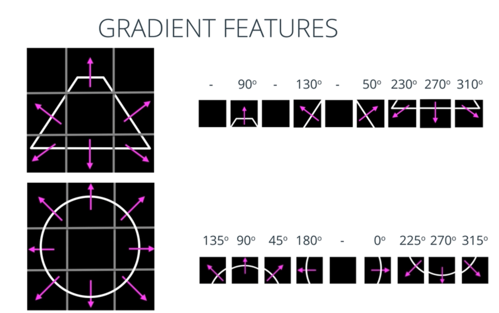

This section deals with two important algorithms that implement feature vectors:

- ORB = Oriented FAST and Rotated BRIEF; used for **matching known patterns**.
- HOG = Histogram of Oriented Gradients; used for **detecting object classes**.

### ORB = Oriented FAST and rotated BRIEF
	
State-of-the-Art algorithm for feature detection, implemented in OpenCV:

> ORB: An efficient alternative to SIFT or SURF. Ethan Rublee; Vincent Rabaud; Kurt Konolige; Gary Bradski. 2011.

See handwritten notes to understand how it works!

It works in 2 steps:

1. FAST is applied for feature or keypoint detection
2. BRIEF used for feature vector creation

ORB is very fast and

- scale invariant
- rotation invariant
- illumination invariant
- noise invariant

### FAST = Features from Accelerated Segment Test

First step of ORB (pattern matching).

Algorithm to determine whether a pixel is a keypoint.
A set of 16 pixels in the circumference of a pixel `P` is analized.
If 8 connected pixels in the circumference are brighter or darker than `P`, `P` is a keypoint:

- A threshold `h` is defined.
- All pixels are classified in 3 groups:
	- Intensity `I < I(P)-h`: DARKER
	- Intensity `I > I(P)+h`: BRIGHTER
	- INtensity: `I(P)-h < I < I(P)+h`: SIMILAR

A faster version analyzes only 4 pixels: if a pair is brighter or darker, `P` is a keypoint. This allows for very fast computations.

The keypoints found by FAST are associated with pixels that are surrounded by intensity changes; these appear often at edges that define shapes - that's what we want! However, we have only the location, the orientation is missing yet.

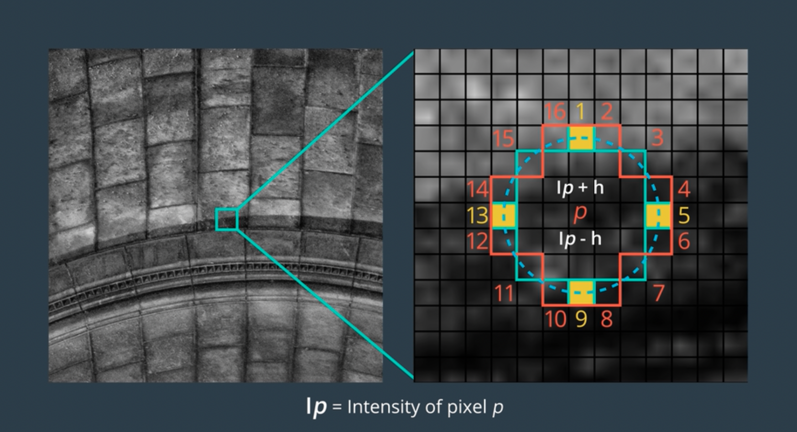

### BRIEF = Binary Robust Independent Elementary Features

Algorithm to create a feature vector given an identified keypoint.  
For each keypoint `k`, a bit-string of length `N` is created

	V_k = [01101001...]

`N` varies from 128 to 512 (usual value: 256).  
Each bit corresponds to the comparison of **two random pixels** around keypoint `k`:

- First random pixel: randomly picked with a Gaussian centered in `k` and spread `sigma`.
- Second random pixel: randomly picked with a Gaussian centered in the first random pixel and spread `sigma/2`.

Bit value: if `Intensity(first random pixel) > Intensity(second random pixel) -> 1, 0 otherwise`.  
All `N` bits are then sequentially assembled.  
Note that th eimage is blurred before computing the feature descriptors in order to filter out high frequency noise.

The advantage of using bit-strings as feature descriptors is that they can be computed, handled and stored very efficiently.

For each keypoint detected by FAST, a binary feature descriptor or vector of `N` bits is computed using BRIEF.

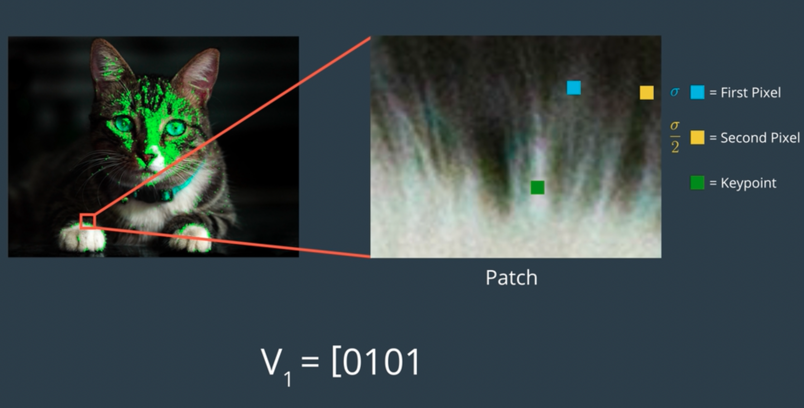

### Scale and rotation invariance

FAST and BRIEF as explained so far cannot handle different sizes and orientations.  
ORB introduced that scale and rotation invariance as explained in the following.

To solve the **scaling** issues, image pyramids are created:

- level 0: original image
- level 1: resolution x 1/2
- level 2: resolution x 1/4
- ...

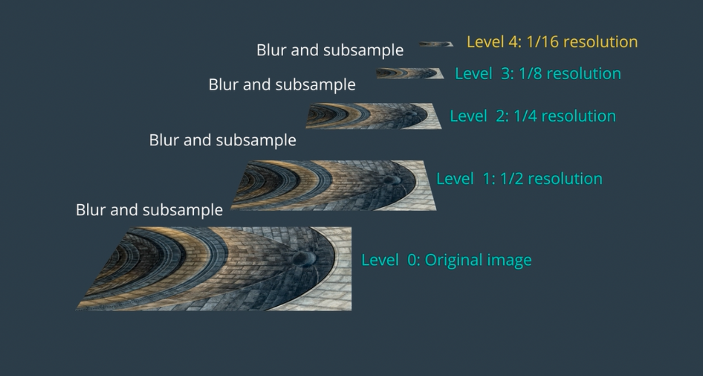

Then, keypoints are are transformed/located into the different levels of the pyramids, i.e., we have different scales.

To achieve **rotation invariance**, the BRIEF descriptors are modified to be rotation aware BRIEF (rBRIEF) as follows:

- For each keypoint, its orientation is computed:
	- Given a keypoint, the intensity centroid in its patch is measured
	- The orientation is the angle of the centroid wrt x axis
	- Note that patch sizes are constant at all scale levels; thus high levels have larges patch sizes
- BRIEF computation is modified to be Rotation aware BRIEF, RBRIEF:
	- We start as with BRIEF: `N` pairs of random points are created around keypoint
	- The set of N pairs is rotated the orientation of the keypoint
	- The descriptor is computed with the rotated pixel pairs

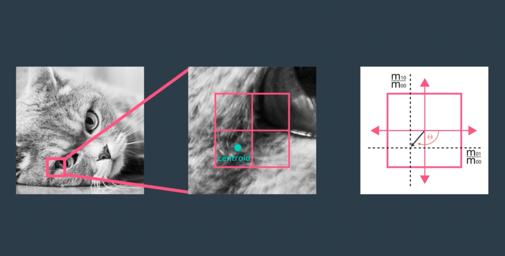

### Forum Question: ORB

In order to achieve scale and rotation invariance in ORB, image pyramids are used to place the FAST keypoints in images of reduced resolutions and the pixel pairs used in by FAST are rotated the angle of the centroid in their patch.

However, given the fact that the pixel pairs are random, why do we need to rotate? Rotating would imply that pixel pair locations are the same every time. That implies they are random *only* the first time they are computed -- in later computations of the same keypoint (e.g., when trying to find it on an image) should produce the same random pixel pairs. I understand this can be achieved either (1) by storing the pixel pair locations or (2) using a pseudo-random distribution which yields the same random locations given the same seed.

Am I correct?

Thank you,
Mikel

#### Answer

Yes, the same random points are used.

[Feature matching using ORB algorithm in Python-OpenCV](https://www.geeksforgeeks.org/feature-matching-using-orb-algorithm-in-python-opencv/)

### **Notebook**: `1_4_Feature_Vectors` / `1. Image Pyramids.ipynb`

An image and its lower resolution versions are displayed.

```python
level_1 = cv2.pyrDown(image)

f, (ax1,ax2) = plt.subplots(1, 2, figsize=(20,10))
ax1.set_title('original')
ax1.imshow(image)
ax2.imshow(level_1)
ax2.set_xlim([0, image.shape[1]])
ax2.set_ylim([image.shape[0], 0])
```

### Feature Matching

We distinguish: 

- The training image: used to compute the ORB descriptors (keypoints + feature vectors); the model can be saved.
- The query image: image where we look for templates the of training image.
	
The matching works as follows:

- Keypoints and their feature descriptors from query image are computed
- Keypoints and their feature descriptors from template are compared against keypoints from query image
- The comparison is done with a metric that accounts for the similarity; for binary vectors, the **Hamming distance** can be used
	- Hamming distance (between two strings of equal length) = the number of positions at which the corresponding symbols are different; the lower, the more similar
- Then, best keypoint matches are returned

Then, we need to account for some thresholds of number of matches, etc. For instance: `35%` threshold means that `35%` of template keypoints must match with a set in the query image so as to state that the template object is in the frame / query image.

### ORB in video
	
ORB can be used in videos because it's very fast.  
Applications:

- car detection and tracking
- face identification and tracking (faces are quite consistent)
- concrete well defined objects not influenced by background

BUT: ORB doesn't work that well for general object detection.

### **Notebook**: `1_4_Feature_Vectors` / `2. ORB.ipynb`

The ORB algorithm is showcased.

This notebook is quite large and the usage of ORB seems a bit tedious.

The parts related to the ORB descriptor computation and matching are the following:

```python
# Feature descriptor creation in the template image
orb = cv2.ORB_create(nfeatures = 1000,
           scaleFactor = 2,
           nlevels = 8,
           edgeThreshold = 31,
           firstLevel = 0,
           WTA_K = 2,
           scoreType = HARRIS_SCORE,
           patchSize = 31,
           fastThreshold = 20)
keypoints, descriptor = orb.detectAndCompute(training_gray, None)
cv2.drawKeypoints(training_image, keypoints, keyp_with_size, flags = cv2.DRAW_MATCHES_FLAGS_DRAW_RICH_KEYPOINTS)
plt.imshow(keyp_with_size)

# Matching
bf = cv2.BFMatcher(cv2.NORM_HAMMING, crossCheck = True)
matches = bf.match(descriptors_train, descriptors_query)
matches = sorted(matches, key = lambda x : x.distance)
result = cv2.drawMatches(training_gray, keypoints_train, query_gray, keypoints_query, matches[:100], query_gray, flags = 2)
plt.imshow(result)
```

The most important parameters of ORB object creation are:

- `nfeatures`: max number of features to locate
- `scaleFactor`: pyramid decimation ratio; shoudl be > 1, usually 2 is taken

Use default values for the rest.

In the following, the code of the notebook is provided; however, better look at the notebook.

```python
import cv2
import matplotlib.pyplot as plt

# Set the default figure size
plt.rcParams['figure.figsize'] = [14.0, 7.0]

# Load the training image
image1 = cv2.imread('./images/face.jpeg')

# Load the query image
image2 = cv2.imread('./images/Team.jpeg')

# Convert the training image to RGB
training_image = cv2.cvtColor(image1, cv2.COLOR_BGR2RGB)

# Convert the query image to RGB
query_image = cv2.cvtColor(image2, cv2.COLOR_BGR2RGB)

# Display the images
plt.subplot(121)
plt.imshow(training_image)
plt.title('Training Image')
plt.subplot(122)
plt.imshow(query_image)
plt.title('Query Image')
plt.show()

######

# Set the default figure size
plt.rcParams['figure.figsize'] = [34.0, 34.0]

# Convert the training image to gray scale
training_gray = cv2.cvtColor(training_image, cv2.COLOR_BGR2GRAY)

# Convert the query image to gray scale
query_gray = cv2.cvtColor(query_image, cv2.COLOR_BGR2GRAY)

# Set the parameters of the ORB algorithm by specifying the maximum number of keypoints to locate and
# the pyramid decimation ratio
orb = cv2.ORB_create(5000, 2.0)

# Find the keypoints in the gray scale training and query images and compute their ORB descriptor.
# The None parameter is needed to indicate that we are not using a mask in either case.  
keypoints_train, descriptors_train = orb.detectAndCompute(training_gray, None)
keypoints_query, descriptors_query = orb.detectAndCompute(query_gray, None)

# Create copies of the query images to draw our keypoints on
query_img_keyp = copy.copy(query_image)

# Draw the keypoints with size and orientation on the copy of the query image
cv2.drawKeypoints(query_image, keypoints_query, query_img_keyp, flags = cv2.DRAW_MATCHES_FLAGS_DRAW_RICH_KEYPOINTS)

# Display the query image with the keypoints with size and orientation
plt.title('Keypoints With Size and Orientation', fontsize = 30)
plt.imshow(query_img_keyp)
plt.show()

######

# Print the number of keypoints detected
print("\nNumber of keypoints Detected: ", len(keypoints_query))

# Set the default figure size
plt.rcParams['figure.figsize'] = [34.0, 34.0]

# Create a Brute Force Matcher object. We set crossCheck to True so that the BFMatcher will only return consistent
# pairs. Such technique usually produces best results with minimal number of outliers when there are enough matches.
bf = cv2.BFMatcher(cv2.NORM_HAMMING, crossCheck = True)

# Perform the matching between the ORB descriptors of the training image and the query image
matches = bf.match(descriptors_train, descriptors_query)

# The matches with shorter distance are the ones we want. So, we sort the matches according to distance
matches = sorted(matches, key = lambda x : x.distance)

# Connect the keypoints in the training image with their best matching keypoints in the query image.
# The best matches correspond to the first elements in the sorted matches list, since they are the ones
# with the shorter distance. We draw the first 85 mathces and use flags = 2 to plot the matching keypoints
# without size or orientation.
result = cv2.drawMatches(training_gray, keypoints_train, query_gray, keypoints_query, matches[:85], query_gray, flags = 2)

# we display the image
plt.title('Best Matching Points', fontsize = 30)
plt.imshow(result)
plt.show()

# Print the number of keypoints detected in the training image
print("Number of Keypoints Detected In The Training Image: ", len(keypoints_train))

# Print the number of keypoints detected in the query image
print("Number of Keypoints Detected In The Query Image: ", len(keypoints_query))

# Print total number of matching Keypoints between the training and query images
print("\nNumber of Matching Keypoints Between The Training and Query Images: ", len(matches))
```

### HOG = Histogram of Oriented Gradients

HOG descriptor: feature vector that contains all gradient histograms of the cells of an image

- The image is divided in square cells that contain pixels
- Image gradients are computed: direction & magnitude
- For each cell, a histogram of gradient direction is assembled, weighted with magnitude
- Cells are grouped in blocks
	- The histograms of each block are normalized together; therefore, edges can be detected in each block reliably
	- Blocks usually overlap
- All normalized histograms are packed in a vector: the HOG descriptor
- NOTE: the number of histograms in the HOG descriptor is not the number of cells, but num blocks x cells per block; thus, most cell histograms appear several times with a different normalization

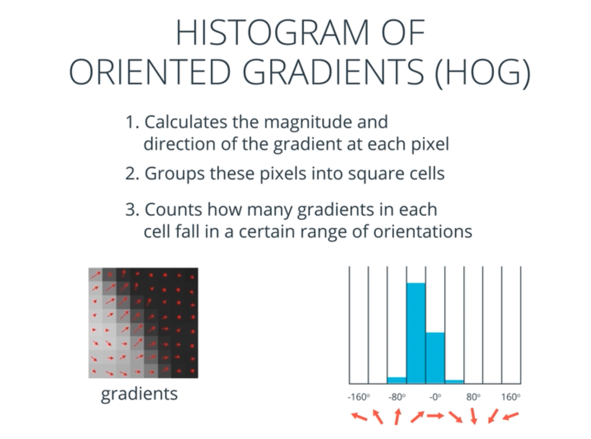

A classifier can be trained with feature vectors; e.g., a Support Vector Machine (SVM)

- HOG descriptors of an object class are trained along with descriptors of other classes
- The classifier learns the object class
- Object detection happens by sliding a window through image: the HOG descriptor of the window is computed and tested with classifier

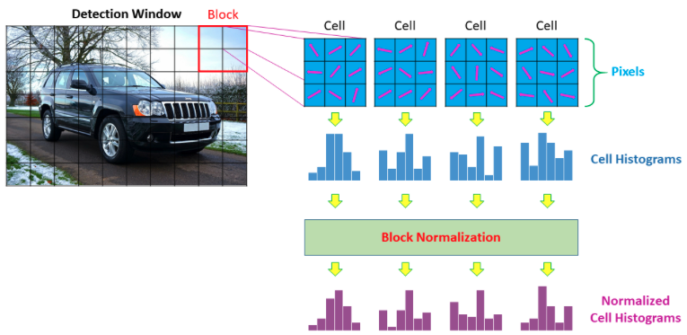

### **Notebook**: `1_4_Feature_Vectors` / `3_1. HOG.ipynb`

In the notebook, the HOG descriptor is computed visualized and extensive details are given.  
All that is in reality unnecessary, it's done for learning reasons.  
In practice, the following call would be enough to create the HOG descriptors, which are then used for training a classifier.

```python
hog = cv2.HOGDescriptor(win_size = (64, 128),  
              block_size = (16, 16),  
              block_stride = (8, 8),  
              cell_size = (8, 8),  
              nbins = 9,  
              win_sigma = DEFAULT_WIN_SIGMA,  
              threshold_L2hys = 0.2,  
              gamma_correction = true,  
              nlevels = DEFAULT_NLEVELS)
hog_descriptor = hog.compute(gray_image)
```

The most important parameters:

- `block_size`: the smaller the block, the finer the details
- `block_stride`: allow overlap
- `cell_size`: the smaller the cell, the finer the details
- `nbins`: more bins capture more angular directions; unsigned directions used: 0-180

The rest can be left with default values:

- `win_size`: ROI or window of detection for later 
- `win_sigma`: Gaussian blur improves HOG
- `threshold_L2hys`: normalization method
- `gamma_correction`: gamma correction slightly improves HOG

The length of the HOG descriptor is computed in the notebook manually, using formulas.

## 5. CNN Layers and Feature Visualization (Lesson 8)

At the beginning of this section, it is pointed to a tutorial on Pytorch.

That tutorial is summarized in the DLND repositoy:

[deep_learning_udacity](https://github.com/mxagar/deep_learning_udacity) `/02_Pytorch_Guide/`

The contents summrized in the current document refer to specific topics related to the CVND, which focus on convolutional neural networks (CNN).

However, note that the Udacity Deep Learning Nanodegree shows a deeper context of Deep Learning.

In the present lesson/section, first, some CNN layer notes and visualizations are dealed; then, the lesson focuses on applying CNNs to the [Fashion-MNIST dataset](https://github.com/zalandoresearch/fashion-mnist).

Finally, some related links to blog posts by Cezanne Camacho:

- [Introduction to neural networks](https://cezannec.github.io/Intro_Neural_Networks/)
- [Convolutional neural networks](https://cezannec.github.io/Convolutional_Neural_Networks/)


### Convolutional Layers

N filters applied to the input image or feature maps; feature maps are also known as activation maps.    
Output of N filters: N feature maps: that's like an image with N channels.  
Each filter has 3 dimensions: height x width x depth:

- Depth is the depth of the input image or feture map
- In the case of color input images the depth is the RGB channel; thus the first filters have in reality 3 2D filters, one for each channel
- However, all sub-filter convolutions are summed to produce one value per pixel!

Thus, when a feature map has N1 channels and we pass it through a layer with N2 filters, the convulution needs to have N2 filters of depth N1: N1 x N2. The convolution of each filter with depth N1 will be one activation map, yielding a total of N2 activation maps.

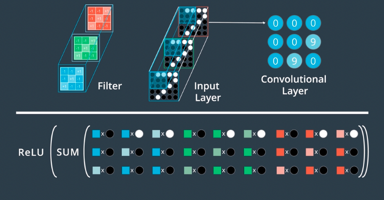

The size of the output feature map is expected to be

	(size(input feature map) - size(filter kernel))/stride + 1

During training, the weights of the filter kernels are learned.  
If convolutional layers concatenated, patterns within patterns are learned/detected.  
In contrast to fully connected layers, conv layers are locally connected: features that have a meaning in a local 2D space are learned. In the case of fully connected layers, all nodes are connected to all nodes.


### Defining Layers in Pytorch

All Pytorch layers can be looked here: [torch.nn](https://pytorch.org/docs/stable/nn.html)

Common layers in computer vision are:

- Convolutional
- Pooling: aggregation or summary functions: max value, average, etc.; relevant pixel values are taken by compressing the feature maps. The most typical layer in CNNs is by far the `MaxPool2d`.
- Fully connected: all previous nodes (pixels) are connected to the successor nodes; usually, at the end there is mapping to the classes using a fully connected layer.

Example architecture of VGG-16 (Karen Simonyan & Andrew Zisserman, 2014) with those typical layers:


Example of a max-pooling layer:

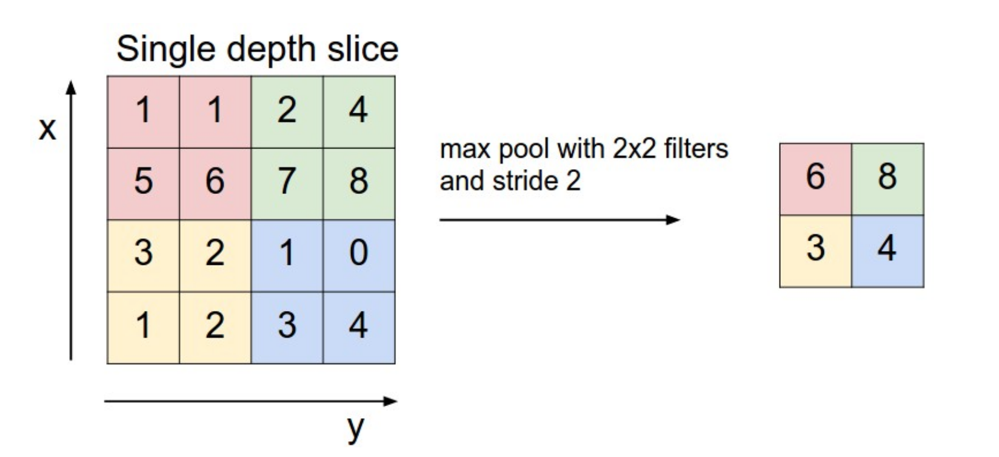

All layers are defined within the `__init__()` function of our `Network` class in Pytorch, and used in the `forward()` member of that class:

```python
import torch.nn as nn
import torch.nn.functional as F

class Net(nn.Module):

    def __init__(self, n_classes):
        super(Net, self).__init__()

        # 1 input image channel (grayscale)
        # 32 output channels/feature maps
        # 5x5 square convolution kernel
        # output_size: input_size - 5 + 1
        self.conv1 = nn.Conv2d(1, 32, 5)

        # maxpool layer
        # pool with kernel_size=2, stride=2
        self.pool = nn.MaxPool2d(2, 2)

        # fully-connected layer
        # 32*4 input size to account for the downsampled image size after pooling
        # num_classes outputs (for n_classes of image data)
        self.fc1 = nn.Linear(32*4, n_classes)

    # define the feedforward behavior
    def forward(self, x):
        # one conv/relu + pool layers
        x = self.pool(F.relu(self.conv1(x)))

        # prep for linear layer by flattening the feature maps into feature vectors
        x = x.view(x.size(0), -1)
        # linear layer 
        x = F.relu(self.fc1(x))

        # final output
        return x

# instantiate and print your Net
n_classes = 20 # example number of classes
net = Net(n_classes)
print(net)

```

### **Notebook**: `1_5_CNN_Layers` / `1. Conv Layer Visualization.ipynb`

Interesting notebook in which a simple convolutional network is defined in Pytorch. The following is done:

- Filter values are defined outside and set to the convolution layer weights (X & Y Sobel kernels)
- An image is passed (convuluted): the convoluton output (feature map) is returned with and without the ReLU activation
- Returned maps are visualized

The notebook can be practical if we want to visualize layers in the future!

```python
import numpy as np
import cv2
import matplotlib.pyplot as plt
%matplotlib inline

import torch
import torch.nn as nn
import torch.nn.functional as F

# Load color image 
img_path = 'images/udacity_sdc.png'
bgr_img = cv2.imread(img_path)
# Convert to grayscale
gray_img = cv2.cvtColor(bgr_img, cv2.COLOR_BGR2GRAY)

# Normalize, rescale entries to lie in [0,1]
gray_img = gray_img.astype("float32")/255

# Convert the image into an input Tensor
gray_img_tensor = torch.from_numpy(gray_img).unsqueeze(0).unsqueeze(1)

# Manual filter: 4 filters
filter_vals = np.array([[-1, -1, 1, 1], [-1, -1, 1, 1], [-1, -1, 1, 1], [-1, -1, 1, 1]])
filter_1 = filter_vals
filter_2 = -filter_1
filter_3 = filter_1.T
filter_4 = -filter_3
filters = np.array([filter_1, filter_2, filter_3, filter_4])
    
# Define a neural network with a single convolutional layer with four filters
class Net(nn.Module):
        def __init__(self, weight):
        super(Net, self).__init__()
        k_height, k_width = weight.shape[2:]
        self.conv = nn.Conv2d(1, 4, kernel_size=(k_height, k_width), bias=False)
        self.conv.weight = torch.nn.Parameter(weight)

    def forward(self, x):
        conv_x = self.conv(x)
        activated_x = F.relu(conv_x)

        return conv_x, activated_x

# Instantiate model with manual filter weights
weight = torch.from_numpy(filters).unsqueeze(1).type(torch.FloatTensor)
model = Net(weight)

# Get the convolutional layer (pre and post activation)
# See model definition in 
conv_layer, activated_layer = model(gray_img_tensor)

# Helper function for visualizing the output of a given layer
# default number of filters is 4
def viz_layer(layer, n_filters= 4):
    fig = plt.figure(figsize=(20, 20))
    
    for i in range(n_filters):
        ax = fig.add_subplot(1, n_filters, i+1, xticks=[], yticks=[])
        # grab layer outputs
        ax.imshow(np.squeeze(layer[0,i].data.numpy()), cmap='gray')
        ax.set_title('Output %s' % str(i+1))

# Visualize the output of a conv layer
viz_layer(conv_layer) # convoluted image
viz_layer(activated_layer) # convoluted imaged after passing through activation
```

### Pooling layers

Pooling layers usually come after convolutional layers and reduce the dimensionality, preventing overfitting.
Convolutional layers have many channels or feature maps which increase parameters:

- This might lead to overfitting
- Therefore, reducing dimensionality is a way of reducing the risk of overfitting

Usually, a max-pooling layer

- has as input a convolutional layer of size W x H x D
	- W x H: size of each feature map
	- D: depth or number of feature maps (channels)
- has an output of size w x h x D
	- w x d: new feature maps with reduced size w x h < W x H
	- D: same depth as before, the same amount of feature maps as before

There are several types of pooling layers, 2 of the most important are:

1. Max Pooling
	- window size & stride defined, eg 2x2 & 2 (in pixels)
	- for each window 2x2 max pixel value is chosen
	- in this sparticular case, w = W/2, h = H/2
2. Global Average Pooling
	- for each feature map, average pixel value is chosen
	- output: vector of length D: (1x1x)D

[Pooling layers in Pytorch](https://pytorch.org/docs/stable/nn.html#pooling-layers)

### Fully Connected Layers

Pixel/node outputs from previous layers are linearly mapped to C nodes:

- Say we have WxHxD nodes/pixels from previous classes
- These are mapped to C nodes, which are usually the classes

So, 3D tensors of feature maps with D channels are reduced to 1xC vectors.

Several fully connected layers can be concatenated at the end:

- If the input is comming from convolutional layers, it must be flattened: `x = x.view(x.size(0), -1)
- Intermmediate fully connected layers have ReLU
- Last fully connected layer has usually `Softmax` or `LogSoftmax`, which generates class (log) probabilities.

Dropout:

- It de-activates nodes randomly, assigning each node an independent deactivation probability `p`.
- It is implemented by adding a layer which zeroes the output of the previous layer.
- It should be active only during tranining.
- It prevents overfitting

[Dropout layers in Pytorch](https://pytorch.org/docs/stable/nn.html#dropout-layers)

### **Notebook**: `1_5_CNN_Layers` / `2. Pool Visualization.ipynb`

Pooling layers come often after a convolution and they reduce the dimensionality of the feeature maps, thus, reducing the risk of overfitting.

This notebook is very similar to the previous one; the new addition is that a max-pooling layer is added, so that the output after `Conv2d -> MaxPool2d` is visualized: similar to before, but the images are compressed.

### **Notebook**: `1_5_CNN_Layers` / `3. Load and Visualize FashionMNIST.ipynb`

Visualization of the [Fashion-MNIST dataset](https://github.com/zalandoresearch/fashion-mnist):  
The dataset is loaded and batches are extracted in `Tensor` format with the `DataLoader`.  
Additionally, a big picture of the images is constructed, with annotated pixel values.

```python
import torch
import torchvision

from torchvision.datasets import FashionMNIST
from torch.utils.data import DataLoader
from torchvision import transforms

# The output of torchvision datasets are PILImage images of range [0, 1]. 
# We transform them to Tensors for input into a CNN
# Define a transform to read the data in as a tensor: mapped to [0, 1]
data_transform = transforms.ToTensor()
train_data = FashionMNIST(root='./data', train=True,
                                   download=True, transform=data_transform)
print('Train data, number of images: ', len(train_data))

batch_size = 20
train_loader = DataLoader(train_data, batch_size=batch_size, shuffle=True)

# Image classes
classes = ['T-shirt/top', 'Trouser', 'Pullover', 'Dress', 'Coat', 
           'Sandal', 'Shirt', 'Sneaker', 'Bag', 'Ankle boot']

import numpy as np
import matplotlib.pyplot as plt
%matplotlib inline
    
# Obtain one batch of training images
dataiter = iter(train_loader)
images, labels = dataiter.next()
images = images.numpy()

# Plot the images in the batch, along with the corresponding labels
fig = plt.figure(figsize=(25, 4))
for idx in np.arange(batch_size):
    ax = fig.add_subplot(2, batch_size/2, idx+1, xticks=[], yticks=[])
    ax.imshow(np.squeeze(images[idx]), cmap='gray')
    ax.set_title(classes[labels[idx]])

```

### Training

In addition to the dataset and the network definition, for training we need a loss function and an optimizer:

- [Loss functions](https://pytorch.org/docs/master/nn.html#loss-functions)
- [Optimizers](https://pytorch.org/docs/master/optim.html)

The **loss function** is the definition of how we compute the error of an inference:


	loss = torch.nn.MSELoss(...) # regression
	loss = torch.nn.CrossEntropyLoss(...) # classification with raw output, ie., no activation
	loss = torch.nn.NLLLoss(...) # classification with LogSoftmax activated output
	...

The **optimizer** is the definition of how the weights are updated given the loss gradient (e.g., simple gradient descend):

	criterion = torch.optim.Adam(...)
	criterion = torch.optim.SGD(...)

The basic training loop is the following:

0. prepare batch images to feed to network
1. forward pass
2. compute loss
3. backward pass (compute gradients)
4. optimize/update weights

### **Notebook**: `1_5_CNN_Layers` / `4_1. Classify FashionMNIST, exercise.ipynb`, `4_2. Classify FashionMNIST, solution 1.ipynb`, `4_3. Classify FashionMNIST, solution 2.ipynb`

This is a **very important and complete example** in which a convolutional network is defined and trained with the Fashion-MNIST dataset.

Performed steps:

	load dataset
		train & test split
	visualize samples
	create CNN
		conv2d
		maxpool2d
		linear
		dropout
	feedforward some samples
		cross-entropy loss / log_softmax + NLLLoss
		adam
	train model (on selected device)
		validation with test split
	test model
		overall & class accuracy
	visualize forwardpass results
	save model
	load model

Interesting links:

- [A guide to convolution arithmetic](https://arxiv.org/pdf/1603.07285.pdf)
- [Convolution arithmetic](https://github.com/vdumoulin/conv_arithmetic)

Altogether, three network architectures are tested:

```
# Solution 1

Net(
  (conv1): Conv2d(1, 10, kernel_size=(3, 3), stride=(1, 1))
  (pool): MaxPool2d(kernel_size=2, stride=2, padding=0, dilation=1, ceil_mode=False)
  (conv2): Conv2d(10, 20, kernel_size=(3, 3), stride=(1, 1))
  (fc1): Linear(in_features=500, out_features=10, bias=True)
)

# Solution 2

Net(
  (conv1): Conv2d(1, 10, kernel_size=(3, 3), stride=(1, 1))
  (pool): MaxPool2d(kernel_size=2, stride=2, padding=0, dilation=1, ceil_mode=False)
  (conv2): Conv2d(10, 20, kernel_size=(3, 3), stride=(1, 1))
  (fc1): Linear(in_features=500, out_features=50, bias=True)
  (fc1_drop): Dropout(p=0.4, inplace=False)
  (fc2): Linear(in_features=50, out_features=10, bias=True)
)

# My own defined network

Net(
  (conv1): Conv2d(1, 10, kernel_size=(3, 3), stride=(1, 1))
  (conv2): Conv2d(10, 20, kernel_size=(3, 3), stride=(1, 1))
  (pool1): MaxPool2d(kernel_size=2, stride=2, padding=0, dilation=1, ceil_mode=False)
  (dropout1): Dropout(p=0.5, inplace=False)
  (conv3): Conv2d(20, 30, kernel_size=(3, 3), stride=(1, 1))
  (conv4): Conv2d(30, 40, kernel_size=(3, 3), stride=(1, 1))
  (pool2): MaxPool2d(kernel_size=2, stride=2, padding=0, dilation=1, ceil_mode=False)
  (dropout2): Dropout(p=0.5, inplace=False)
  (linear1): Linear(in_features=640, out_features=100, bias=True)
  (linear2): Linear(in_features=100, out_features=10, bias=True)
)

```

In the following, the most important parts of the notebook are summarized:

1. Load and visualize the dataset
2. Define the network
3. Training and validation
4. Evaluate the network
5. Inference
6. Saving and loading the weights

```python

### -- 1. Load and visualize the dataset

import torch
import torchvision

from torchvision.datasets import FashionMNIST
from torch.utils.data import DataLoader
from torchvision import transforms

# The output of torchvision datasets are PILImage images of range [0, 1]. 
# We transform them to Tensors for input into a CNN
# Define a transform to read the data in as a tensor: pixel values mapped to [0,1]
data_transform = transforms.ToTensor()

# Choose the training and test datasets
train_data = FashionMNIST(root='./data', train=True,
                                   download=True, transform=data_transform)

test_data = FashionMNIST(root='./data', train=False,
                                  download=True, transform=data_transform)


# Print out some stats about the training and test data
print('Train data, number of images: ', len(train_data)) # 60,000
print('Test data, number of images: ', len(test_data)) # 10,000

# Prepare data loaders, set the batch_size
batch_size = 20
train_loader = DataLoader(train_data, batch_size=batch_size, shuffle=True)
test_loader = DataLoader(test_data, batch_size=batch_size, shuffle=True)

# Specify the image classes
classes = ['T-shirt/top', 'Trouser', 'Pullover', 'Dress', 'Coat', 
           'Sandal', 'Shirt', 'Sneaker', 'Bag', 'Ankle boot']

# Visualize some images
import numpy as np
import matplotlib.pyplot as plt
%matplotlib inline
    
# Obtain one batch of training images
dataiter = iter(train_loader)
images, labels = dataiter.next()
images = images.numpy()

# Plot the images in the batch, along with the corresponding labels
fig = plt.figure(figsize=(25, 4))
for idx in np.arange(batch_size):
    ax = fig.add_subplot(2, batch_size/2, idx+1, xticks=[], yticks=[])
    ax.imshow(np.squeeze(images[idx]), cmap='gray')
    ax.set_title(classes[labels[idx]])

images[0].shape # (1, 28, 28)

### -- 2. Define the network

import torch.nn as nn
import torch.nn.functional as F

class Net(nn.Module):

    def __init__(self, drop_p=0.5):
        super(Net, self).__init__()
        
        # 1 input image channel (grayscale)
        # 10 output channels/feature maps
        # 3x3 square convolution kernel
        # input size batch_size x 1 x 28 x 28,
        # output size batch_size x 10 x 26 x 26 (look formula in docu)
        # (W-F)/S + 1 = (28-3)/1 + 1 = 26
        self.conv1 = nn.Conv2d(1, 10, 3)
        
        # input size batch_size x 10 x 26 x 26
        # output size batch_size x 20 x 24 x 24 (look formula in docu)
        # (W-F)/S + 1 = (26-3)/1 + 1 = 24
        self.conv2 = nn.Conv2d(10, 20, 3)
        # input size batch_size x 20 x 24 x 24,
        # output size batch_size x 20 x 12 x 12 (look formula in docu)
        # kernel_size=2, stride=2 -> W = W/2 = 24/2 = 12
        self.pool1 = nn.MaxPool2d(2,2)
        self.dropout1 = nn.Dropout(p=drop_p)

        # input size batch_size x 20 x 12 x 12
        # output size batch_size x 30 x 10 x 10 (look formula in docu)
        self.conv3 = nn.Conv2d(20, 30, 3)
        # input size batch_size x 30 x 10 x 10
        # output size batch_size x 40 x 8 x 8 (look formula in docu)
        self.conv4 = nn.Conv2d(30, 40, 3)
        # input size batch_size x 40 x 8 x 8,
        # output size batch_size x 40 x 4 x 4 (look formula in docu)
        self.pool2 = nn.MaxPool2d(2,2)
        self.dropout2 = nn.Dropout(p=drop_p)
        
        # input features: batch_size x 40 x 4 x 4; 40 x 4 x 4 = 640
        self.linear1 = nn.Linear(640,100)
        self.linear2 = nn.Linear(100,10)
        
    # Feedforward pass
    def forward(self, x):
        x = F.relu(self.conv1(x))
        x = F.relu(self.conv2(x))
        x = F.relu(self.pool1(x))
        x = self.dropout1(x)
        x = F.relu(self.conv3(x))
        x = F.relu(self.conv4(x))
        x = F.relu(self.pool2(x))
        x = self.dropout2(x)
        # flatten: batch_size x 40 x 4 x 4 -> (batch_size, 640)
        x = x.view(x.size(0), -1)
        x = F.relu(self.linear1(x))
        #x = F.softmax(self.linear2(x),dim=1)        
        x = F.log_softmax(self.linear2(x),dim=1)        
        # final output
        return x

# instantiate and print your Net
net = Net()
print(net)

### -- 3. Training and validation

import torch.optim as optim

# Specify loss function
#criterion = nn.CrossEntropyLoss()
criterion = nn.NLLLoss()

## Specify optimizer 
#optimizer = optim.SGD(net.parameters(), lr=0.001, momentum=0.9)
optimizer = optim.Adam(net.parameters(), lr=0.001)

# Validation function: try it before training
def validate(net, criterion, test_loader):
    # Select device
    device = torch.device("cuda" if torch.cuda.is_available() else "cpu")
    # Transfer model/network to device
    net.to(device, dtype=torch.float)
    # Calculate accuracy before training
    running_correct = 0
    total = 0
    running_loss = 0
    # Set net in evaluation mode (no dropout)
    net.eval()
    # Iterate through test dataset
    for images, labels in test_loader:
        # forward pass to get outputs
        # the outputs are a series of class scores
        images, labels = images.to(device, dtype=torch.float), labels.to(device, dtype=torch.float)
        outputs = net(images)
        # calculate the loss
        loss = criterion(outputs, labels)
        running_loss += loss.item()
        # get the predicted class from the maximum value in the output-list of class scores
        _, predicted = torch.max(outputs.data, dim=1)
        # count up total number of correct labels
        # for which the predicted and true labels are equal
        total += labels.size(0)
        running_correct += ((predicted == labels).sum()).item()
    # calculate the accuracy
    average_accuracy = running_correct / total
    average_loss = running_loss / total
    return average_accuracy, average_loss

# Compute accuracy
accuracy, loss = validate(net, criterion, test_loader)
# Print it out
print(f'Accuracy and loss before training: {accuracy}, {loss}')
# Accuracy and loss before training: 0.0657, 0.11523878312110901

def train(net, n_epochs, train_loader, test_loader, validation=True):
    # Print/validation frequency
    validation_freq = 1000
    # select device: CPU / CUDA
    device = torch.device("cuda" if torch.cuda.is_available() else "cpu")
    print("Training on {}".format(device))
    # transfer model/network to device
    net.to(device, dtype=torch.float)
    # set model in traning mode (dropout active)
    net.train()
    train_loss_over_time = [] # to track the loss as the network trains
    test_loss_over_time = [] # to track the loss as the network trains
    test_accuracy_over_time = []
    for epoch in range(n_epochs):  # loop over the dataset multiple times
        running_loss = 0.0
        for batch_i, data in enumerate(train_loader):
            # get the input images and their corresponding labels
            inputs, labels = data
            # transfer data to device
            inputs, labels = inputs.to(device, dtype=torch.float), labels.to(device, dtype=torch.float)
            # zero the parameter (weight) gradients
            optimizer.zero_grad()
            # forward pass to get outputs
            outputs = net(inputs)
            # calculate the loss
            loss = criterion(outputs, labels)
            # backward pass to calculate the parameter gradients
            loss.backward()
            # update the parameters
            optimizer.step()
            # print loss statistics
            # to convert loss into a scalar and add it to running_loss, we use .item()
            running_loss += loss.item()
            if batch_i % validation_freq == 999:    # print every 1000 mini-batches
                if validation:
                    test_accuracy, test_loss = validate(net, criterion, test_loader)
                    test_accuracy_over_time.append(test_accuracy)
                avg_loss = running_loss/validation_freq
                train_loss_over_time.append(avg_loss)
                test_loss_over_time.append(test_loss)
                print('Epoch: {}, Batch: {}, Avg. Train Loss: {}, Avg. Test Loss: {}, Test Accuracy: {}'.format(epoch + 1, batch_i+1, avg_loss, test_loss, test_accuracy))
                running_loss = 0.0
    print('Finished Training')
    return train_loss_over_time, test_loss_over_time, test_accuracy_over_time

    # define the number of epochs to train for

# Train
n_epochs = 5 # start small to see if your model works, initially

import time
t1 = time.time()
train_loss_over_time, test_loss_over_time, test_accuracy_over_time = train(net, n_epochs, train_loader, test_loader)
t2 = time.time()
print("Time for training: {} seconds".format(t2-t1))

# ...
# Epoch: 5, Batch: 3000,
# Avg. Train Loss: 0.10901981005590641, Avg. Test Loss: 0.0163709447588888, Test Accuracy: 0.9122
# Finished Training
# Time for training: 319.07084107398987 seconds

# Visualize the loss as the network trained
# It seems that the network is overfitting,
# because the test loss starts increasing while the train loss decreases
# Early stopping could be an option, or regularization & dropout
train_loss_over_time = np.array(train_loss_over_time)
train_loss_over_time /= train_loss_over_time.max()
test_loss_over_time = np.array(test_loss_over_time)
test_loss_over_time /= test_loss_over_time.max()
test_accuracy_over_time = np.array(test_accuracy_over_time)
plt.plot(train_loss_over_time, label='Train loss')
plt.plot(test_loss_over_time, label='Test loss')
plt.plot(test_accuracy_over_time, label='Test accuracy')
plt.legend()
plt.xlabel('1000\'s of batches')
plt.ylabel('loss')
plt.ylim(0, 1.25) # consistent scale
plt.show()

### -- 4. Evaluate the network

# initialize tensor and lists to monitor test loss and accuracy
test_loss = torch.zeros(1)
class_correct = list(0. for i in range(10))
class_total = list(0. for i in range(10))

# select device: CPU / CUDA
device = torch.device("cuda" if torch.cuda.is_available() else "cpu")
print("Testing on {}".format(device))
# transfer model/network to device
net.to(device, dtype=torch.float)

# set the module to evaluation mode (deactivate dropout)
net.eval()

for batch_i, data in enumerate(test_loader):
    
    # get the input images and their corresponding labels
    inputs, labels = data
    
    # transfer data to device
    inputs, labels = inputs.to(device, dtype=torch.float), labels.to(device, dtype=torch.float)

    # forward pass to get outputs
    outputs = net(inputs)

    # calculate the loss
    loss = criterion(outputs, labels)
            
    # update average test loss 
    test_loss = test_loss + ((torch.ones(1) / (batch_i + 1)) * (loss.data - test_loss))
    
    # get the predicted class from the maximum value in the output-list of class scores
    _, predicted = torch.max(outputs.data, 1)
    
    # compare predictions to true label
    correct = predicted == labels
    
    # calculate test accuracy for *each* object class
    # we get the scalar value of correct items for a class, by calling `correct[i].item()`
    for i in range(batch_size):
        label = labels.data[i]
        class_correct[label] += correct[i].item()
        class_total[label] += 1

print('Test Loss: {:.6f}\n'.format(test_loss.numpy()[0]))

for i in range(10):
    if class_total[i] > 0:
        print('Test Accuracy of %5s: %2d%% (%2d/%2d)' % (
            classes[i], 100 * class_correct[i] / class_total[i],
            np.sum(class_correct[i]), np.sum(class_total[i])))
    else:
        print('Test Accuracy of %5s: N/A (no training examples)' % (classes[i]))

        
print('\nTest Accuracy (Overall): %2d%% (%2d/%2d)' % (
    100. * np.sum(class_correct) / np.sum(class_total),
    np.sum(class_correct), np.sum(class_total)))

# Testing on cpu
# Test Loss: 0.327419

# Test Accuracy of T-shirt/top: 89% (899/1000)
# Test Accuracy of Trouser: 98% (982/1000)
# Test Accuracy of Pullover: 89% (898/1000)
# Test Accuracy of Dress: 91% (917/1000)
# Test Accuracy of  Coat: 85% (857/1000)
# Test Accuracy of Sandal: 98% (985/1000)
# Test Accuracy of Shirt: 68% (682/1000)
# Test Accuracy of Sneaker: 98% (986/1000)
# Test Accuracy of   Bag: 97% (974/1000)
# Test Accuracy of Ankle boot: 94% (942/1000)

# Test Accuracy (Overall): 91% (9122/10000)

### -- 5. Inference

# obtain one batch of test images
dataiter = iter(test_loader)
images, labels = dataiter.next()
# since images and labels are casted to numpy, we need to have the network in CPU
device = "cpu"
net.to(device, dtype=torch.float)

# get predictions
preds = np.squeeze(net(images).data.max(1, keepdim=True)[1].numpy())
images = images.numpy()
labels = labels.numpy()  

# plot the images in the batch, along with predicted and true labels
fig = plt.figure(figsize=(25, 4))
for idx in np.arange(batch_size):
    ax = fig.add_subplot(2, batch_size/2, idx+1, xticks=[], yticks=[])
    ax.imshow(np.squeeze(images[idx]), cmap='gray')
    c = 'red'
    if preds[idx]==labels[idx]:
        c = 'green'
    ax.set_title("{} ({})".format(classes[preds[idx]], classes[labels[idx]]), color=c)

### -- 6. Saving and loading the weights

# Watch out: here we save the weights only
# We need to either
# (1) parametrize the model and save its params in a dictionary
# (2) or save the model definition in a file and instantiate it before loading the weights
model_dir = 'saved_models/'
model_name = 'model_1.pt'
torch.save(net.state_dict(), model_dir+model_name)

# Instantiate your Net
net = Net()

# Load the net parameters by name
net.load_state_dict(torch.load('saved_models/model_1.pt'))
# If we saved the model in a CUDA device, we need to map it to CPU
# net.load_state_dict(torch.load('saved_models/model_1.pt', map_location=torch.device('cpu')))
print(net)

```

### Network structure: How to decide leayers, etc?

To prevent OVERFITTING

1. Early stopping
2. Regularization
	- L2 regularization implemented as `weight_decay` (alpha) in torch.optim functions
3. Dropout
	- use at the end of the network, eg., betwen fully connected layers
4. Batch normalization
	- use at the beginning of the network
	- just as with dropout, a layer is added
		- `nn.BatchNorm1d` after linear
		- `nn.Batchnorm2d` after conv2
	- for each batch, output's mean substracted and std divided
	- effect: the values of hidden layer don't shift that much, network more stable
	
Which layers should we use?

- More layers = we see more complex structures; BUT: for simple structures, few layers are enough!
- Look for inspiration in known netwrks, since people already tried many things!

Always try changes and see what happens

- vary number of layers
- vary size or kernels
- try different loss/optimization functions
- tune hyperparamters: learning rate, momentum
- change batch size

### Feature Visualization

In some cases the network learns false cues. Example: wolf in snow -> snow learned; network fails to ditinguish between dog and wolf in snow.

Therefore, it's good being able to visualize the learned filters & the feature maps we obtain.

Layers learn the following:

- First layer: usually highpass filters for lines learned
- Successive layers: from lines to corners, object parts, more complex shapes, objects, animals, humans
	- Important note: the input they receive are not images, but feature maps!
- Last layers (fully connected): long vector that enconde object

It is important to distinguish that we can visualize two different things:

- Filter weight visualization: we visualize the filters, which are related to the particular features they detect
- Feature/activation map visualization: these are much more interesting than the filters; we should not get noisy blobby activation maps, but specific local areas should be clearly highlighted depending on the class.

Interesting references:

- [Matt Zeiler, Visualizing DL models - deconvolution](https://www.youtube.com/watch?v=ghEmQSxT6tw)
- [Visualization of activation maps](https://experiments.withgoogle.com/what-neural-nets-see)
- [What Neural Networks See](https://experiments.withgoogle.com/what-neural-nets-see)

Some layer visualizations, by [Matt Zeiler](https://www.clarifai.com/):


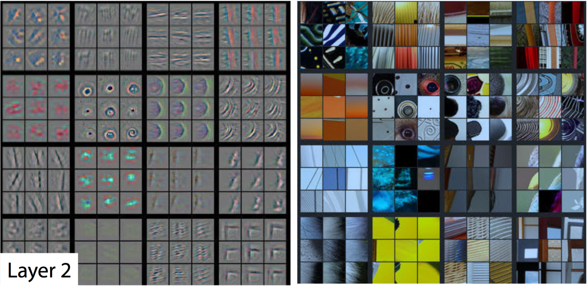

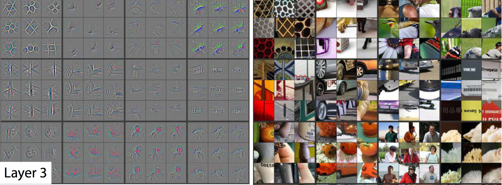


### **Notebook**: `1_5_CNN_Layers` / `5_1. Feature viz for FashionMNIST`

In this notebook a pre-trained simple network is loaded and its first convolutional filter as well as the first activation map are visualized.

```python

### -- 1. Filter visualization

# Get the weights in the conv layer
weights = net.conv1.weight.data
#weights = net.conv2.weight.data
w = weights.numpy()
fig = plt.figure(figsize=(20, 8))
columns = 5
rows = 2
for i in range(0, columns*rows):
    fig.add_subplot(rows, columns, i+1)
    plt.imshow(w[i][0], cmap='gray')
plt.show()

### -- 2. Activation map visualization

# Obtain one batch of testing images
dataiter = iter(test_loader)
images, labels = dataiter.next()
images = images.numpy()

# Select an image by index
idx = 10
img = np.squeeze(images[idx])

# Use OpenCV's filter2D function 
# apply a specific set of filter weights to the test image
# (like the one's displayed above) 

import cv2
plt.imshow(img, cmap='gray')

weights = net.conv1.weight.data
w = weights.numpy()

# First conv layer
# for 10 filters
fig=plt.figure(figsize=(30, 10))
columns = 5*2
rows = 2
for i in range(0, columns*rows):
    fig.add_subplot(rows, columns, i+1)
    if ((i%2)==0):
        plt.imshow(w[int(i/2)][0], cmap='gray')
    else:
        c = cv2.filter2D(img, -1, w[int((i-1)/2)][0])
        plt.imshow(c, cmap='gray')
plt.show()

```

### Last Feature Vector, Dimensionality Reduction

The last feature vector before the class scores is a compressed representation of the image content. Images with similar contents should have similar vectors.

Thus, we can look for similar images we applying nearest neighbors of the image feature vectors in that feature space!

Additionally, if we apply dimensionality reduction techniques like Principal Components Analysis (PCA) or t-SNE we can reduce the high dimensional feature vectors to 2D/3D spaces and visualize them for a better understanding of our dataset.

See handwritten notes.


### Occlusion, Saliency, Guided Backpropagation

With **occlusion** experiments, an occlusion mask is swept through the `(x,y)` coordinates of an image and the probability of the correct class is stored for that point. When a relevant part is occluded, the probability decreases considerably; as a result a heatmap of the relevant regions of an image in relation to its class are detected. 

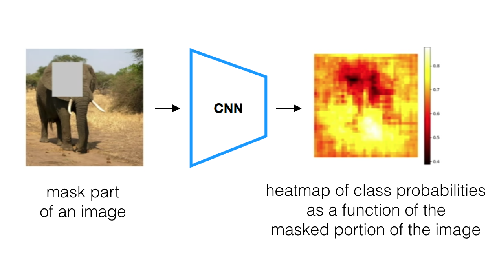

**Saliency maps** evaluate how relevant a pixel is for a given class. Basically, the gradient of the class with respect to changes in the pixels is measured. Thus, we get maps that are similar to the heatmaps. The saliency maps have been used to perform image segmentation.

With **guided backpropagation** the gradient of the activated outputs of a neurons with respect to the changes of pixels are measured. As such, we get how relevant pixels are for specific neurons.

### Some Applications with Feature Maps

- Deep Dream: select features are amplified in an image; basically, we select the layer with features we'd like to highlight and set its activated output to be the gradient. The resulting effect is that the activated features are amplified.
- Style transfer: content (latest layers) and style are captured from 2 images and they are combined. The staly is related to the texture: this can be detected by computing correlations between different feature maps of different layers.

### Popular Networks (my notes, not in Udacity)

See handwritten notes.

#### LeNet (1989-1998)

[LeNet](https://en.wikipedia.org/wiki/LeNet) is the first CNN architecture, published by Yann LeCun in 1989.

There are several versions, the 5th is usually mentioned (1998).

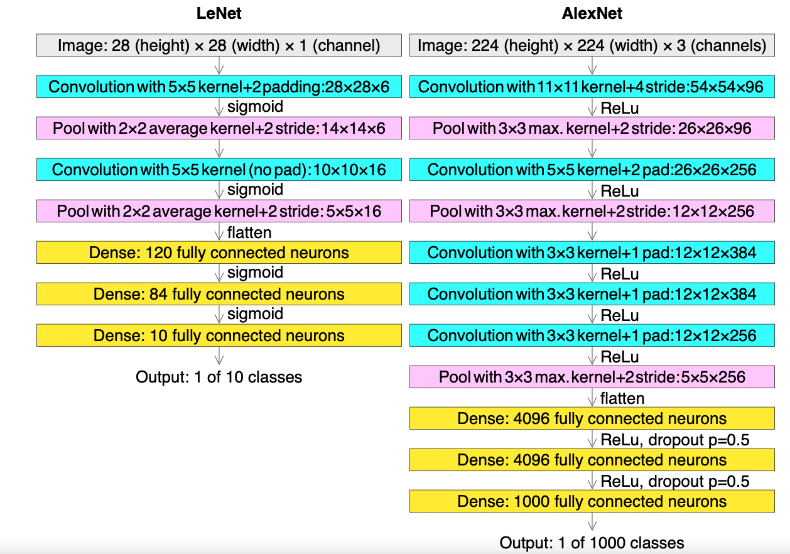

#### AlexNet (2012)

[ImageNet Classification with Deep Convolutional Neural Networks](https://papers.nips.cc/paper/2012/hash/c399862d3b9d6b76c8436e924a68c45b-Abstract.html)  
Alex Krizhevsky, Ilya Sutskever, Geoffrey Hinton (2012).  

They competed in the [ImageNet challenge](https://en.wikipedia.org/wiki/ImageNet) and achieved a remarkable result for the first time; that's when the deep learning hype started, or at least people started to pay attenton to deep learning.


Some features:

- 2 GPUs used, faster
- 1000 classes 
- ReLU used
- 8 layers and 3 max-pooling: 5 convolutional, 3 dense
- 60M parameters, 650k neurons
- Data augmentation used to prevent overfitting
- Dropout (p=0.5) in the first two dense layers
- Momentum = 0.9, weight decay = 0.0005

#### VGG-16 (2014)

[Very Deep Convolutional Networks for Large-Scale Image Recognition](https://arxiv.org/abs/1409.1556)  
Simonyan, Zisserman (2014).  
Visual Geometry Group, Oxford.

Some features:

- Smaller filters used (3x3): less paramaters, faster.
- More layers than AlexNet; the optimum amount is 16.


#### ResNet (2015)

[Deep Residual Learning for Image Recognition](https://arxiv.org/abs/1512.03385)  
Kaiming He, Xiangyu Zhang, Shaoqing Ren, Jian Sun

Look at this Medium article: [Review: ResNet, by Sik-Ho Tsang](https://towardsdatascience.com/review-resnet-winner-of-ilsvrc-2015-image-classification-localization-detection-e39402bfa5d8)

Deep learning neural networks have the **vanishing/exploding gradient problem**: since the error is backpropagated with chain multiplications, large or small values are magnified, thus, loosing information. This problem is more accute when the number of layers increases.

ResNets, in contrast, can have many layers but they avoid the vanishing/exploding gradient problem. They achieve that with skip/shortcut connections: inputs from previous layers are taken without any modifications.

ResNets applied of these important features:

1. **Skip/shortcut connections**: even with vanishing/exploding gradients the information is not lost, because the inputs from previous layers are preserved. However, the weights are optimized with the residual mapping (removing the previous input).

2. **Bottleneck design with 1x1 convolutions**: 1x1 convolutions preserve the WxH size of the feature map but can reduce its depth. Therefore, they can reduce complexity. With them, it is possible to addd more layers!

The result is that:

- Deeper netorks with less parameters: faster to train and use
- Increased accuracy

As we increase the layers, the accuracy increases, but the speed decreases; **ResNet-50 is a good trade-off**.

#### Inception v3 (2015)

[Rethinking the Inception Architecture for Computer Vision](https://arxiv.org/abs/1512.00567)  
Christian Szegedy, Vincent Vanhoucke, Sergey Ioffe, Jonathon Shlens, Zbigniew Wojna (2015)

Look at this Medium article: [Review: Inception-v3, by Sik-Ho Tsang](https://sh-tsang.medium.com/review-inception-v3-1st-runner-up-image-classification-in-ilsvrc-2015-17915421f77c)

They achieved a deep network (42 layers) with much less parameters.

The key concepts that made that possible are:

1. Batch normalization: the output of each batch is normalized (-mean, /std) to avoiddd the shifting of weights.

2. **Factorization**: they introduced this approach. Larger filters (eg., 5x5) are replaced by smaller ones (eg., 3x3) that work in parallel; then, result is concatenated. This reduces the number of parameters without decreasing the network efficiency.

#### DenseNet (2018)

[Densely Connected Convolutional Networks](https://arxiv.org/abs/1608.06993).  
Gao Huang, Zhuang Liu, Laurens van der Maaten, Kilian Q. Weinberger (2016/8)  

[Review: DenseNet, by Mukul Khanna](https://medium.com/towards-data-science/paper-review-densenet-densely-connected-convolutional-networks-acf9065dfefb)


The network targets the vanishing/exploding gradiengt problem, too.

The architecture is composed of dense blocks of layers. Each layer from a dense block receives feature maps from all preceding layers and these are fused through concatenation, not summation (in constrast to ResNets).

In consequence, the vanishing gradient is alleviated, while having deep networks with reduced number of parameters.

DenseNets have much less parameters than ResNets but achieve the same accuracy. See comparison diagram in the paper.

Reference DenseNet: DenseNet-121.

### Summary Examples (my notebooks, not in Udacity)

My notes of the [Udacity Deep Learning Nanodegree](https://www.udacity.com/course/deep-learning-nanodegree--nd101) have a folder/section in which the summary examples for Deep Learning using Pytorch are collected:

[deep_learning_udacity](https://github.com/mxagar/deep_learning_udacity) `/02_Pytorch_Guide/lab`.

Look at the `README.md` there.

## 6. Project 1: Facial Keypoint Detection

Original project repository: [P1_Facial_Keypoints](https://github.com/udacity/P1_Facial_Keypoints).  
Repository cloned to [P1_Facial_Keypoints](https://github.com/mxagar/P1_Facial_Keypoints.git).  

Given an image, predict 68 facial keypoints, each with `(x,y)` pixel coordinates:

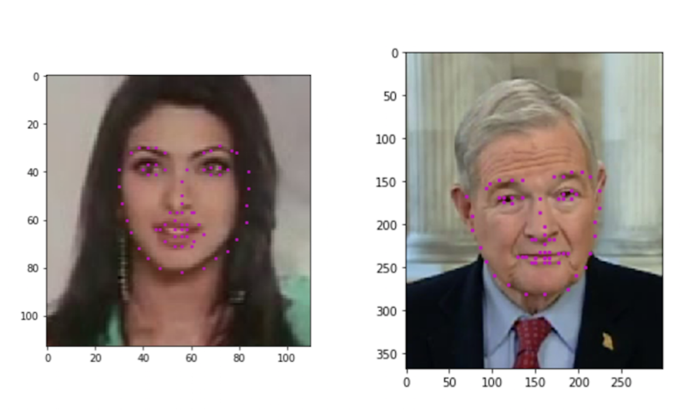

The [Youtub Faces Dataset](https://www.cs.tau.ac.il/~wolf/ytfaces/) is used. The dataset is in `./data/`:

- `train/` (3462 images)
- `traning_frames_keypoints.csv`
- `test/` (2308 images)
- `test_frames_keypoints.csv`

All files in the project folder:

- Notebook 1: Loading and Visualizing the Facial Keypoint Data
- Notebook 2: Defining and Training a Convolutional Neural Network (CNN) to Predict Facial Keypoints
- Notebook 3: Facial Keypoint Detection Using Haar Cascades and your Trained CNN
- Notebook 4: Fun Filters and Keypoint Uses
- Notebook 5: Submission instructions
- `models.py`

Notebooks which will be graded: 2 & 3; file graded: `model.py`.

Evaluation [rubric](https://review.udacity.com/#!/rubrics/1426/view):

- All files submitted and all questions answered: NB 2, NB 3, `model.py`	
- At least one convolutional layer, i.e. `self.conv1 = nn.Conv2d(1, 32, 5)`; start with 2 and increase if necessary.
- Take in grayscale, square images
- `data_transform`: rescaling/cropping, normalization, and turning input images into torch Tensors; normalized, square, grayscale image
- Select appropriate loss function and optimizer for training the mode (regression)
- Visualize the loss over time/epochs
- Save your best trained model
- Answer questions about model architecture
- Visualize one or more learned feature maps
- Answer question about feature visualization
- Use a Haar cascade face detector to detect faces
- Predict and display the keypoints on each face

Extra tasks:

- Initialize the weights of your CNN by sampling a normal distribution or by performing Xavier initialization so that a particular input signal does not get too big or too small as the network trains.
- In Notebook 4, create face filters that add sunglasses, mustaches, or any .png of your choice to a given face in the correct location.
- Use the keypoints around a person's mouth to estimate the curvature of their mouth and create a smile recognition algorithm.
- Use OpenCV's k-means clustering algorithm to extract the most common facial poses (left, middle, or right-facing, etc.).
- Use the locations of keypoints on two faces to swap those faces.
- Add a rotation transform to our list of transformations and use it to do data augmentation.

Submission notes:

- Intsructions in 5th NB in Udacity workspace
- If we work locally, upload files
- Hit "Submit Project" button

Udacity Workspace instructions:

- keep home < 2GB
- only home folder persists after sessions
- when submission home folder < 25MB
- check size with `du -h . | tail -1`
- do not waste GPU time; use GPU time for training
- if "Out of Memory" error, restart the kernel
- workspace connection stops after 30 mins of inactivity; if DL training performed, use `workspace_utils.py`:

```
Example using context manager:
	from workspace_utils import active_session
	with active_session():
		# do long-running work here
Example using iterator wrapper:
	from workspace_utils import keep_awake
	for i in keep_awake(range(5)):
	    # do iteration with lots of work here
```

- even with `workspace_utils`, set the Jupyter notebook to save after cell execution!

The data needs to be uploaded to the cloud workspace:

- zip the `data/` folder to be `data.zip`
- upload `data.zip` to the workspace
- open Terminal: `mkdir data && unzip data.zip -d /data`
- remove `data.zip` after it has been inflated: `rm -f data.zip`

Some interesting links:

- [Pytorch data loading tutorial](https://pytorch.org/tutorials/beginner/data_loading_tutorial.html)

### Important Learnings

- Convolutional ffilter should be odd-sized to have an anchor pixel and prevent aliasing
- It is better to use 3x3 filters than 5x5 filters, because:
	- 3x3 = 9, 5x5 = 25; 3x3 is faster because it has less parameters
	- Stacking 2 conv layers of 3x3 is equivalent to a conv layer with 5x5
- 1x1 conv layers are used as bottlenecks, i.e., to reduce the number of channels; thus, avoid them unless we need a bottleneck
- Usually, MaxPool2d is used with 2x2 size to halven the size of the feature map; pooling removes the artifacts on the boundaries, too!
- Always test if your weight initialization is better than the default; it might not be
- Face keypoint detection: reduce from 6 conv + 3 linear to 4 conv + 2 linear
- Adam is good to avoid saddle points / local optima
- Larger batch size values increase traning speed because more data points are processed in parallel, but they decrease the generalization capability, i.e., the final accuracy is decreased.

Interesting links provided by the reviewer:

- [An Intuitive Explanation of Convolutional Neural Networks](https://ujjwalkarn.me/2016/08/11/intuitive-explanation-convnets/)
- [Book Chapter: Practical Methodology, by Goodfellow](https://www.deeplearningbook.org/contents/guidelines.html)
- [Facial Keypoints Detection](https://www.kaggle.com/competitions/facial-keypoints-detection/data)
- [PyTorch Loss Functions: The Ultimate Guide](https://neptune.ai/blog/pytorch-loss-functions)
- [Facial keypoints detection using Neural Network](http://cs231n.stanford.edu/reports/2016/pdfs/007_Report.pdf)
- [Facial Keypoints Detection: An Effort to Top the Kaggle Leaderboard](https://www.ischool.berkeley.edu/projects/2015/facial-keypoints-detection-effort-top-kaggle-leaderboard)
- [VISUALIZING MODELS, DATA, AND TRAINING WITH TENSORBOARD](https://pytorch.org/tutorials/intermediate/tensorboard_tutorial.html)
- [Neural Architecture Search (NAS)- The Future of Deep Learning](https://theaiacademy.blogspot.com/2020/05/neural-architecture-search-nas-future.html)
- [How Hyperparameter Tuning Works](https://docs.aws.amazon.com/sagemaker/latest/dg/automatic-model-tuning-how-it-works.html)

### Forum Question: Project 1: Face Keypoint Detection - Losses Not Decreasing

#### Question

Hello,

I am working on the Project #1 of the Computer Vision Nanodegree and I am stuck with the CNN model that needs to be defined in `models.py`. I have solved all the other coding exercises without any problems, but I cannot find an architecture that yields descreasing losses when trained.

- I have tried the architecture sketched in the paper by Agarwal et al. (NaimishNet, linked in the notebooks) and some other - similar architectures, all based on LeNet, but I cannot manage to get decreasing losses.
- I have tried the usual recommendations to create different architectures, but all failed:
- I have added dropout (p varying from 0.1 to 0.6)
- I have added batch normalization (in the first convolutional layers)
- I have decreased and increased the learning rate (always in a range of 0.0003 and 0.1)
- I have applied Xavier initialization
- I have used different loss functions: MSE, SmoothL1
- I have increased the number of layers and parameters (all model variations have between 20M - 40M trained parameters)

I perform a cross-validation run after every epoch and I store the history of the training and validation loss. In all cases, the loss values oscillate around their initial value.

In the following, I attach two example models I have tried and their results.

My repository can be found at:
https://github.com/mxagar/P1_Facial_Keypoints

Please, could you please help me?

Thank you,
Mikel

```
### Model 1

Net(
(conv1): Conv2d(1, 32, kernel_size=(5, 5), stride=(1, 1))
(pool1): MaxPool2d(kernel_size=2, stride=2, padding=0, dilation=1, ceil_mode=False)
(conv2): Conv2d(32, 64, kernel_size=(5, 5), stride=(1, 1))
(pool2): MaxPool2d(kernel_size=2, stride=2, padding=0, dilation=1, ceil_mode=False)
(conv3): Conv2d(64, 128, kernel_size=(3, 3), stride=(1, 1))
(pool3): MaxPool2d(kernel_size=2, stride=2, padding=0, dilation=1, ceil_mode=False)
(conv4): Conv2d(128, 256, kernel_size=(2, 2), stride=(1, 1))
(pool4): MaxPool2d(kernel_size=2, stride=2, padding=0, dilation=1, ceil_mode=False)
(conv5): Conv2d(256, 512, kernel_size=(1, 1), stride=(1, 1))
(pool5): MaxPool2d(kernel_size=2, stride=2, padding=0, dilation=1, ceil_mode=False)
(dropout5): Dropout(p=0.5, inplace=False)
(conv6): Conv2d(512, 1024, kernel_size=(1, 1), stride=(1, 1))
(pool6): MaxPool2d(kernel_size=2, stride=2, padding=0, dilation=1, ceil_mode=False)
(dropout6): Dropout(p=0.5, inplace=False)
(linear1): Linear(in_features=9216, out_features=2000, bias=True)
(dropout7): Dropout(p=0.5, inplace=False)
(linear2): Linear(in_features=2000, out_features=500, bias=True)
(dropout8): Dropout(p=0.5, inplace=False)
(linear3): Linear(in_features=500, out_features=136, bias=True)
)

- Number of parameters: 20416812
- Xavier initialization
- criterion = nn.MSELoss()
- optimizer = optim.Adam(net.parameters(), lr=0.001)

Training output:
Epoch: 1, Training Loss: 0.020920200698434928, Validation Loss: 0.020428773799499908
Epoch: 2, Training Loss: 0.020777514237740494, Validation Loss: 0.020857440999576024
Epoch: 3, Training Loss: 0.020643692263490818, Validation Loss: 0.021000844859457635
Epoch: 4, Training Loss: 0.02084479694900865, Validation Loss: 0.01977874156716582
...
Epoch: 28, Training Loss: 0.021002676878135236, Validation Loss: 0.01979653277954498
Epoch: 29, Training Loss: 0.02087379113950184, Validation Loss: 0.01936164227398959
Epoch: 30, Training Loss: 0.02093802300372749, Validation Loss: 0.019763932057789393
Finished Training!

### Model 2

Net(
(conv1): Conv2d(1, 32, kernel_size=(5, 5), stride=(1, 1))
(pool1): MaxPool2d(kernel_size=2, stride=2, padding=0, dilation=1, ceil_mode=False)
(conv2): Conv2d(32, 32, kernel_size=(3, 3), stride=(1, 1))
(pool2): MaxPool2d(kernel_size=2, stride=2, padding=0, dilation=1, ceil_mode=False)
(conv3): Conv2d(32, 64, kernel_size=(3, 3), stride=(1, 1))
(pool3): MaxPool2d(kernel_size=2, stride=2, padding=0, dilation=1, ceil_mode=False)
(conv4): Conv2d(64, 64, kernel_size=(1, 1), stride=(1, 1))
(pool4): MaxPool2d(kernel_size=2, stride=2, padding=0, dilation=1, ceil_mode=False)
(fc1): Linear(in_features=10816, out_features=4096, bias=True)
(fc1_dropout): Dropout(p=0.5)
(fc2): Linear(in_features=4096, out_features=1024, bias=True)
(fc2_dropout): Dropout(p=0.5)
(fc3): Linear(in_features=1024, out_features=136, bias=True)
)

- Number of parameters: 48673896
- Xavier initialization
- criterion = nn.SmoothL1Loss()
- optimizer = optim.Adam(net.parameters(), lr=0.0003)

Training output:
Epoch: 1, Batch: 10, Avg. Loss: 0.2838428482413292
Epoch: 1, Batch: 20, Avg. Loss: 0.3179457187652588
Epoch: 1, Batch: 30, Avg. Loss: 0.29876292794942855
...
Epoch: 39, Batch: 100, Avg. Loss: 0.31495306342840196
Epoch: 39, Batch: 110, Avg. Loss: 0.27538169324398043
Epoch: 39, Batch: 120, Avg. Loss: 0.2962385803461075
Epoch: 39, Batch: 130, Avg. Loss: 0.29411947876214983
```

#### Answer

Hi Mikel S,

The one issue I see is with the kernel sizes in the convolution layers.

	self.conv1=nn.Conv2d(1, 32, 5)
	self.conv2=nn.Conv2d(32, 64, 5)
	self.conv3=nn.Conv2d(64, 128, 3)
	self.conv4=nn.Conv2d(128, 256, 2)
	self.conv5=nn.Conv2d(256, 512, 1)
	self.conv6=nn.Conv2d(512, 1024, 1)

The kernel size in conv1 and conv2 is 5x5, and conv3 is 3x3. This is fine.
But I would like to know why you chose 2x2 for conv4, and 1x1 for conv5 and conv6??

Let me explain a little bit about choosing kernel size.

The odd size(3, 5, 7) kernels in convolution layers captures spatial information efficiently since they have a central pixel/data as reference. 3x3 kernel size achieves this while maintaining good performance over larger kernel sizes. Hence, using 3x3 instead of 5x5 improves the performance of the model. In fact 2 layers with 3x3 kernels is same as 1 layer with 5x5 kernel.

1x1 is used as bottleneck layers in huge networks and may not be necessary in this small model.
2x2 kernels are used mostly in pooling layers, there is some information loss or information filter that happens in pooling. Hence choosing a smaller window is better in this case.

There may not be any hard and fast rule in the choice of kernel sizes but this does affect the performance and even accuracy of a model.

More Info:

https://medium.com/analytics-vidhya/significance-of-kernel-size-200d769aecb1

https://datascience.stackexchange.com/questions/23183/why-convolutions-always-use-odd-numbers-as-filter-size

The other point is about weight initialization, you have the custom initialize_weights() which is fine. In most model the default initialization available with packages like Pytorch perform well. When you have a custom weight initialization you should have a strong reason and be sure that it is performing better than the default weight initialization. So please test with both to be sure, keep the other parameters and design constant.

Next point is the number of layers. You have 6 convolution layers and 3 linear layers. Having more layers and parameters help only to certain extent. The training time/epochs will depend on the number of trainable parameters as well. More parameters will take more time and resources to train. I recommend 4 convolution layers and 2 Linear layers.


#### Follow Up

Dear Meera,

Thank you very much for your recommendations and the informative links.

I have applied what you told me, but the loss keeps oscillating around the initial value without significant improvements.

Here is a list of all the changes I made:

- I changed the architecture to be a sequence of 4 convolution layers and 2 linear layers; dropout is in the last 4 layers, but I removed batch normalization from the initial layers.
- I commented out my Xavier initialization.
- I simplified the `train_net` function to the original one (+ tracking of the loss), in case the validation pass I added was causing the missbehavior.

You can find my latest architecture version and the training output in the following Github link:

https://github.com/mxagar/P1_Facial_Keypoints

Below, I add the summary of the architecture.

Could you please try it on your machine and tell me if you replicate the results? What should I try?

Thank you again,
Mikel

Hi Meera,

Before you try it, I think I might have solved the issue. The switch `model.eval()` and the use of CUDA seem to behave strangely.
I re-wrote my validation function inside the training function and added this line before running the training

	torch.backends.cudnn.enabled = False

... and now everything works with any model architecture I have defined previously. I cannot replicate everything 100% so as to point to the real cause, but maybe you should keep this comments documented in case someone falls into the same situation when using GPUs.

More info:

https://stackoverflow.com/questions/48445942/pytorch-training-with-gpu-gives-worse-error-than-training-the-same-thing-with-c

https://discuss.pytorch.org/t/when-should-we-set-torch-backends-cudnn-enabled-to-false-especially-for-lstm/106571

Thank you again,
Mikel