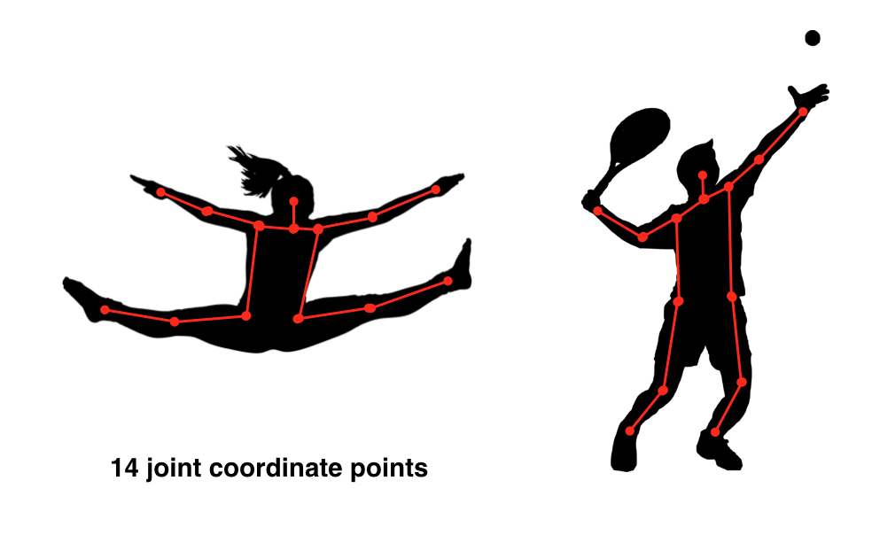

# Udacity Computer Vision Nanodegree: Introduction

These are my personal notes taken while following the [Udacity Computer Vision Nanodegree](https://www.udacity.com/course/computer-vision-nanodegree--nd891).

The nanodegree is composed of six modules:

1. Introduction to Computer Vision
2. Cloud Computing (Optional)
3. Advanced Computer Vision and Deep Learning
4. Object Tracking and Localization
5. Extra Topics: C++ Programming

Each module has a folder with its respective notes.
This folder/file refers to the **third** module: **Advanced Computer Vision and Deep Learning**.

Note that:

- I made many hand-written nortes, which I will scan and push to this repostory.
- I forked the Udacity repositors for the exercises; all the material and  notebooks are there:
	- [CVND_Exercises](https://github.com/mxagar/CVND_Exercises)
	- [DL_PyTorch](https://github.com/mxagar/DL_PyTorch)

Mikel Sagardia, 2022.
No guarantees.

## Practical Installation Notes

I basically followed the installation & setup guide from [CVND_Exercises](https://github.com/mxagar/CVND_Exercises), which can be summarized with the following commands:

```bash
# Create new conda environment to be used for the nanodegree
conda create -n cvnd python=3.6
conda activate cvnd
conda install pytorch torchvision -c pytorch
conda install pip
#conda install -c conda-forge jupyterlab
# Go to the folder where the Udacity DL exercises are cloned, after forking the original repo
cd ~/git_repositories/CVND_Exercises
pip install -r requirements.txt
# I had some issues with numpy and torch
pip uninstall numpy
pip uninstall mkl-service
pip install numpy
pip install mkl-service
```

## Overview of Contents

1. Advanced CNN Architectures
2. YOLO: You Only Look Once
3. Recursive Neural Networks (RNN)
4. Long Short-Term Memory Networks (LSTM)
5. Hyperparameters
6. Attention Mechanisms
7. Image Captioning
8. Project: Image Captioning

## 1. Advanced CNN Architectures

Common CNN architectures defined so far apply convolutional layers to an image with an object to obtain a feature vector that is processed by fully connected layer to yield class probabilities.


However, real world images contain several objects that overlap and we want to locate them on the same image. Additionally, visual information can be related to text or language information, too. This section deals with architectures that allow that:

- Object detection: R-CNN, YOLO; they detect the bounding boxes of the objects and the they classify them.
- Recurrect Neural Networks (RNN): LSTM; they are able to predict sequences of objects, like text.

### 1.1 Object Detection: Localization

Object detection is basically object **localization** in an image: a bounding box is predicted around the object, together with its class. The bounding box is defined with its center and size: `(x,y,w,h)`. By working with bounding box centers and sizes, we can estimate the distances between the objects (useful for self-driving cars) or the relative semantic postion: behind, in, etc.

One way of predicting bounding boxes consists in adding additional fully connected layers to the feature vector generated by the convolutional layers so that the tuple `(x,y,w,h)` is predicted by regression.


### 1.2 Bounding Boxes and Regression

While **cross-entropy loss** is good for classification, regression requires other loss or error computations:

- L1 loss: `(1/n) * sum(abs(y_i - y_pred_i))`
- L2 loss, or (root) mean squared error: `(1/n) * sum((y_i - y_pred_i)^2)`; note that large errors are amplified.
- [Smoooth L1 loss](https://pytorch.org/docs/stable/generated/torch.nn.SmoothL1Loss.html#torch.nn.SmoothL1Loss): for large errors, L1 is used, for small errors, L2; thus, the goal is to avoid amplifying large errors. See the documentation.

Note that the regression problem of predicting a bounding box `(x,y,w,h)` can be extended to any fixed point cloud prediction, for instance: [face keypoint detection](https://github.com/mxagar/P1_Facial_Keypoints) or human pose estimation.



In the case of object detection, we now have two losses:

1. Classification loss, e.g., cross-entropy.
2. Regression loss, e.g., L1.

We need to use them both to perform backpropagation; this is often done by summing them up witha weighting factor, which is an added hyperparameter:

`loss = w_c *  classification_loss + w_r * regression_loss`

An option would be to have `w_c = w_r = 0.5`; however, it is usually considered as a hyperparaneter
 to be discovered with the cross-validation split.

### 1.3 Region Proposals: R-CNN

Another challenge in object detection is that we have a variable number of outputs; we don't know the exact number of boxes / objects in the image beforehand. A naive approach would consist in sweeping a window in the image to analyze many cropped image patches, however, that is very expensive.

Instead, **region proposals** were introduced: tradictional image processing techniques are used to identify regions that:

- have many edges
- have same texture
- are enclosed by teh same boundary
- etc.

Thus, with region proposal algorithms we get a set of possible object regions, aka **Regions of Interest (ROI**); many are noise, but the objects will be found there, too!


The least sophisticated architecture for object detection is **R-CNN, Region-CNN**: for every input ROI from the region proposal algorithm, it outputs (1) a bounding box and (2) class scores. R-CNNs have  a class called `background`, which is associated for any ROIs containing noise.

Cropped input ROIs need to be processed as always (resize/warp to a standard size, etc.). Note that ROIs are already a bounding box, but the real bounding box does not need to be exactly that of the cropping.

Even though the R-CNN is better than the naive approach with the sliding window, it still is slow, since many ROIs need to be processed for often few objects in the scene.

### 1.4 Fast R-CNN

Instead of feeding each cropped ROI to the CNN individually, Fast R-CNNs convolute the entire image once and project the ROIs on the last set of feature maps before the fully connected layers.

Then, each ROI is warped to a fixed size using **ROI pooling** so that it can be fed to the fully connected layers, which, as before: (1) classify the object and (2) regress the position of its bounding box.


**ROI pooling** takes in a rectangular region of any size, performs a maxpooling operation on that region in pieces such that the output is a fixed shape.

Nice animation of how ROI pooling works from [deppsense.ai](https://blog.deepsense.ai/region-of-interest-pooling-explained/):


Fast R-CNN is 10x faster to train than R-CNN; its test time is dominated by the suggestion of ROIs.

### 1.5 Faster R-CNN

A way of speeding up the Fast R-CNN consists in using a separate network that suggests ROIs; in other words, we attack the bottleneck we had beforehand.

The steps are the following:

- The image is convoluted until a given layer, which produces a set of feature maps.
- Instead of projecting ROIs on those feature maps, we feed them to a separate network which predicts possible ROIs: these are called **Region Proposal Networks**; if edges or other relevant features have been detected, ROIs that enclose them will emerge.
- The ROI proposals are passed to the original network, which performs a quick binary check: does the ROI contain an object or not? If so, the ROI is taken.
- After that, the network continues as in Fast R-CNN: ROI pooling is applied and a fully connected network predicts classes and bounding boxes.

Thus, the difference is in the ROIs: instead of projecting them after applying classical algorithms, a Region Proposal Network is used with the feature maps. The Faster R-CNNs are the fastest R-CNN networks.

#### Region Proposal Networks

How do the Region Proposal Networks (RPN) from Faster R-CNN work?

They work in a similar fashion as the YOLO network does; see the next section on [YOLO](#-2.-YOLO:-You-Only-Look-Once).

The basic principle is as follows:

- A small (usually 3x3) window is slided on the feature maps. I understand that 3x3 means the stride in both axes, since I don't see how the content of the window is used otherwise.
- `k` anchor boxes are applied on each window. These anchor boxes are pre-defined boxes with different aspect ratios.
- For each `k` boxes in each window, the probability of it containing an object is measured. If it's higher than a threshold, the anchor box is suggested as a ROI.

During training, the ground truth is given by the real boudning box: if the suggested ROI overlaps considerably with a true bounding box, the suggestion is correct.

Very interesting link on the topic: [Deep Learning for Object Detection: A Comprehensive Review](https://towardsdatascience.com/deep-learning-for-object-detection-a-comprehensive-review-73930816d8d9)

A Github repo with a peer reviewed implementation of the Faster R-CNN: [
faster-rcnn.pytorch](https://github.com/jwyang/faster-rcnn.pytorch)

## 2. YOLO: You Only Look Once

There are some alternatives to R-CNN networks that came out around the same time:

- YOLO: You Only Look Once
- SSD: Single Shot Detection

This section analyzes YOLO. Look in at the literature folder for the paper.

The advantage of YOLO is that it works in realtime! Thus, it prioritizes fast object detection and it can be used in applications such like self-driving cars. In addition to localizing the bounding boxes, some important object types/classes are predicted: pedestrians, traffic lights, vehicles, etc.

As explained in the previous section, object detection networks perform classification and regression tasks. Instead of seggregating both tasks into separate outputs, we can compile them both into a single vector. For instance, if we want to find 3 classes of objects, the output vector would be:

`[p_c, c_1, c_2, c_3, x, y, w, h]`, where

- `p_c = [0,1]`: probability of the box of containing an object
- `c_1, c_2, c_3`: probabilities of the object being oc class 1-3
- `x, y, w, h`: location and size of the bounding box

### 2.1 Sliding Windows

Faster R-CNNs work with a sliding window of small stride and varying window sizes to detect possible regions that contain object candidates. Those windows are set over anchor points defined by the stride we use.

Sliding a window and testing different bounding boxes is very expensive; additionally, we can take into account the following observation:

- The different bounding boxes we test overlap with each other.
- If we overlap all bounding boxes in all the anchor points, we get a (non-uniform) grid.

Thus, it makes sense to use the whole image once with a grid of non-overlapping cells on it! YOLO uses a grid instead of sliding windows, in addition to two other techniques, known as **Intersection Over Union** and **Non-Maximal Suppression**. Those techniques are one of the reasons why YOLO works so well.

### 2.2 Grids insted of Sliding Windows

In YOLO, the image is tesselated in a uniform grid. Each grid cell contains the aforementioned information:

- The probability of the cell to contain an object: *objectness*.
- One probability value for each of the object classes.
- The location and size of the object bounding box.

Additionally, all continuous values are normalized to the `[0,1]` region:

- Location of the center of bounding box `(x,y)`: in coordinates relative to the cell.
- Size of the boundingbox `(w,h)`: in relative size of the image.

This normalization improves the training convergence.

Thus, if we have 3 object classes in a grid of `W x H` cells, we have a final classification map of 8 channels; concretely, the final size/volume will be:

`Volume = W x H x 8`,

where the size of 8 for the channels comes from the vector:

`g_ij = [p_c, c_1, c_2, c_3, x, y, w, h]`, for each cell `(i,j)`.

When there is no object in a cell, the value the the objectness should be 0, and the rest of values are ignored. When `p_c -> 1`, we start looking at the other values.


In order to train a network with such an output, we need to create such a ` W x H x 8` ground truth tensor for each image.

#### Ground Truth Bounding Boxes

Even though several grid cells overlap with the real bounding box, only the cell which contains the center of the bounidng box is asssigned with the bounding box values:

- Objectness `p_c = 1`.
- Center `(x,y)`: with coordinates relative to the cell.
- Size `(w,h)`: with size relative to the complete image size.

IMPORTANT: **if the center of the ground truth bounding box is not in a cell, even though the cell is overlapped by the bounding box, its `p_c = 0`**.


### 2.3 Intersection over Union (IoU) and Non-Maximal Supression

The architecture explained so far outputs too many bounding boxes for the same object candidate if we have a fine grid (as we sould have).

Thus, we need to select the best candidates; that is done with **Intersection over Union (IoU) and Non-Maximal Supression**.


The **Intersection over the union** between two bounding boxesis computed as follows:

`IoU = area of intersection / area of union = [0,1]`.


**Non-Maximal Supression** works with the following steps:

1. Go through all cells and take the ones which have `p_c > nms_thres = 0.6` (or a value of choice).
2. Take the cell with the largest `p_c`.
3. Compute the IoUs of the other bounding boxes with respect to the one with the largest `p_c`.
4. Remove all bounding boxes which have a high IoU value, e.g., `IoU >= iou_thres = 0.4`.
5. Repeat from step 2 using the cells that are remaining.

Note that in case of oveerlap, this algorithm would not work, since the overlapping object would default to one.

In order to work with overlapping objects, we use **anchor boxes**.

#### Anchor Boxes

It can happen that one grid cell contains the centers of two bounding boxes for two different objects that overlap in the image; for instance, a person entereing a car.

In order to deal with that we can define object specific **anchor boxes** that are associated with a pre-defined aspect ratio:

- Anchor box 1: large and wide (car)
- Anchor box 2: medium and tall (person)
- ...

The number of channels is multiplied by the number of anchor boxes `n`. That ways, for labelling, the segment of the output vector which corresponds to the anchor box with the largest IoU with the ground truth is filled.


We can define as many anchor boxes as we want. Note that:

- We limit the amount of possible overlapping objects to the number of anchor boxes.
- To be detected, the overlapping objects should be associated with the size and aspect ratio of one of the anchor boxes.
- Thus, several overlapping objects of the same class are difficult to detect, unless we have foreseen several similar anchor boxes.

However, note that anchor boxes work on the cell level; that is, we can define a fine enough grid so that overlapping bounding box centers are fairly few!

In that way, we define few anchor boxes of significant sizes and YOLO runs nicely.

[Medium post on Anchor Boxes](https://vivek-yadav.medium.com/part-1-generating-anchor-boxes-for-yolo-like-network-for-vehicle-detection-using-kitti-dataset-b2fe033e5807).

### 2.4 Final YOLO Algorithm

This section summarizes the content of the YOLO notebook in the exercises repository:

[CVND_Exercises](https://github.com/mxagar/CVND_Exercises) `/2_2_YOLO`

Note that YOLO uses [Darknet](https://pjreddie.com/darknet/), a C implementation for deep neural networks. The YOLO nerual network architecture is described in `cfg/` and the weights need to be downloaded separately; they are located in `weights/` but not committed, due to their large size (almost 250 MB).

The weights were trained with the [Common Objects in Context (COCO) dataset](https://cocodataset.org/), which contains more than 200k labelled images with 80 object categories.

There is a simplified Pytorch implementation of the model in `darknet.py`; simplified, because training is not implemented, just forward passes. Additionally, the script `utils.py` contains some helper functions for:

- IoU computation
- Non-maximum supression
- Model forward pass to detect objects
- Plotting boxes
- etc.

Test images are in `images/` and everything is controled from the notebook `YOLO.ipynb`.

In the notebook, we can print how the YOLO v3 architecture is; some notes:

- The input size is 416 x 416 x 3
- The output size is 52 x 52 x 255
	- Grid: 52 x 52
	- Channels: 255; these contain the bounding box and class vectors
- There are 100+ layers!
	- Most of the layers are convolutions: 3x3, 1x1; number of filters vary: 32 - 1024 and pooling is applied every 2-3 convolutions.
	- There are shortcut and routing layers too.

For more information, check this blog post: [How to implement a YOLO (v3) object detector from scratch in PyTorch](https://blog.paperspace.com/how-to-implement-a-yolo-object-detector-in-pytorch/).

Also, look at the YOLO v1 & v3 papers in the `litearture/` folder.


