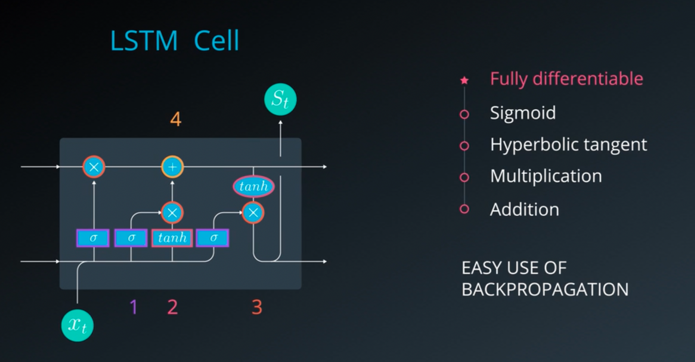

# Udacity Computer Vision Nanodegree: Advanced CV and DL

These are my personal notes taken while following the [Udacity Computer Vision Nanodegree](https://www.udacity.com/course/computer-vision-nanodegree--nd891).

The nanodegree is composed of six modules:

1. Introduction to Computer Vision
2. Cloud Computing (Optional)
3. Advanced Computer Vision and Deep Learning
4. Object Tracking and Localization
5. Extra Topics: C++ Programming

Each module has a folder with its respective notes.
This folder/file refers to the **third** module: **Advanced Computer Vision and Deep Learning**.

Note that:

- I made many hand-written nortes, which I will scan and push to this repostory.
- I forked the Udacity repositors for the exercises; all the material and notebooks are there:
	- [CVND_Exercises](https://github.com/mxagar/CVND_Exercises)
	- [DL_PyTorch](https://github.com/mxagar/DL_PyTorch)
- The sections related to the Recurrent Neural Networks (RNNs) have a large overlap with the [Udacity Deep Learning Nanodegree](https://www.udacity.com/course/deep-learning-nanodegree--nd101), for which I have a repostory with notes, too: [deep_learning_udacity](https://github.com/mxagar/deep_learning_udacity). There is also a forked DL exercise repo, too:
	- [deep-learning-v2-pytorch](https://github.com/mxagar/deep-learning-v2-pytorch)

Mikel Sagardia, 2022.
No guarantees.

## Practical Installation Notes

I basically followed the installation & setup guide from [CVND_Exercises](https://github.com/mxagar/CVND_Exercises), which can be summarized with the following commands:

```bash
# Create new conda environment to be used for the nanodegree
conda create -n cvnd python=3.6
conda activate cvnd
conda install pytorch torchvision -c pytorch
conda install pip
#conda install -c conda-forge jupyterlab
# Go to the folder where the Udacity DL exercises are cloned, after forking the original repo
cd ~/git_repositories/CVND_Exercises
pip install -r requirements.txt
# I had some issues with numpy and torch
pip uninstall numpy
pip uninstall mkl-service
pip install numpy
pip install mkl-service
```

## Overview of Contents

1. [Advanced CNN Architectures]()
2. [YOLO: You Only Look Once]()
3. [Recursive Neural Networks (RNN)]()
4. [Long Short-Term Memory Networks (LSTM)]()
5. [Implementation of RNNs and LSTMs]()
6. [Hyperparameters]()
7. [Attention Mechanisms]()
8. [Image Captioning]()
9. [Project: Image Captioning]()

## 1. Advanced CNN Architectures

Common CNN architectures defined so far apply convolutional layers to an image with an object to obtain a feature vector that is processed by fully connected layer to yield class probabilities.


However, real world images contain several objects that overlap and we want to locate them on the same image. Additionally, visual information can be related to text or language information, too. This section deals with architectures that allow that:

- Object detection: R-CNN, YOLO; they detect the bounding boxes of the objects and the they classify them.
- Recurrect Neural Networks (RNN): LSTM; they are able to predict sequences of objects, like text.

### 1.1 Object Detection: Localization

Object detection is basically object **localization** in an image: a bounding box is predicted around the object, together with its class. The bounding box is defined with its center and size: `(x,y,w,h)`. By working with bounding box centers and sizes, we can estimate the distances between the objects (useful for self-driving cars) or the relative semantic postion: behind, in, etc.

One way of predicting bounding boxes consists in adding additional fully connected layers to the feature vector generated by the convolutional layers so that the tuple `(x,y,w,h)` is predicted by regression.


### 1.2 Bounding Boxes and Regression

While **cross-entropy loss** is good for classification, regression requires other loss or error computations:

- L1 loss: `(1/n) * sum(abs(y_i - y_pred_i))`
- L2 loss, or (root) mean squared error: `(1/n) * sum((y_i - y_pred_i)^2)`; note that large errors are amplified.
- [Smoooth L1 loss](https://pytorch.org/docs/stable/generated/torch.nn.SmoothL1Loss.html#torch.nn.SmoothL1Loss): for large errors, L1 is used, for small errors, L2; thus, the goal is to avoid amplifying large errors. See the documentation.

Note that the regression problem of predicting a bounding box `(x,y,w,h)` can be extended to any fixed point cloud prediction, for instance: [face keypoint detection](https://github.com/mxagar/P1_Facial_Keypoints) or human pose estimation.


In the case of object detection, we now have two losses:

1. Classification loss, e.g., cross-entropy.
2. Regression loss, e.g., L1.

We need to use them both to perform backpropagation; this is often done by summing them up witha weighting factor, which is an added hyperparameter:

`loss = w_c *  classification_loss + w_r * regression_loss`

An option would be to have `w_c = w_r = 0.5`; however, it is usually considered as a hyperparaneter
 to be discovered with the cross-validation split.

### 1.3 Region Proposals: R-CNN

Another challenge in object detection is that we have a variable number of outputs; we don't know the exact number of boxes / objects in the image beforehand. A naive approach would consist in sweeping a window in the image to analyze many cropped image patches, however, that is very expensive.

Instead, **region proposals** were introduced: tradictional image processing techniques are used to identify regions that:

- have many edges
- have same texture
- are enclosed by teh same boundary
- etc.

Thus, with region proposal algorithms we get a set of possible object regions, aka **Regions of Interest (ROI**); many are noise, but the objects will be found there, too!


The least sophisticated architecture for object detection is **R-CNN, Region-CNN**: for every input ROI from the region proposal algorithm, it outputs (1) a bounding box and (2) class scores. R-CNNs have  a class called `background`, which is associated for any ROIs containing noise.

Cropped input ROIs need to be processed as always (resize/warp to a standard size, etc.). Note that ROIs are already a bounding box, but the real bounding box does not need to be exactly that of the cropping.

Even though the R-CNN is better than the naive approach with the sliding window, it still is slow, since many ROIs need to be processed for often few objects in the scene.

### 1.4 Fast R-CNN

Instead of feeding each cropped ROI to the CNN individually, Fast R-CNNs convolute the entire image once and project the ROIs on the last set of feature maps before the fully connected layers.

Then, each ROI is warped to a fixed size using **ROI pooling** so that it can be fed to the fully connected layers, which, as before: (1) classify the object and (2) regress the position of its bounding box.


**ROI pooling** takes in a rectangular region of any size, performs a maxpooling operation on that region in pieces such that the output is a fixed shape.

Nice animation of how ROI pooling works from [deppsense.ai](https://blog.deepsense.ai/region-of-interest-pooling-explained/):


Fast R-CNN is 10x faster to train than R-CNN; its test time is dominated by the suggestion of ROIs.

### 1.5 Faster R-CNN

A way of speeding up the Fast R-CNN consists in using a separate network that suggests ROIs; in other words, we attack the bottleneck we had beforehand.

The steps are the following:

- The image is convoluted until a given layer, which produces a set of feature maps.
- Instead of projecting ROIs on those feature maps, we feed them to a separate network which predicts possible ROIs: these are called **Region Proposal Networks**; if edges or other relevant features have been detected, ROIs that enclose them will emerge.
- The ROI proposals are passed to the original network, which performs a quick binary check: does the ROI contain an object or not? If so, the ROI is taken.
- After that, the network continues as in Fast R-CNN: ROI pooling is applied and a fully connected network predicts classes and bounding boxes.

Thus, the difference is in the ROIs: instead of projecting them after applying classical algorithms, a Region Proposal Network is used with the feature maps. The Faster R-CNNs are the fastest R-CNN networks.

#### Region Proposal Networks

How do the Region Proposal Networks (RPN) from Faster R-CNN work?

They work in a similar fashion as the YOLO network does; see the next section on [YOLO](#-2.-YOLO:-You-Only-Look-Once).

The basic principle is as follows:

- A small (usually 3x3) window is slided on the feature maps. I understand that 3x3 means the stride in both axes, since I don't see how the content of the window is used otherwise.
- `k` anchor boxes are applied on each window. These anchor boxes are pre-defined boxes with different aspect ratios.
- For each `k` boxes in each window, the probability of it containing an object is measured. If it's higher than a threshold, the anchor box is suggested as a ROI.

During training, the ground truth is given by the real boudning box: if the suggested ROI overlaps considerably with a true bounding box, the suggestion is correct.

Very interesting link on the topic: [Deep Learning for Object Detection: A Comprehensive Review](https://towardsdatascience.com/deep-learning-for-object-detection-a-comprehensive-review-73930816d8d9)

A Github repo with a peer reviewed implementation of the Faster R-CNN: [
faster-rcnn.pytorch](https://github.com/jwyang/faster-rcnn.pytorch)

## 2. YOLO: You Only Look Once

There are some alternatives to R-CNN networks that came out around the same time:

- YOLO: You Only Look Once
- SSD: Single Shot Detection

This section analyzes YOLO. Look in at the literature folder for the paper.

The advantage of YOLO is that it works in realtime! Thus, it prioritizes fast object detection and it can be used in applications such like self-driving cars. In addition to localizing the bounding boxes, some important object types/classes are predicted: pedestrians, traffic lights, vehicles, etc.

As explained in the previous section, object detection networks perform classification and regression tasks. Instead of seggregating both tasks into separate outputs, we can compile them both into a single vector. For instance, if we want to find 3 classes of objects, the output vector would be:

`[p_c, c_1, c_2, c_3, x, y, w, h]`, where

- `p_c = [0,1]`: probability of the box of containing an object
- `c_1, c_2, c_3`: probabilities of the object being oc class 1-3
- `x, y, w, h`: location and size of the bounding box

### 2.1 Sliding Windows

Faster R-CNNs work with a sliding window of small stride and varying window sizes to detect possible regions that contain object candidates. Those windows are set over anchor points defined by the stride we use.

Sliding a window and testing different bounding boxes is very expensive; additionally, we can take into account the following observation:

- The different bounding boxes we test overlap with each other.
- If we overlap all bounding boxes in all the anchor points, we get a (non-uniform) grid.

Thus, it makes sense to use the whole image once with a grid of non-overlapping cells on it! YOLO uses a grid instead of sliding windows, in addition to two other techniques, known as **Intersection Over Union** and **Non-Maximal Suppression**. Those techniques are one of the reasons why YOLO works so well.

### 2.2 Grids insted of Sliding Windows

In YOLO, the image is tesselated in a uniform grid. Each grid cell contains the aforementioned information:

- The probability of the cell to contain an object: *objectness*.
- One probability value for each of the object classes.
- The location and size of the object bounding box.

Additionally, all continuous values are normalized to the `[0,1]` region:

- Location of the center of bounding box `(x,y)`: in coordinates relative to the cell.
- Size of the boundingbox `(w,h)`: in relative size of the image.

This normalization improves the training convergence.

Thus, if we have 3 object classes in a grid of `W x H` cells, we have a final classification map of 8 channels; concretely, the final size/volume will be:

`Volume = W x H x 8`,

where the size of 8 for the channels comes from the vector:

`g_ij = [p_c, c_1, c_2, c_3, x, y, w, h]`, for each cell `(i,j)`.

When there is no object in a cell, the value the the objectness should be 0, and the rest of values are ignored. When `p_c -> 1`, we start looking at the other values.


In order to train a network with such an output, we need to create such a ` W x H x 8` ground truth tensor for each image.

#### Ground Truth Bounding Boxes

Even though several grid cells overlap with the real bounding box, only the cell which contains the center of the bounidng box is asssigned with the bounding box values:

- Objectness `p_c = 1`.
- Center `(x,y)`: with coordinates relative to the cell.
- Size `(w,h)`: with size relative to the complete image size.

IMPORTANT: **if the center of the ground truth bounding box is not in a cell, even though the cell is overlapped by the bounding box, its `p_c = 0`**.


### 2.3 Intersection over Union (IoU) and Non-Maximal Supression

The architecture explained so far outputs too many bounding boxes for the same object candidate if we have a fine grid (as we sould have).

Thus, we need to select the best candidates; that is done with **Intersection over Union (IoU) and Non-Maximal Supression**.


The **Intersection over the union** between two bounding boxesis computed as follows:

`IoU = area of intersection / area of union = [0,1]`.


**Non-Maximal Supression** works with the following steps:

1. Go through all cells and take the ones which have `p_c > nms_thres = 0.6` (or a value of choice).
2. Take the cell with the largest `p_c`.
3. Compute the IoUs of the other bounding boxes with respect to the one with the largest `p_c`.
4. Remove all bounding boxes which have a high IoU value, e.g., `IoU >= iou_thres = 0.4`.
5. Repeat from step 2 using the cells that are remaining.

Note that in case of oveerlap, this algorithm would not work, since the overlapping object would default to one.

In order to work with overlapping objects, we use **anchor boxes**.

#### Anchor Boxes

It can happen that one grid cell contains the centers of two bounding boxes for two different objects that overlap in the image; for instance, a person entereing a car.

In order to deal with that we can define object specific **anchor boxes** that are associated with a pre-defined aspect ratio:

- Anchor box 1: large and wide (car)
- Anchor box 2: medium and tall (person)
- ...

The number of channels is multiplied by the number of anchor boxes `n`. That ways, for labelling, the segment of the output vector which corresponds to the anchor box with the largest IoU with the ground truth is filled.


We can define as many anchor boxes as we want. Note that:

- We limit the amount of possible overlapping objects to the number of anchor boxes.
- To be detected, the overlapping objects should be associated with the size and aspect ratio of one of the anchor boxes.
- Thus, several overlapping objects of the same class are difficult to detect, unless we have foreseen several similar anchor boxes.

However, note that anchor boxes work on the cell level; that is, we can define a fine enough grid so that overlapping bounding box centers are fairly few!

In that way, we define few anchor boxes of significant sizes and YOLO runs nicely.

[Medium post on Anchor Boxes](https://vivek-yadav.medium.com/part-1-generating-anchor-boxes-for-yolo-like-network-for-vehicle-detection-using-kitti-dataset-b2fe033e5807).

### 2.4 Final YOLO Algorithm

This section summarizes the content of the YOLO notebook in the exercises repository:

[CVND_Exercises](https://github.com/mxagar/CVND_Exercises) `/2_2_YOLO`

Note that YOLO uses [Darknet](https://pjreddie.com/darknet/), a C implementation for deep neural networks. The YOLO nerual network architecture is described in `cfg/` and the weights need to be downloaded separately; they are located in `weights/` but not committed, due to their large size (almost 250 MB).

The weights were trained with the [Common Objects in Context (COCO) dataset](https://cocodataset.org/), which contains more than 200k labelled images with 80 object categories.

There is a simplified Pytorch implementation of the model in `darknet.py`; simplified, because training is not implemented, just forward passes. Additionally, the script `utils.py` contains some helper functions for:

- IoU computation
- Non-maximum supression
- Model forward pass to detect objects
- Plotting boxes
- etc.

Test images are in `images/` and everything is controled from the notebook `YOLO.ipynb`.

In the notebook, we can print how the YOLO v3 architecture is; some notes:

- The input size is 416 x 416 x 3
- The output size is 52 x 52 x 255
	- Grid: 52 x 52
	- Channels: 255; these contain the bounding box and class vectors
- There are 100+ layers!
	- Most of the layers are convolutions: 3x3, 1x1; number of filters vary: 32 - 1024 and pooling is applied every 2-3 convolutions.
	- There are shortcut and routing layers too.

For more information, check this blog post: [How to implement a YOLO (v3) object detector from scratch in PyTorch](https://blog.paperspace.com/how-to-implement-a-yolo-object-detector-in-pytorch/).

Also, look at the YOLO v1 & v3 papers in the `litearture/` folder.

## 3. Recursive Neural Networks (RNN)

While CNNs can retrieve **spatial information**, RNNs can incorporate **memory** into our networks. They are used in sequences, such as natural language.

However, they can be used any time we have a sequence with images:

- Video images: classification and captioning
- Gesture recognition
- Object tracking

The project of this module consists in creating an image captioning model; thus, we need both a CNN and a RNN.

Example: [Sketch RNN](https://magenta.tensorflow.org/assets/sketch_rnn_demo/index.html).

See the review on video classification in the literature folder: `Sun_VideoClassification_2017.pdf`.

### 3.1 Introduction and History

Many information processing we do incorporates sequential relationships. Thus, it makes sense to add recurrence or temporal awareness to neural networks.

These are the most important attempts to do so:

- Time Delay Neural Networks (TDNN), 1989. They were limited to the chosen time window. See [Time delay neural network, Wikipedia](https://en.wikipedia.org/wiki/Time_delay_neural_network)
- Simple RNNs or Elman Networks, 1990. The major problem the had is the **vanishing gradient** problem: the gradients become 0 **geometrically** as we backpropagate the error back in time.
- Long Short-Term Memory Networks (LSTM), 1995. They emerged as a solution to the vanishing gradient problem.
- Gated Recurret Units (GRU), 2014. They are similar to LSTMs, but with fewer parameters. They have both similar performances.


See the `literature/` folder for papers on them.

### 3.2 Applications of RNNs

- Speech recognition: Alexa, Siri, etc.
- Time series predictions
	- Traffic patterns (Waze)
	- Movie selection (Netflix)
	- Stock movement and market condition
- Natural Language Processing (NLP)
	- Machine translation
	- Question answering chatbots
- Gesture recognition from video; many companies behind that:
	- Qualcomm
	- EyeSight / Cipia
	- Intel

In **gesture recognition**, in particular, it is common to have CNNs in the first layers to extract features, and then RNNs, when memory is needed.

### 3.3 Neural Networks Refresher: Feedforward, Backpropagation

This section is a refresher of neural networks in general; basically, feedforward and backpropagation are explained.

I add very simple notes. Refer to either of these materials for a deeper understanding:

- Previous module of the Nanodegree or hand-written notes.
- [deep_learning_udacity](https://github.com/mxagar/deep_learning_udacity); in particular, the project of the first module implements a neural network in numpy.
- [machine_learning_coursera](https://github.com/mxagar/machine_learning_coursera); in particular, the module on neural networks implements feedforward and backpropagation.

Neural networks are non-linear function approximators composed by matrix multiplications internally. The goal is to find the optimal set of matrix weights.

Primary applications: Classification and Regression.

Usually, we talk about static mappings between input and output in a NN, i.e., no memory is considered. In RNNs, memory is added.

We have two important phases: Training and Evaluation.

In the training phase, we feedforward the input to obtain an output; we compare the output with the expected one, calculate the error and try to update the weights in the direction in which the error would decrease. To that end we need feedforward (output computation from inputs) and backpropagation (propagation of the error related to each weight).

During feedforward, we do two major things step-wise layer after layer:

- Weight matrix multiplication: the inputs are multiplied by the weight matrix of the layer they enter into.
- Activation function: the layer outputs are mapped to a region; the goal of the activation function is to allow the networks to output non-linear outputs.

Example of weiht matrix multiplication and activation:

```
Layer l
	h = [h1 h2 h3] = [x1 x2 x3 x4] * [W]
	[W] = [W(l)_ij]
		n inputs (i=1:n) x m outputs (j=1:m)
		n = 4, m = 3
	a = [a1 a2 a3] = sigmoid(h)
```

In order to compute the error, we compare the output to an expected value using a difference summarizing function:

- Mean squared error, for regression.
- Cross-entropy loss, for classification.

During backpropagation, we update the weights in the direction in which the error decreases:

```
W_new <- W_old + learning_rate * (- dE/dW)
dE/dW = [dE/dW_ij]: Gradient of the Error with respect to each of the weights
```

In order to compute the error gradient, we need to propagate backwards the error using the chain rule. That is backpropagation.

During training, we risk of fitting the weights too tighty to the data: that is overfitting. Methods to avoid that:

- Regularization
- Validation set
- Dropout

Very interesting link to a lesson from Fei-Fei Li on [Learning in Neaural Networks](https://cs231n.github.io/neural-networks-3/).

### 3.4 Simple Recurrent Neural Networks (RNNs)

Recurrent Neural Networks are like usual MLPs, but with two important changes:

- We input sequences in the training phase, and
- We keep the ouputs of each neuron as memory states that are added to the same neurons in the next sequence pass


In oder words, the **memory** is the output of the hidden layer neurons; it will be an additional input to the network during the next training step. This additonal input has its own weights, too!

The Elman Network is the Simple RNN defined as described above; see the `literature/` folder for the paper.

The fact that we add the previous output as input makes us dependable of the previous elements exposed to the network.

We often talk about the folded and teh unfolded RNN model; that refers to visualizing all the temporal state inputs over the time.


Given an input vector `x_t`, we have two outputs:

- The memory state `s_t = sigmoid(x_t * W_x + s_(t-1) * W_s)`; it is saved for the next input.
- The output of the layer: `y_t = sigmoid(s_t * W_y)`; it is passed to the next neuron.

Note that the layer ouput `y_t` is computed from the memory state vector `s_t`, which contains the current input `x_t` and all previous inputs through `s_(t-1)`!

Layers are independent from each other, so we can stack them as we please; also, as with any other neural network, we can map from any number of input size to any number of output size.

Note that as in feedforward neural networks, training can be carried out in several forms:

- Batch gradient descend: the complete dataset (one epoch) is used to compute the weight update
- Stochastic gradient descend: each sample is used to compute small weight updates
- Mini batch stochastic gradient descend: mini batches (e.g., 20 smaples) are used to compute a weight update vector for the group; this reduces noise.

### 3.5 Backpropagation in Simple RNNs

With RNNs, we perform backpropagation as with feedforward neural networks, however, we accumulate the gradients through time, i.e, we carry out **Backpropagation Through Time**.


Recall we have these weight matrices per hidden layer: 

- `W_x`: weight matrix connecting the inputs to the state layer.
- `W_y`: weight matrix connecting the state to the output.
- `W_s`: weight matrix connecting the state from the previous timestep to the state in the following timestep.

If we unfold the model and compute the gradients propagating the error in the network, we see that the error derivatives with respect to `W_x` and `W_s` are the summation of the current derivative and all the previous ones.

However, not all previous derivates are considered due to the **vanishing gradient** problem; in practice, the 8-10 previous steps are used. Similarly, to avoid the **exploding gradient** issue, **gradient clipping** is applied: if the gradient exceeds a threshold, it is normalized.

### 3.6 From RNN cells to LSTM cells

The Long Short-Term Memory (LSTM) unit appeared (1997) to solve the issue of the vanishing gradient. Basically, all simple RNN cells can be replaced by LSTM cells and **almost all recurrent neural networks are being moved to use LSTM of cells**. These are the most important properties of LSTM-based RNNs:

- The state preserving unit is replaced by the LSTM unit, which has more operations than only the weight matrix multiplication adn summation of input and previous state.
- The cell is fully differentiable: we can apply backpropagation on it to optimize its weights. We have 4 operations inside:
	- Sigmoid
	- Hyperbolic tangent
	- Multiplication
	- Addition
- The LSTM cells are able to keep for longer periods of time past events: +1000 steps backwards can be considered, not only 8-10.
- LSTM cells can decide
	- which information to remove
	- which to store and
	- when to use it
	- when to pass the information to the next stage
- That selective information gating is achieved through the initial sigmoid activations, which let information flow if the outcome is close to 1 only; the cell learns the weights to adjust those gates.




## 4. Long Short-Term Memory Networks (LSTMs)

Very interesting links:

- [Understanding LSTM Networks, by Chris Olah](http://colah.github.io/posts/2015-08-Understanding-LSTMs/)
- [Exploring LSTMs, by Edwin Chen](http://blog.echen.me/2017/05/30/exploring-lstms/)
- [Karpathy's Lecture: Recurrent Neural Networks, Image Captioning, LSTM](https://www.youtube.com/watch?v=iX5V1WpxxkY)

### 4.1 Usefulness of a RNN

Sometimes recurrency or past information is relevant to perform better inferences. For instance, if we have a video and a wolf appears in the scene, the neural network might infer from a single image that we see a dog; however, if the neural network has the information that previously a bear and a fox were detected, it's more likely for it to infer it's a wolf, not a dog, because the past animals were wild animals, not pets.


Thus, recurrent neural networks can be very useful. However, simple RNNs can have a very short memory: only 8-10 steps backwards can be remembered, because of the vanishing gradient problem. In contrast, LSTMs can achive short and long term memory.


### 4.2 Practical Intuition of What LSTMs Do

Simple RNN cells compute a single memory state which is passed to the next iteration; thus, in order to compute a state, they use the previous state. The current state is also used to compute the cell output by using also the input signal.

Therefore, a simple RNN unit has:

- Two inputs: signal/event + previous memory state
- Two outputs: transformed signal + current/updated memory state

LSTM cells segregate the memory input/output into two types: short-term memory & long-term memory. Therefore, we have:

- Three inputs: signal/event + previous short-term memory + previous long-term memory 
- Three outputs: transformed signal + current/updated short-term memory + current/updated long-term memory

However, note that the updated short-term memory is the signal output, too!


All 3 inputs are used in the cell in **4 different and interconnected gates** to generate the 3 ouputs. In the wolf example, the different inputs / outputs would be the following:

- Previous memories (input):
	- Long-term: show about nature, many forest animals
	- Short-term: squirrels, trees
- Input signal / event: wolf / dog
- Current memories (output):
	- Long-term: show about nature, many forest animals
	- Short-term: wolf, squirrels
- Output signal: wolf more probable than dog

Again, note that the output signal is the updated short-term memory, too.


The **4 interconnected gates** inside the LSTM cell are:

- Forget gate: useless parts of previous long-term memory are forgotten, creating a lighter long-term memory
- Learn gate: previous short-term memory and current event are learned
- Remember gate: we mix the light long-term memory with forgotten parts and the learned information to form the new long-term memory
- Use gate: similarly, we mix the light long-term memory with forgotten parts and the learned information to form the new short-term memory


### 4.3 Architecture of an LSTM

These are manily my notes after reading the great blog post by Christopher Olah:

[Understanding LSTM Networks](http://colah.github.io/posts/2015-08-Understanding-LSTMs/)

**The images I use here come also from his blog post.**

The cells of a simple RNN are very simple: signal input is combined with the previous memory to yield the current output, which is the new memory.


LSTM networks follow the same architectural structure, but the cells have two memory outputs and more operations occur inside of them.


The basic operations that occur in them are:

- There are 4 neural network layers with learned weights and activation functions (`sigmoid` and `tanh`).
- Additionally, simple vector point-wise operations occur: `*`.
- Vectors are transferred, copied and concatenated inside the cell.


Note that there are two memory states that enter and go out from the cell:

- `C_(t-1)`, `C_t`: long-term memory or cell state.
- `h_(t-1)`, `h_t`: short-term memory or cell state; `h_t` is as well the output to the next LSTM cell layer!

Also, note that the output from the `sigmoid` functions is multiplied point-wise to the memory `C` vector: since the sigmoid outputs values between `[0,1]` and the weights before applying it are learned, the cell learns which vector elements from the memory to keep (sigmoid result `-> 1`) and which to remove (sigmoid result `-> 0`). So, sigmoids work as filters!

Therefore, internally, the vectors are processed so that we keep the long-term relevant information, forgetting irrelevant pieces of data and we output a signal based on the current event and recent outputs. The key idea is that the weights are learned so that the `sigmoid` and `tanh` preserve or cancel given vector elements.

In the following image, the cell computes what to **forget** and **learn**:


... and then, this is applied to the old long-term memory state:


Finally, it is decided what to output given the event, the recent short-term memory and the newly updated long-term memory:


That output is the new short-term memory.

There are some variants of the LSTM, such as the Gated Recurrent Unit (GRU, 2014), which simplifies the cell/unit, while keeping the performance.


### 4.4 Definition of an LSTM Cell in Pytorch

[CVND_Exercises](https://github.com/mxagar/CVND_Exercises) `/2_4_LSTMs`

In this notebook, the inputs/outputs of an LSTM cell in Pytorch are shown. Note that the sizes and dimensions differ a bit from what's expected from the theory explained so far, because all hidden stuff is abstracted for the user and we can have several internal layers.

Example used: input vectors of 4 items map to output vectors of 3 items with one cell. We can pass sequences of vectors, i.e., several vectors arranged in a tensor. One vector can be a word after being transformed into an embedding.

Notes: 

- `nn.LSTM` is more like a layer than a neuron; its equivalent would be `nn.Linear`. Additionally, `nn.LSTM` can have several layers inside.
- We can pass one vector after the another in a loop. However, it's more efficient to pass several vectors together in a tensor. Note this is not a batch - a batch would be another grouping on top of that. It is rather a sequence. If a vector is a word, it would be a sentence!

```python
import torch
import torch.nn as nn
from torch.autograd import Variable

# input_dim: number of inputs, length of the input vector, number of units in the input vector
# hidden_dim: number of ouputs, length of the output vector, number of units in the output vector
# n_layers: number of hidden layers used; 1 == the LSTM cell has 1 hidden state
# Note that we pass a SEQUENCE of vectors of dimension input_dim;
# The length of the sequence appears later
input_dim = 4 # example: dimensions of the input word embedding
hidden_dim = 3 # example: number output class categories, if we directly have the output after the LSTM
n_layers = 1 # usually 1 (default) to 3
lstm = nn.LSTM(input_size=input_dim, hidden_size=hidden_dim, num_layers=n_layers)
# We can add dropout layers on the outputs of each LSTM layer if we add the argument dropout=drop_p
# drop_p needs to be non-zero; dropout layer is added in all layers except the last one.
# Default: 0

# Make a sequence of 5 input vectors of 4 random values each
# Ie., each vector is of dimension 4 (=input_dim)
inputs_list = [torch.randn(1, input_dim) for _ in range(5)]

# Turn input vectors into a tensor with 5 rows of data.
# This is our SEQUENCE.
# Note that the LENGTH of the SEQUENCE is ARBITRARY!
# Add the extra 2nd dimension (1) for batch_size.
# We can also pass each of the 5 vectors one after the other,
# but packing them together is more efficient.
# This seems to be a batch -- but a batch is an additional grouping
# on top of it. IT IS A SEQUENCE.
# Batch size != sequence length.
batch_size = 1
inputs = torch.cat(inputs_list).view(len(inputs_list), batch_size, -1) 

# Size: (number of sequences, batch size, input_dim)
print('inputs size: \n', inputs.size()) # [5, 1, 4]

# Initialize the hidden states: short- and long-term memories
# We have so many as layers we have defined.
# h0: (n_layers, batch_size, hidden_dim)
# c0: (n_layers, batch_size, hidden_dim)
h0 = torch.randn(n_layers, batch_size, hidden_dim)
c0 = torch.randn(n_layers, batch_size, hidden_dim)

# Wrap everything in torch Variable
# Torch Variables are a wrapper around tensors; they represent a node in a graph,
# and they have almost the same operations as tensors.
# To obtain a tensro from a Variable: var.data
# To obtain the gradient tensor of a Variable: var.grad.data
inputs = Variable(inputs)
h0 = Variable(h0)
c0 = Variable(c0)
# get the outputs and hidden state
#output, hidden = lstm(inputs, (h0, c0))
output, (h1, c1) = lstm(inputs, (h0, c0))

# output size: [5, 1, 3]: one output of 3 elements for each of the 5 sequences of 4 elements
# hidden size, (h1, c1): we get the last hidden state; INPUT for the next LSTM
# h1: [1, 1, 3] 
# c1: [1, 1, 3]

```

### 4.5 The Gates

As mentioned, LSTMs have 4 gates that work together:

- The learn gate
- The forget gate
- The remember gate
- The use gate or output gate

Those gates emerge from the LSTM cell the flow diagram; if the vector flow is dissected, we see that the learn-forget-remember-use effects appear. Most of the intuitive ideas have been introduced in Sections 4.2 and 4.3; here each gate effect is analyzed.

#### The Learn Gate

The Short-Term Memory STM and the Event are combined (technically, concatenated). Then, some parts of the combined vector are ignored by applying a sigmoided vector. That's how we learn.


#### The Forget Gate

We take the Long Term Memory LTM and cancel some of its parts. This cancelling is done as in the learn gate: we multiply the LTM vector by a sigmoided vector.


#### The Remember Gate

The outputs from the learn gate and the forget gate are added.


#### The Use Gate or Output Gate

Several signals are combined:

- The `tanh` of the forget gate
- The `sigmoid` of the concatenated STM and E


#### Complete Architecture

The complete architecture is not that complicated after all; however, several operations are carried out to achieve the goals.

Important notes:

- The complete LSTM cell is differentiable! This is fundamental, since we can compute gradients of the network and apply some optimization algorithm on top of it.
- An LSTM cell has several weight matrices; each of the can be understood as a layer, since we pass vectors to the cell.
- The architecture might seem quite arbitrary, and in some sense it is: it was probably defined so because it works!


#### Gated Recurrent Units (GRUs)

An alternative to LSTMs are the Gated Recurrent Units (GRUs), which appeared later. They simplify the recurrent cell while achieving similar performances.

[Gated Recurrect Units (GRU)](http://www.cs.toronto.edu/~guerzhoy/321/lec/W09/rnn_gated.pdf)


### 4.6 Example: Part of Speech Tagging Notebook

[CVND_Exercises](https://github.com/mxagar/CVND_Exercises) `/ 2_4_LSTMs`

This notebook implements an LSTM network which predicts the parts-of-speech (POS) of a sentence. The type of part-of-speech is the category of the word morphology, i.e., we tag each word to be a noun, adjective, verb, etc.

Applications: Basically, predict the category (POS) of a likely work in NLP to

- Disambiguate homophone words.
- Correct mistakes.
- Improve the pronunciation in speech synthesis.
- ...

The notebook is very interesting, since it shows how to map a sequence (words) to a sequence (of classes). The length of the sequence is arbitrary; in other words: we can input sentences of arbitrary length.

However, note that the example is very simple: we use a vocabulary of less than 15 words and 3 possible parts-of-speech (noun, verb, determinant).

One important aspect is that we need an **Embedding** the words. Given a vocabulary, the embedding achieves a compressed vector representation of the discrete words. For instance, we might have a vocabulary of discrete 10,000 words represented with a one-hot vector of dimension 10,000; this sparse vector can be compressed to an embedding of dimension 10, such that each word is represented by 10 floating point numbers. Embeddings have several advantages:

- Fixed vector size for all words
- Continuous floating point elements
- Compressed representation

This is the summary of steps inside the network:

- At the beginning, a vocabulary is built: each word gets an index and vice versa.
- We take a sentence: a sequence of arbitrary length composed of words.
- The words are converted to indices.
- The sequence of indices is converted to a sequence of vectors using the embedding; we have a tensor of this size: `[sequence_length, embedding_vector_size]`.
- The sequence is passed to the LSTM. We need to specify the batch size too, e.g., 1; thus, the tensor is reshaped to `[sequence_length, batch_size=1, embedding_vector_size]`.
- The output is of size `[sequence_length, batch_size=1, hidden_dimension]`, which is mapped to `[sequence_length, output_classes]` with a linear layer.

Thus, for each word in the input sequence we have `output_classes` probabilities, each corresponding with one possible part-of-speech (POS).

In the following, the summary of the code in the notebook:

```python

# import resources
import torch
import torch.nn as nn
import torch.nn.functional as F
import torch.optim as optim
import numpy as np

import matplotlib.pyplot as plt
%matplotlib inline

### -- Training Data: Vocabulary and POS

# training sentences and their corresponding word-tags
training_data = [
    ("The cat ate the cheese".lower().split(), ["DET", "NN", "V", "DET", "NN"]),
    ("She read that book".lower().split(), ["NN", "V", "DET", "NN"]),
    ("The dog loves art".lower().split(), ["DET", "NN", "V", "NN"]),
    ("The elephant answers the phone".lower().split(), ["DET", "NN", "V", "DET", "NN"])
]

# create a dictionary that maps words to indices
word2idx = {}
for sent, tags in training_data:
    for word in sent:
        if word not in word2idx:
            word2idx[word] = len(word2idx)

# create a dictionary that maps tags to indices
tag2idx = {"DET": 0, "NN": 1, "V": 2}

# print out the created dictionary
print(word2idx) # {'the': 0, 'cat': 1, 'ate': 2, 'cheese': 3, 'she': 4, 'read': 5, 'that': 6, 'book': 7, 'dog': 8, 'loves': 9, 'art': 10, 'elephant': 11, 'answers': 12, 'phone': 13}

# a helper function for converting a sequence of words to a Tensor of numerical values
# will be used later in training
def prepare_sequence(seq, to_idx):
    '''This function takes in a sequence of words and returns a 
    corresponding Tensor of numerical values (indices for each word).'''
    idxs = [to_idx[w] for w in seq]
    idxs = np.array(idxs)
    return torch.from_numpy(idxs)

# check out what prepare_sequence does for one of our training sentences:
example_input = prepare_sequence("The dog answers the phone".lower().split(), word2idx)
print(example_input) # tensor([ 0,  8, 12,  0, 13])

### -- Creating the Model

class LSTMTagger(nn.Module):

    def __init__(self, embedding_dim, hidden_dim, vocab_size, tagset_size):
        ''' Initialize the layers of this model.'''
        super(LSTMTagger, self).__init__()
        
        self.hidden_dim = hidden_dim

        # embedding layer that turns words into a vector of a specified size
        self.word_embeddings = nn.Embedding(vocab_size, embedding_dim)

        # the LSTM takes embedded word vectors (of a specified size) as inputs 
        # and outputs hidden states of size hidden_dim
        self.lstm = nn.LSTM(embedding_dim, hidden_dim)

        # the linear layer that maps the hidden state output dimension 
        # to the number of tags we want as output, tagset_size (in this case this is 3 tags)
        self.hidden2tag = nn.Linear(hidden_dim, tagset_size)
        
        # initialize the hidden state (see code below)
        self.hidden = self.init_hidden()

        
    def init_hidden(self):
        ''' At the start of training, we need to initialize a hidden state;
           there will be none because the hidden state is formed based on perviously seen data.
           So, this function defines a hidden state with all zeroes and of a specified size.'''
        # The axes dimensions are (n_layers, batch_size, hidden_dim)
        return (torch.zeros(1, 1, self.hidden_dim),
                torch.zeros(1, 1, self.hidden_dim))

    def forward(self, sentence):
        ''' Define the feedforward behavior of the model.'''
        # create embedded word vectors for each word in a sentence
        embeds = self.word_embeddings(sentence)
        
        # get the output and hidden state by passing the lstm over our word embeddings
        # the lstm takes in our embeddings and hiddent state
        lstm_out, self.hidden = self.lstm(
            embeds.view(len(sentence), 1, -1), self.hidden)
        
        # get the scores for the most likely tag for a word
        tag_outputs = self.hidden2tag(lstm_out.view(len(sentence), -1))
        tag_scores = F.log_softmax(tag_outputs, dim=1)
        
        return tag_scores

# the embedding dimension defines the size of our word vectors
# for our simple vocabulary and training set, we will keep these small
EMBEDDING_DIM = 6
HIDDEN_DIM = 6

# instantiate our model
model = LSTMTagger(EMBEDDING_DIM, HIDDEN_DIM, len(word2idx), len(tag2idx))

# define our loss and optimizer
loss_function = nn.NLLLoss()
optimizer = optim.SGD(model.parameters(), lr=0.1)

### --  Test Pass

test_sentence = "The cheese loves the elephant".lower().split()

# see what the scores are before training
# element [i,j] of the output is the *score* for tag j for word i.
# to check the initial accuracy of our model, we don't need to train, so we use model.eval()
inputs = prepare_sequence(test_sentence, word2idx)
inputs = inputs
tag_scores = model(inputs)
print(tag_scores)

# tag_scores outputs a vector of tag scores for each word in an inpit sentence
# to get the most likely tag index, we grab the index with the maximum score!
# recall that these numbers correspond to tag2idx = {"DET": 0, "NN": 1, "V": 2}
_, predicted_tags = torch.max(tag_scores, 1)
print('\n')
print('Predicted tags: \n',predicted_tags)

### -- Train the Model

# normally these epochs take a lot longer 
# but with our toy data (only 3 sentences), we can do many epochs in a short time
n_epochs = 300

for epoch in range(n_epochs):
    
    epoch_loss = 0.0
    
    # get all sentences and corresponding tags in the training data
    for sentence, tags in training_data:
        
        # zero the gradients
        model.zero_grad()

        # zero the hidden state of the LSTM, this detaches it from its history
        model.hidden = model.init_hidden()

        # prepare the inputs for processing by out network, 
        # turn all sentences and targets into Tensors of numerical indices
        sentence_in = prepare_sequence(sentence, word2idx)
        targets = prepare_sequence(tags, tag2idx)

        # forward pass to get tag scores
        tag_scores = model(sentence_in)

        # compute the loss, and gradients 
        loss = loss_function(tag_scores, targets)
        epoch_loss += loss.item()
        loss.backward()
        
        # update the model parameters with optimizer.step()
        optimizer.step()
        
    # print out avg loss per 20 epochs
    if(epoch%20 == 19):
        print("Epoch: %d, loss: %1.5f" % (epoch+1, epoch_loss/len(training_data)))

### -- Inference

test_sentence = "The cheese loves the elephant".lower().split()

# see what the scores are after training
inputs = prepare_sequence(test_sentence, word2idx)
inputs = inputs
tag_scores = model(inputs)
print(tag_scores)

# print the most likely tag index, by grabbing the index with the maximum score!
# recall that these numbers correspond to tag2idx = {"DET": 0, "NN": 1, "V": 2}
_, predicted_tags = torch.max(tag_scores, 1)
print('\n')
print('Predicted tags: \n',predicted_tags)

```

### 4.7 Example: Character-Level LSTM

This notebook is based on Andrej Karpathy's [post on RNNs](http://karpathy.github.io/2015/05/21/rnn-effectiveness/) and [implementation in Torch](https://github.com/karpathy/char-rnn).

Since it is better covered in a module of the Deep Learning Nanodegree, I added that module here, which is the next one: [5. Implementation of RNNs and LSTMs](#5.-Implementation-of-RNNs-and-LSTMs).

Basically, a network is defined to be trained with sequences of characters such that the network is able to predict the next most likely character given the character sequence fed so far. In consequence, the network is able to generate a text character by character.

**IMPORTANT: I have moved this example to the next section. The next section is originally from the Deep Learning Nanodegree, which is explained in more detail and has more examples on RNNs.**

## 5. Implementation of RNNs and LSTMs

This setion is originally from the [Udacity Deep Learning Nanodegree](https://www.udacity.com/course/deep-learning-nanodegree--nd101), for which I have a repository with notes, too: [deep_learning_udacity](https://github.com/mxagar/deep_learning_udacity).

The section consists basically of two examples:

1. Implementation of a Simple RNN: A time series
2. Implementation of an LSTM network: 

The examples are implemented in the DL Nanodegree repository, not the CV repo: [deep-learning-v2-pytorch](https://github.com/mxagar/deep-learning-v2-pytorch) `/ recurrent-neural-networks`.

### 5.1 Example 1: RNN

Notebook: `Simple_RNN.ipynb`.

In this notebook, a time-series prediction is carried out with a simple RNN: the last 20 values of a sine wave are used to predict the next one.

The most important part is that the structure (inputs & outputs) of an RNN layer are shown:

`nn.RNN(input_size, hidden_dim, n_layers, batch_first)`:

- `input_size`: the vector size of the input; that's not the sequence length! In our case, each data point is a scalar, this `input_size = 1`.
- `hidden_dim`: number on features in the RNN output and in the hidden state
- `n_layers`: number of layers inside of an RNN, typically 1-3; if more than 1, we're stacking RNNs.
- `batch_first`: whether or not the input/output of the RNN will have the batch_size as the first dimension, i.e.., `(batch_size, seq_length, hidden_dim)`.

In order to give an input vectors a batch_size:

```python
seq_length = 20
time_steps = np.linspace(0, np.pi, seq_length) # (20,)
data = np.sin(time_steps)
data.resize((seq_length, 1)) # (20,1)
test_input = torch.Tensor(data).unsqueeze(0) # give it a batch_size of 1 as first dimension: (1,20,1)
```

**Important: look in the code comments the sizes of the vectors. The sizing conventions of an RNN are similar to the LSTM, except for the hidden memory states.**

```python
# input (batch_size, seq_length, input_size)
# hidden (n_layers, batch_size, hidden_dim)
# output (batch_size, time_step, hidden_size)

output, hidden = nn.rnn(input, hidden)
```

In the following, the code of the notebook divided in the following sections:

1. Create the data
2. Define the Network
3. Check the Input and Output Dimensions
4. Test the RNN
5. Train


```python
import torch
from torch import nn
import numpy as np
import matplotlib.pyplot as plt
%matplotlib inline

### -- 1. Create the data

plt.figure(figsize=(8,5))

# how many time steps/data pts are in one batch of data
seq_length = 20

# generate evenly spaced data pts
time_steps = np.linspace(0, np.pi, seq_length + 1)
data = np.sin(time_steps)
data.resize((seq_length + 1, 1)) # size becomes (seq_length+1, 1), adds an input_size dimension

x = data[:-1] # all but the last piece of data
y = data[1:] # all but the first

# display the data
plt.plot(time_steps[1:], x, 'r.', label='input, x') # x
plt.plot(time_steps[1:], y, 'b.', label='target, y') # y

plt.legend(loc='best')
plt.show()

### -- 2. Define the Network

class RNN(nn.Module):
    def __init__(self, input_size, output_size, hidden_dim, n_layers):
        super(RNN, self).__init__()
        
        self.hidden_dim=hidden_dim

        # define an RNN with specified parameters
        # batch_first means that the first dim of the input and output will be the batch_size
        self.rnn = nn.RNN(input_size, hidden_dim, n_layers, batch_first=True)
        
        # last, fully-connected layer
        self.fc = nn.Linear(hidden_dim, output_size)

    def forward(self, x, hidden):
        # x (batch_size, seq_length, input_size)
        # hidden (n_layers, batch_size, hidden_dim)
        # r_out (batch_size, time_step, hidden_size)
        batch_size = x.size(0)
        
        # get RNN outputs
        r_out, hidden = self.rnn(x, hidden)
        # shape output to be (batch_size*seq_length, hidden_dim)
        r_out = r_out.view(-1, self.hidden_dim)  
        
        # get final output 
        output = self.fc(r_out)
        
        return output, hidden

### -- 3. Check the Input and Output Dimensions

# test that dimensions are as expected
test_rnn = RNN(input_size=1, output_size=1, hidden_dim=10, n_layers=2)

# generate evenly spaced, test data pts
time_steps = np.linspace(0, np.pi, seq_length)
data = np.sin(time_steps)
print('Initial data size:', data.shape) # Initial data size: (20,)
data.resize((seq_length, 1))

test_input = torch.Tensor(data).unsqueeze(0) # give it a batch_size of 1 as first dimension
print('Input size: ', test_input.size()) # Input size:  torch.Size([1, 20, 1])

# test out rnn sizes
# hidden states are input as None, ie. initialized as 0s
test_out, test_h = test_rnn(test_input, None)
print('Output size: ', test_out.size()) # Output size:  torch.Size([20, 1])
print('Hidden state size: ', test_h.size()) # Hidden state size:  torch.Size([2, 1, 10])

### -- 4. Test the RNN

# decide on hyperparameters
input_size=1 
output_size=1
hidden_dim=32
n_layers=1

# instantiate an RNN
rnn = RNN(input_size, output_size, hidden_dim, n_layers)
print(rnn)

### -- 5. Train

# MSE loss and Adam optimizer with a learning rate of 0.01
criterion = nn.MSELoss()
optimizer = torch.optim.Adam(rnn.parameters(), lr=0.01) 

# train the RNN
def train(rnn, n_steps, print_every):
    
    # initialize the hidden state: None initializes to 0s
    hidden = None      
    
    for batch_i, step in enumerate(range(n_steps)):
        # defining the training data 
        time_steps = np.linspace(step * np.pi, (step+1)*np.pi, seq_length + 1)
        data = np.sin(time_steps)
        data.resize((seq_length + 1, 1)) # input_size=1

        x = data[:-1]
        y = data[1:]
        
        # convert data into Tensors
        x_tensor = torch.Tensor(x).unsqueeze(0) # unsqueeze gives a 1, batch_size dimension
        y_tensor = torch.Tensor(y)

        # outputs from the rnn
        prediction, hidden = rnn(x_tensor, hidden)

        ## Representing Memory ##
        # take the latest hidden state and use it as input in next step, BUT
        # make a new variable for hidden and detach the hidden state from its history
        # this way, we don't backpropagate through the entire history
        hidden = hidden.data

        # calculate the loss
        loss = criterion(prediction, y_tensor)
        # zero gradients
        optimizer.zero_grad()
        # perform backprop and update weights
        loss.backward()
        optimizer.step()

        # display loss and predictions
        if batch_i%print_every == 0:        
            print('Loss: ', loss.item())
            plt.plot(time_steps[1:], x, 'r.') # input
            plt.plot(time_steps[1:], prediction.data.numpy().flatten(), 'b.') # predictions
            plt.show()
    
    return rnn

# train the rnn and monitor results
n_steps = 75
print_every = 15

trained_rnn = train(rnn, n_steps, print_every)
```

### 5.2 Example 2: Character-Level LSTM

This notebook is based on Andrej Karpathy's [post on RNNs](http://karpathy.github.io/2015/05/21/rnn-effectiveness/) and [implementation in Torch](https://github.com/karpathy/char-rnn).

Since it is better covered in a module of the Deep Learning Nanodegree, I added that module here.

Basically, a network is defined to be trained with sequences of characters such that the network is able to predict the next most likely character given the character sequence fed so far. In consequence, the network is able to generate a text character by character. **It is a very interesting network which could serve as a blueprint for similar situations; many things are touched**.

I have an example of this in Tensorflow, too; have a look at:

- [data_science_python_tools](https://github.com/mxagar/data_science_python_tools/tree/main/19_NeuralNetworks_Keras/19_08_Keras_NLP)
- `~/git_repositories/data_science_python_tools/19_NeuralNetworks_Keras/19_08_Keras_NLP`
- `keras_tensorflow_guide.txt`

The network in the notebook is trained with the text from Anna Karenina.

Here is a figure of the architectural idea, drawn by Karpathy:


#### Encoding Text

The text is encoded as follows:

- Vocabulary dictionaries are built: `int2char` and `char2int`; these convert each unique character into an integer and vice versa.
- Integer representations of the characters are one-hot encoded: each integer representation becomes an array of `1/0` of the size of the maximum number of unique characters.

#### Sequence Batching

One very important thing is creating the **(mini) batches**. Before reading this, have a look at Sections 4.4 and 4.6.


The array of encoded characters `arr` is split into multiple sequences, given by `batch_size`; each of the sequences will be `seq_length` long.

Steps:

1. Discard some text so that we have complete mini-batches. Each mini-batch contains `N x M = batch_size x seq_length` characters. The total number of mini-batches `K` is obtained by dividing the length of `arr` by the number of character per mini-batch. The total number of characters to keep will be `N * M * K`.
2. Split `arr` into `N` batches: `arr.reshape(batch_size, -1)`; the `arr` with have a size of `N x (M*K)`. Recall we have saved the number of characters to have complete mini-batches.
3. Iterate to get mini-batches. Each mini-batch is a `N x M` window in the `N x (M*K)` array, where `M = seq_length`. Input and output/expected sequences are created from the same data, but the output/expected is shifted by one character.

#### LSTM layers

```python
# input_size: number of inputs, number of units in the input vector = number of characters
# hidden_size: number of outputs, length of the output vector, number of units in the output vector
# n_layers: number of hidden layers used; 1 == the LSTM cell has 1 hidden state
# Note that we pass a SEQUENCE of vectors of dimension input_size;
input_size = 4 # example: dimensions of the input word embedding / number of unique characters
hidden_size = 3 # example: number output class categories, if we directly have the output after the LSTM
n_layers = 1 # usually 1 (default) to 3
lstm = nn.LSTM(input_size=input_size,
			   hidden_size=hidden_size,
			   num_layers=n_layers,
			   dropout=drop_prob,
			   batch_first=True)
# batch_first: first dimension is the batch
# We can add dropout layers on the outputs of each LSTM layer if we add the argument dropout=drop_p
# drop_p needs to be non-zero; dropout layer is added in all layers except the last one.
# Default: 0

# If we want to have a large hidden_size
# and predict a vector with the same shape as the input
# we need a linear layer which maps from the hidden_size to the input_size=output_size
fc = nn.Linear(n_hidden, input_size)
```

#### Notebook

The notebook is broken down to several parts, each covering important fundamentals typical from RNNs and text processing (for NLP):

1. Encoding the Text
2. Batch Generation
3. Network Definition
4. Train
5. Notes on Hyperparameter Tuning
6. Saving the Model
7. Prediction Function
8. Priming and Generating Text
9. Load Network and Predict

Some important concepts are used in the notebook, summarized in the following:

- Clipping: `clip_grad_norm` is used to clip gradient values and prevent exploding gradients.
- Memory: the hidden state is copied to a new tuple to prevent backprop through the entire training history. Why?
- The use of `contiguous`: `.view()` does not change the ordering of the data in memory; to re-order the elements in a tensor in memory, we need to use `reshape` or `contiguous`.
- Priming: Text prediction needs some priming or initial characters in order to build the first memory correctly; otherwise, random characters are predicted.
- Hyperparameter tuning: nice suggestion from Karpathy are in the comments:
	- Track the validation loss: if larger than the train loss overfitting; if similar, underfitting.
	- If overfitting: reduce complexity of add droput.
	- If underfitting: increase complexity: `n_hidden`, `n_layers` (try to keeo 2-3).
	- Rule of thumb: number of parameters of model should be of similar order of magnitude as the number of training characters.
	- The validation data needs to be significant (at least 10%).
	- The larger the `seq_length` the better, because the longer are the dependencies.
	- Usual strategies:
		- Define complex model, if overfitting, increase dropout probability.
		- Train different models, take the one that reaches the smallest validation loss.

```python
import numpy as np
import torch
from torch import nn
import torch.nn.functional as F

### -- 1. Encoding the Text 

# open text file and read in data as `text`
with open('data/anna.txt', 'r') as f:
    text = f.read()

# Show first 100 characters
text[:100]

# Tokenization
# encode the text and map each character to an integer and vice versa

# we create two dictionaries:
# 1. int2char, which maps integers to characters
# 2. char2int, which maps characters to unique integers
chars = tuple(set(text))
int2char = dict(enumerate(chars))
char2int = {ch: ii for ii, ch in int2char.items()}

# encode the text
encoded = np.array([char2int[ch] for ch in text])

# Show first 100 encoded characters
encoded[:100]
encoded.shape

def one_hot_encode(arr, n_labels):
    
    # Initialize the encoded array
    one_hot = np.zeros((arr.size, n_labels), dtype=np.float32)
    
    # Fill the appropriate elements with ones
    one_hot[np.arange(one_hot.shape[0]), arr.flatten()] = 1.
    
    # Finally reshape it to get back to the original array
    one_hot = one_hot.reshape((*arr.shape, n_labels))
    
    return one_hot

# check that the function works as expected
test_seq = np.array([[3, 5, 1]])
one_hot = one_hot_encode(test_seq, 8)

print(one_hot)
# [[[0. 0. 0. 1. 0. 0. 0. 0.]
#  [0. 0. 0. 0. 0. 1. 0. 0.]
#  [0. 1. 0. 0. 0. 0. 0. 0.]]]

### -- 2. Batch Generation

# 1. Discard some text so that we have complete mini-batches.
# Each mini-batch contains `N x M = batch_size x seq_length` characters.
# The total number of mini-batches `K` is obtained by dividing the length of `arr`
# by the number of character per mini-batch.
# The total number of characters to keep will be `N * M * K`.
# 2. Split `arr` into `N` batches: `arr.reshape(batch_size, -1)`;
# the `arr` with have a size of `N x (M*K)`.
# Recall we have saved the number of characters to have complete mini-batches.
# 3. Iterate to get mini-batches.
# Each mini-batch is a `N x M` window in the `N x (M*K)` array, where `M = seq_length`.
# Input and output/expected sequences are created from the same data,
# but the output/expected is shifted by one character.
def get_batches(arr, batch_size, seq_length):
    '''Create a generator that returns batches of size
       batch_size x seq_length from arr.
       
       Arguments
       ---------
       arr: Array you want to make batches from
       batch_size: Batch size, the number of sequences per batch
       seq_length: Number of encoded chars in a sequence
    '''
    
    ## TODO: Get the number of batches we can make
    # the passed array of shape (x,),
    # so the for loop in the shape tuple is unnecessary
    n_chars = arr.shape[0]
    n_batches = int(np.floor(n_chars / (batch_size*seq_length)))
    
    ## TODO: Keep only enough characters to make full batches
    # the passed encoded arrray is of size (x,)
    arr = arr[:(batch_size*seq_length*n_batches)]
    
    ## TODO: Reshape into batch_size rows
    # (batch_size, -1 = seq_length*n_batches)
    arr = arr.reshape(batch_size, -1)
    
    ## TODO: Iterate over the batches using a window of size seq_length
    for n in range(0, arr.shape[1], seq_length):
        # The features
        x = arr[:,n:(n+seq_length)]
        # The targets, shifted by one
        # Since we shift one chracter at a time, the last mini-batch
        # has one character less;
        # I solve this by taking the very first character of the text.
        if (n+seq_length+1) <= arr.shape[1]:
            y = arr[:,(n+1):(n+seq_length+1)]
        else:
            y = np.zeros_like(x)
            y[:,0:(seq_length-1)] = arr[:,(n+1):(n+seq_length)]
            y[:,(seq_length-1)] = arr[:,0]
        yield x, y

# Test
batches = get_batches(encoded, 8, 50)
x, y = next(batches)

# printing out the first 10 items in a sequence
print('x\n', x[:10, :10])
print('\ny\n', y[:10, :10])

# Check that we don't have an IndexError
# and all mini-batch sizes are correct
count = 0
for x,y in get_batches(encoded, 8, 50):
    print(count+1, x.shape, y.shape, x[0,-5:-1], y[0,-5:-1])
    count += 1

### -- 3. Network Definition

# check if GPU is available
train_on_gpu = torch.cuda.is_available()
if(train_on_gpu):
    print('Training on GPU!')
else: 
    print('No GPU available, training on CPU; consider making n_epochs very small.')

class CharRNN(nn.Module):
    
    def __init__(self, tokens, n_hidden=256, n_layers=2,
                               drop_prob=0.5, lr=0.001):
        super().__init__()
        self.drop_prob = drop_prob
        self.n_layers = n_layers
        self.n_hidden = n_hidden
        self.lr = lr
        
        # creating character dictionaries
        self.chars = tokens # number of unique characters
        self.int2char = dict(enumerate(self.chars))
        self.char2int = {ch: ii for ii, ch in self.int2char.items()}
        
        ## TODO: define the LSTM
        self.lstm = nn.LSTM(len(self.chars), n_hidden, n_layers, 
                            dropout=drop_prob, batch_first=True)
        
        ## TODO: define a dropout layer
        self.dropout = nn.Dropout(drop_prob)
        
        ## TODO: define the final, fully-connected output layer
        self.fc = nn.Linear(n_hidden, len(self.chars))

    def forward(self, x, hidden):
        ''' Forward pass through the network. 
            These inputs are x, and the hidden/cell state `hidden`. '''
                
        ## TODO: Get the outputs and the new hidden state from the lstm
        r_output, hidden = self.lstm(x, hidden)
        
        ## TODO: pass through a dropout layer
        out = self.dropout(r_output)
        
        # Stack up LSTM outputs using view
        # you may need to use contiguous to reshape the output
        # .view does not copy or re-order the tensor elements,
        # it's just a view; with .contiguous() we re-order them in memory, too!
        # If we get a RunTimError related to view, try reshape or contiguous
        out = out.contiguous().view(-1, self.n_hidden)
        
        ## TODO: put x through the fully-connected layer
        out = self.fc(out)
        
        # return the final output and the hidden state
        return out, hidden
    
    
    def init_hidden(self, batch_size):
        ''' Initializes hidden state '''
        # Create two new tensors with sizes n_layers x batch_size x n_hidden,
        # initialized to zero, for hidden state and cell state of LSTM
        weight = next(self.parameters()).data
        
        if (train_on_gpu):
            hidden = (weight.new(self.n_layers, batch_size, self.n_hidden).zero_().cuda(),
                  weight.new(self.n_layers, batch_size, self.n_hidden).zero_().cuda())
        else:
            hidden = (weight.new(self.n_layers, batch_size, self.n_hidden).zero_(),
                      weight.new(self.n_layers, batch_size, self.n_hidden).zero_())
        
        return hidden

### -- 4. Train

def train(net, data, epochs=10, batch_size=10, seq_length=50, lr=0.001, clip=5, val_frac=0.1, print_every=10):
    ''' Training a network 
    
        Arguments
        ---------
        
        net: CharRNN network
        data: text data to train the network
        epochs: Number of epochs to train
        batch_size: Number of mini-sequences per mini-batch, aka batch size
        seq_length: Number of character steps per mini-batch
        lr: learning rate
        clip: gradient clipping
        val_frac: Fraction of data to hold out for validation
        print_every: Number of steps for printing training and validation loss
    
    '''
    net.train()
    
    opt = torch.optim.Adam(net.parameters(), lr=lr)
    criterion = nn.CrossEntropyLoss()
    
    # create training and validation data
    val_idx = int(len(data)*(1-val_frac))
    data, val_data = data[:val_idx], data[val_idx:]
    
    if(train_on_gpu):
        net.cuda()
    
    counter = 0
    n_chars = len(net.chars)
    for e in range(epochs):
        # initialize hidden state
        h = net.init_hidden(batch_size)
        
        for x, y in get_batches(data, batch_size, seq_length):
            counter += 1
            
            # One-hot encode our data and make them Torch tensors
            x = one_hot_encode(x, n_chars)
            inputs, targets = torch.from_numpy(x), torch.from_numpy(y)
            
            if(train_on_gpu):
                inputs, targets = inputs.cuda(), targets.cuda()

            # Creating new variables for the hidden state, otherwise
            # we'd backprop through the entire training history
            h = tuple([each.data for each in h])

            # zero accumulated gradients
            net.zero_grad()
            
            # get the output from the model
            output, h = net(inputs, h)
            
            # calculate the loss and perform backprop
            # .view does not copy or re-order the tensor elements,
            # it's just a view; with .contiguous() we re-order them in memory, too!
            # If we get a RunTimError related to view, try reshape or contiguous
            loss = criterion(output, targets.contiguous().view(batch_size*seq_length).long())
            loss.backward()
            # `clip_grad_norm` helps prevent the exploding gradient problem in RNNs / LSTMs.
            nn.utils.clip_grad_norm_(net.parameters(), clip)
            opt.step()
            
            # loss stats
            if counter % print_every == 0:
                # Get validation loss
                val_h = net.init_hidden(batch_size)
                val_losses = []
                net.eval()
                for x, y in get_batches(val_data, batch_size, seq_length):
                    # One-hot encode our data and make them Torch tensors
                    x = one_hot_encode(x, n_chars)
                    x, y = torch.from_numpy(x), torch.from_numpy(y)
                    
                    # Creating new variables for the hidden state, otherwise
                    # we'd backprop through the entire training history
                    val_h = tuple([each.data for each in val_h])
                    
                    inputs, targets = x, y
                    if(train_on_gpu):
                        inputs, targets = inputs.cuda(), targets.cuda()

                    output, val_h = net(inputs, val_h)
                    # .view does not copy or re-order the tensor elements,
                    # it's just a view; with .contiguous() we re-order them in memory, too!
                    # If we get a RunTimError related to view, try reshape or contiguous
                    val_loss = criterion(output, targets.contiguous().view(batch_size*seq_length).long())
                
                    val_losses.append(val_loss.item())
                
                net.train() # reset to train mode after iterationg through validation data
                
                print("Epoch: {}/{}...".format(e+1, epochs),
                      "Step: {}...".format(counter),
                      "Loss: {:.4f}...".format(loss.item()),
                      "Val Loss: {:.4f}".format(np.mean(val_losses)))

## TODO: set your model hyperparameters
# define and print the net
n_hidden = 512
n_layers = 2

net = CharRNN(chars, n_hidden, n_layers)
print(net)

batch_size = 128 # complete text breaken down to batch_size sequences
seq_length = 100 # sequence length
n_epochs = 20 # start small if you are just testing initial behavior

# Sequences of the mini-batches DO NOT overlap
print(f"Number of approximate steps: {int(np.floor(encoded.shape[0]/(batch_size*seq_length)))}")

# train the model
train(net, encoded, epochs=n_epochs, batch_size=batch_size, seq_length=seq_length, lr=0.001, print_every=10)

### -- 5. Notes on Hyperparameter Tuning

# Some very nice rules of thumb/guidelines are provided in Karpathy's blog:

# - Track the validation loss: if larger than the train loss overfitting; if similar, underfitting.
# - If overfitting: reduce complexity of add droput.
# - If underfitting: increase complexity: `n_hidden`, `n_layers` (try to keeo 2-3).
# - Rule of thumb: number of parameters of model should be of similar order of magnitude as the number of training characters.
# - The validation data needs to be significant (at least 10%).
# - The larger the `seq_length` the better, because the longer are the dependencies.
# - Usual strategies:
# 	- Define complex model, if overfitting, increase dropout probability.
# 	- Train different models, take the one that reaches the smallest validation loss.

### -- 6. Saving the Model

# change the name, for saving multiple files
model_name = 'rnn_x_epoch.net'

checkpoint = {'n_hidden': net.n_hidden,
              'n_layers': net.n_layers,
              'state_dict': net.state_dict(),
              'tokens': net.chars}

with open(model_name, 'wb') as f:
    torch.save(checkpoint, f)

### -- 7. Prediction Function

# After applying softmax to the output
# We take the top-k largest or most likely characters
# and randomly pick from that subset

def predict(net, char, h=None, top_k=None):
        ''' Given a character, predict the next character.
            Returns the predicted character and the hidden state.
        '''
        
        # tensor inputs
        x = np.array([[net.char2int[char]]])
        x = one_hot_encode(x, len(net.chars))
        inputs = torch.from_numpy(x)
        
        if(train_on_gpu):
            inputs = inputs.cuda()
        
        # detach hidden state from history
        h = tuple([each.data for each in h])
        # get the output of the model
        out, h = net(inputs, h)

        # get the character probabilities
        p = F.softmax(out, dim=1).data
        if(train_on_gpu):
            p = p.cpu() # move to cpu
        
        # get top characters
        if top_k is None:
            top_ch = np.arange(len(net.chars))
        else:
            p, top_ch = p.topk(top_k)
            top_ch = top_ch.numpy().squeeze()
        
        # select the likely next character with some element of randomness
        p = p.numpy().squeeze()
        char = np.random.choice(top_ch, p=p/p.sum())
        
        # return the encoded value of the predicted char and the hidden state
        return net.int2char[char], h

### -- 8. Priming and Generating Text

# Usually, we want to prime the network so that we build up a hidden state.
# Otherwise, the network starts generating characters at random.
# In general, the first characters are usually a bit rough until the memory is built.

def sample(net, size, prime='The', top_k=None):
        
    if(train_on_gpu):
        net.cuda()
    else:
        net.cpu()
    
    net.eval() # eval mode
    
    # First off, run through the prime characters
    chars = [ch for ch in prime]
    h = net.init_hidden(1)
    for ch in prime:
        char, h = predict(net, ch, h, top_k=top_k)

    chars.append(char)
    
    # Now pass in the previous character and get a new one
    for ii in range(size):
        char, h = predict(net, chars[-1], h, top_k=top_k)
        chars.append(char)

    return ''.join(chars)


print(sample(net, 1000, prime='Anna', top_k=5))

### -- 9. Load Network and Predict

# Here we have loaded in a model that trained over 20 epochs `rnn_20_epoch.net`
with open('rnn_20_epoch.net', 'rb') as f:
    if (train_on_gpu):
        checkpoint = torch.load(f)
    else: 
        checkpoint = torch.load(f,map_location=torch.device('cpu'))

loaded = CharRNN(checkpoint['tokens'], n_hidden=checkpoint['n_hidden'], n_layers=checkpoint['n_layers'])
loaded.load_state_dict(checkpoint['state_dict'])

# Sample using a loaded model
print(sample(loaded, 2000, top_k=5, prime="And Levin said"))
```


## 6. Hyperparameters

This section is instructed ba Jay Alammar: [Jay Alammar's Blog](http://jalammar.github.io/).


## 7. Attention Mechanisms


## 8. Image Captioning


## 9. Project: Image Captioning
