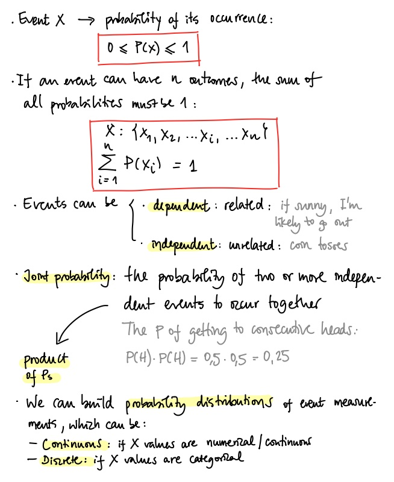
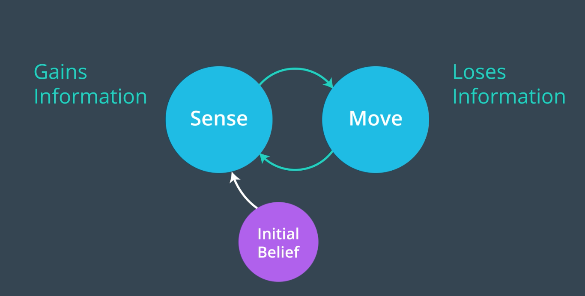

# Udacity Computer Vision Nanodegree: Object Tracking and Localization

These are my personal notes taken while following the [Udacity Computer Vision Nanodegree](https://www.udacity.com/course/computer-vision-nanodegree--nd891).

The nanodegree is composed of these modules:

1. Introduction to Computer Vision
2. Cloud Computing (Optional)
3. Advanced Computer Vision and Deep Learning
4. Object Tracking and Localization

Each module has a folder with its respective notes.
This folder/file refers to the **fourth** module: **Object Tracking and Localization**.

Note that:

- I have also notes on the [Udacity Deep Learning Nanodegree](https://www.udacity.com/course/deep-learning-nanodegree--nd101) in my repository [deep_learning_udacity](https://github.com/mxagar/deep_learning_udacity); that MOOC is strongly related and has complementary material. I have many hand-written notes in [deep_learning_udacity](https://github.com/mxagar/deep_learning_udacity) related to this repository, too.
- The exercises are commented in the Markdown files and linked to their location; most of the exercises are located in other repositories, originally forked from Udacity and extended/completed by me:
	- [CVND_Exercises](https://github.com/mxagar/CVND_Exercises)
	- [DL_PyTorch](https://github.com/mxagar/DL_PyTorch)
	- [CVND_Localization_Exercises](https://github.com/mxagar/CVND_Localization_Exercises)
	- [deep-learning-v2-pytorch](https://github.com/mxagar/deep-learning-v2-pytorch)


Mikel Sagardia, 2022.  
No guarantees.

## Practical Installation Notes

I basically followed the installation & setup guide from [CVND_Exercises](https://github.com/mxagar/CVND_Exercises), which can be summarized with the following commands:

```bash
# Create new conda environment to be used for the nanodegree
conda create -n cvnd python=3.6
conda activate cvnd
conda install pytorch torchvision -c pytorch
conda install pip
#conda install -c conda-forge jupyterlab

# Go to the folder where the Udacity DL exercises are cloned, after forking the original repo
cd ~/git_repositories/CVND_Exercises
pip install -r requirements.txt

# I had some issues with numpy and torch
pip uninstall numpy
pip uninstall mkl-service
pip install numpy
pip install mkl-service
```

## Overview of Contents

- [Udacity Computer Vision Nanodegree: Object Tracking and Localization](#udacity-computer-vision-nanodegree-object-tracking-and-localization)
  - [Practical Installation Notes](#practical-installation-notes)
  - [Overview of Contents](#overview-of-contents)
  - [1. Introduction to Motion](#1-introduction-to-motion)
    - [1.1 Introduction to Optical Flow](#11-introduction-to-optical-flow)
    - [1.2 Motion Vectors](#12-motion-vectors)
    - [1.3 Brightness Consistency Assumption](#13-brightness-consistency-assumption)
    - [1.3 Optical Flow Notebook](#13-optical-flow-notebook)
  - [2. Robot Localization](#2-robot-localization)
    - [2.1 Review of Probability](#21-review-of-probability)
      - [Probability Distributions and Bayes' Rule](#probability-distributions-and-bayes-rule)
    - [2.2 Probabilistic Localization](#22-probabilistic-localization)
    - [2.3 Robot Localization Notebooks](#23-robot-localization-notebooks)
  - [3. Mini-Project: 2D Histogram Filter](#3-mini-project-2d-histogram-filter)
  - [4. Introduction to Kalman Filters](#4-introduction-to-kalman-filters)
  - [5. Representing State and Motion](#5-representing-state-and-motion)
  - [6. Matrices and Transformation of State](#6-matrices-and-transformation-of-state)
  - [7. Simultaneous Localization and Mapping](#7-simultaneous-localization-and-mapping)
  - [8. Vehicle Motion Calculus (Optional)](#8-vehicle-motion-calculus-optional)
  - [9. Project: Landmark Detection & Tracking (SLAM)](#9-project-landmark-detection--tracking-slam)

## 1. Introduction to Motion

The goal of this module is to show pattern recognition techniques over time and space.

We deep dive into field of **Localization**, with the following topics

- Representing motion and tracking objects in a video
- Uncertainty in robotic motion
- A simple localization technique: Histogram Filter
- Motion models and tracking the position of a self-driving car over time

At the end of this module we work on a SLAM project: Simultaneous Localization and Mapping.

### 1.1 Introduction to Optical Flow

One way of capturing motion in a video consists in extracting features in the frames and observing how they change from frame to frame.

**Optical Flow** works that way; it makes two assumptions:

1. Pixel intensities stay consistent between frames.
2. Neighboring pixels have similar motion.


Salient pixels are tracked, e.g., bright pixels or corners; tracking them provides information on

- *how fast* the object is moving
- and in what *direction*,

so we are able to predict where it will be.

Applications:

- Hand gesture recognition
- Tracking vehicle movement
- Distinguish running vs. walking
- Eye tracking
- etc.

### 1.2 Motion Vectors

Given a salient/tracked pixel `(x, y)`, its motion can be tracked by a field vector `(u,v)`:

- Magnitude: `sqrt(u^2 + v^2)`
- Direction: `phi = atan(v/u)`


### 1.3 Brightness Consistency Assumption

We want to get the equation that relates the motion of a pixel (in time: `t`) and the change of the image from frame to frame (change in pixel space: `x, y`). Using the assumptions introduced above, we have:


In practice, we can apply optical flow to keypoints detected by a corner detector. Another option is to apply it to every pixel or to a grid of pixels; in that case, we have a field of velocity vectors.

### 1.3 Optical Flow Notebook

Exercise repository: [CVND_Localization_Exercises](https://github.com/mxagar/CVND_Localization_Exercises).

Notebook: `4_1_Optical_Flow / Optical_Flow.ipynb`.

In the notebook, 3 images that contain a moving packman are used to compute the motion vectors of selected keypoints using optical flow. The example doesn't work that well; possible approaches to improve it: decrease displacement, modify the parameters.

```python
import numpy as np
import matplotlib.image as mpimg  # for reading in images
import matplotlib.pyplot as plt
import cv2  # computer vision library
%matplotlib inline

# Read in the image frames
frame_1 = cv2.imread('images/pacman_1.png')
frame_2 = cv2.imread('images/pacman_2.png')
frame_3 = cv2.imread('images/pacman_3.png')

# Convert to RGB
frame_1 = cv2.cvtColor(frame_1, cv2.COLOR_BGR2RGB)
frame_2 = cv2.cvtColor(frame_2, cv2.COLOR_BGR2RGB)
frame_3 = cv2.cvtColor(frame_3, cv2.COLOR_BGR2RGB)

# Visualize the individual color channels
f, (ax1, ax2, ax3) = plt.subplots(1, 3, figsize=(20,10))
ax1.set_title('frame 1')
ax1.imshow(frame_1)
ax2.set_title('frame 2')
ax2.imshow(frame_2)
ax3.set_title('frame 3')
ax3.imshow(frame_3)

# We need to pass keypoints to track to the Optical Flow API
# We use the Shi-Tomasi corner detector, similar to the Harris corner detector
# We can use Harris or ORB instead, too
# Parameters for Shi-Tomasi corner detection
feature_params = dict( maxCorners = 10,
                       qualityLevel = 0.2,
                       minDistance = 5,
                       blockSize = 5 )

# Convert all frames to grayscale
gray_1 = cv2.cvtColor(frame_1, cv2.COLOR_RGB2GRAY)
gray_2 = cv2.cvtColor(frame_2, cv2.COLOR_RGB2GRAY)
gray_3 = cv2.cvtColor(frame_3, cv2.COLOR_RGB2GRAY)

# Take first frame and find corner points in it
pts_1 = cv2.goodFeaturesToTrack(gray_1, mask = None, **feature_params)

# Display the detected points
plt.imshow(frame_1)
for p in pts_1:
    # plot x and y detected points
    plt.plot(p[0][0], p[0][1], 'r.', markersize=15)

# Parameters for Lucas-Kanade optical flow
# winSize: size of the search window at each pyramid level
# maxLevel: 0, pyramids are not used (single level), if set to 1, two levels are used, and so on
# criteria: termination criteria of the iterative search algorithm
lk_params = dict( winSize  = (5,5), 
                  maxLevel = 2, 
                  criteria = (cv2.TERM_CRITERIA_EPS | cv2.TERM_CRITERIA_COUNT, 10, 0.03))

# Calculate optical flow between first and second frame
# The function implements a sparse iterative version
# of the Lucas-Kanade optical flow in pyramids.
# We pass: first image, next image, first points, parameters
# We get:
# - next points
# - status/match: 1 if the flow for the corresponding features has been found, otherwise, it is set to 0.
# - error values
pts_2_of, match, err = cv2.calcOpticalFlowPyrLK(gray_1, gray_2, pts_1, None, **lk_params)

# Select good matching points between the two image frames
good_new = pts_2_of[match==1]
good_old = pts_1[match==1]

# Create a mask image for drawing (u,v) vectors on top of the second frame
mask = np.zeros_like(frame_2)

# Draw the lines between the matching points (these lines indicate motion vectors)
for i,(new,old) in enumerate(zip(good_new,good_old)):
    a,b = new.ravel()
    c,d = old.ravel()
    # draw points on the mask image
    mask = cv2.circle(img=mask, center=(a,b), radius=5, color=(200), thickness=-1)
    # draw motion vector as lines on the mask image
    mask = cv2.line(img=mask, pt1=(a,b), pt2=(c,d), color=(200), thickness=3)
    # add the line image and second frame together

# Overlay mask
composite_im = np.copy(frame_2)
composite_im[mask!=0] = [0]

# It doesn't seem to work that well; maybe the movement was too big
plt.imshow(composite_im)
```

## 2. Robot Localization

### 2.1 Review of Probability



#### Probability Distributions and Bayes' Rule

The Bayes' rule:

`P(A|B) = P(A) * P(B|A)/P(B)`

- `P(A|B)`: probability of occurring event A given B is true; **posterior**.
- `P(A)`, `P(B)`: probabilities of observing A or B without any conditions; `P(A)` is the **prior**.
- `P(B|A)`: probability of occurring B given A is true.

In many situations the event is fixed, so we omit `P(B)` and the rule becomes:

`P(A|B) proportional to P(A) * P(B|A)`

In other words, the posterior is proportional to the prior times the likelihood.

We can model location vectors as probability distributions; the shape of the distribution tells us the most likely location values; i.e., peaks of higher density values denote most likely values.

At the beginning, our distributions might be quite flat, but as we get more data/inputs, we can produce more meaningful distributions, i.e., distributions with more salient peaks. The Bayes' rule is the mathematical tool to achieve that.

Practical interpretation of the Bayes' Rule: given an initial prediction, if we gather additional data (related to our prediction), we can improve the prediction.

Example: we have GPS data of the car location; however, that location has an uncertainty region of 5m. If we collect data from more sensors, we can produce a better estimate of the car location by combining all sensor inputs.

In the Bayesian framework, we have:

- Prior: a prior probability distribution of an uncertain quantity (e.g., location); this is our belief before any measurement.
- Posterior: updated probability distribution of the same quantity after some evidence, i.e., measurements.

### 2.2 Probabilistic Localization

Let's consider a robot which is trying to find out where it is.

- First, it doesn't know: belief probability distribution is flat.
- It measures a door; since it knows the map, the location probability distribution changes: we have 3 bumps where doors are; that's our posterior: an updated belief of where the robot could be.
- Then, the robot moves to the right: the probability distributions are shifted to the right, too, using a convolution. We shift the probability distribution because that is the map we think where the robot is; if the robot moves in a direction, we need to move our current location map accordingly. A convolution is applied because we apply the uncertainty of the movement, i.e., we flatten the distribution according to the probability of moving correctly/wrong.
- The robot senses a door; where is it? If we multiply the posterior with its convoluted we get the probability distribution of the location.


### 2.3 Robot Localization Notebooks

Exercise repository: [CVND_Localization_Exercises](https://github.com/mxagar/CVND_Localization_Exercises).

There are several notebooks in the folder: `4_2_Robot_Localization`.

The final that summarizes it all is `9_1. Sense and Move, exercise.ipynb`.

Basically, a **histogram filter** (aka. Monte Carlo Localization) is built step by step in all the notebooks: 

> Histogram filters decompose the state space into finitely many regions and represent the cumulative posterior for each region by a single probability value. When applied to finite spaces, they are called discrete Bayes filters; when applied to continuous spaces, they are known as histogram filters. [Probabilistic Robotics](https://calvinfeng.gitbook.io/probabilistic-robotics/basics/nonparametric-filters/01-histogram-filter)

We have the following scenario:

- A world composed by 5 cells which can be `red` / `green`.
- We **have a map of the world**.
- A robot which can **move** in the world and can **sense** the color of the cell it is in.
- The world is cyclical: if we keep forward in the last cell we appear in the first.

The **goal is: localize the robot in the world map as it moves and senses.**


The localization problem is solved with a sense-move cycle:

1. First, the probability of the robot being in any of the 5 cells is `1/5 = 0.2`: `p = [0.2, 0.2, 0.2, 0.2, 0.2]`. That is our first uninformative **initial belief or prior**, the one with the highest entropy (i.e., less possible information).
2. Then, we **sense the cell color we're in**, e,g, `red`. Any measurement has a probability of being right (`pHit`) / wrong (`pMiss`). Thus, we update our localization probability map by multiplying to the previous probability values 
   - `pHit` if the world-cell has the same color as the reading (`red`)
   - `pMiss` if the world-cell has a different color than the reading (`green`)
3. Then, we **move the robot a step size in a direction**, e.g., `1 right`. Again, the movement is not perfect, we have an inaccuracy; as such, we define the probabilities of being exact (`pExact`), of undershooting (`pUndershoot`) and of overshooting (`pOvershoot`). The movement updates the localization probability map with a [convolution](https://en.wikipedia.org/wiki/Convolution): the distribution is shifted in the direction of the motion while applying the uncertainty of the movement. That yields a new updated posterior distribution!
4. Then, we repeat 2-3 again indefinitely. After each cycle, i.e., after each `move()`, we have an updated **posterior**.




Note that:

- Every time we **measure** the **entropy decreases**; i.e., we have **gained information** of where the robot is. Thus, the localization distribution has more clear peaks.
- Every time we **move** the **entropy increases**; i.e., we have **lost information** of where the robot is. Thus, the localization distribution is flatter.
- When we move in a direction, we basically shift our belief map in that direction with the robot; however, since the movement has an uncertainty, we need to account for it. That's why we use a convolution in which the previous belief is convoluted with the uncertainty in the direction of the movement.

The **entropy** is measured as: `- sum(p*ln(p))`.

Case of maximum entropy: `p = [0.2, 0.2, 0.2, 0.2, 0.2] -> E = -5*0.2*ln(
0.2) = 0.699`.

All that is summarized in the following lines of code:

```python
import matplotlib.pyplot as plt
import numpy as np

def display_map(grid, bar_width=1):
    if(len(grid) > 0):
        x_labels = range(len(grid))
        plt.bar(x_labels, height=grid, width=bar_width, color='b')
        plt.xlabel('Grid Cell')
        plt.ylabel('Probability')
        plt.ylim(0, 1) # range of 0-1 for probability values 
        plt.title('Probability of the robot being at each cell in the grid')
        plt.xticks(np.arange(min(x_labels), max(x_labels)+1, 1))
        plt.show()
    else:
        print('Grid is empty')

# INITIAL BELIEF: completely uncertain
p = [0.2, 0.2, 0.2, 0.2, 0.2]
# WORLD MAP: the color of each grid cell in the 1D world
world=['green', 'red', 'red', 'green', 'green']
# Measurement = Z, the sensor reading ('red' or 'green')
measurements = ['red', 'red'] # sequence of mesurements
pHit = 0.6 # the probability that it is sensing the color correctly
pMiss = 0.2 # the probability that it is sensing the wrong color

motions = [1,1] # sequence of movement steps to the right
# Movement accuracy
pExact = 0.8 # probability of moving correctly
pOvershoot = 0.1
pUndershoot = 0.1

def sense(p, Z):
    ''' Takes in a current probability distribution, p, and a sensor reading, Z.
        Returns a *normalized* distribution after the sensor measurement has been made, q.
        This should be accurate whether Z is 'red' or 'green'. '''
    q=[]
    # Loop through all grid cells
    for i in range(len(p)):
        # Check if the sensor reading is equal to the color of the grid cell
        # if so, hit = 1
        # if not, hit = 0
        # Basically, we apply pHit in all map cells
        # with the measurement value, pMiss in the rest
        hit = (Z == world[i])
        q.append(p[i] * (hit * pHit + (1-hit) * pMiss))
        
    # Normalize: divide all elements of q by the sum
    # because the complete distribution should add up to 1
    s = sum(q)
    for i in range(len(p)):
        q[i] = q[i] / s
    return q


def move(p, U):
    q=[]
    # Iterate through all values in p
    # The localization probability map is shifted
    # in the direction of motion and the accuracy
    # of the movement is also applied.
    # This is a CONVOLUTION of the previous p map
    for i in range(len(p)):
        # use the modulo operator to find the new location for a p value
        # this finds an index that is shifted by the correct amount
        index = (i-U) % len(p)
        #nextIndex = (index+1) % len(p)
        #prevIndex = (index-1) % len(p)
        nextIndex = (i-U+1) % len(p)
        prevIndex = (i-U-1) % len(p)
        s = pExact * p[index]
        s = s + pOvershoot  * p[nextIndex]
        s = s + pUndershoot * p[prevIndex]
        # append the correct, modified value of p to q
        q.append(s)
    return q

# Compute the posterior distribution if the robot first senses red, then moves 
# right one, then senses green, then moves right again, starting with a uniform prior distribution.
# This loop is in reality valid for any sequence of measurements and motions
for i in range(len(measurements)):
    p = sense(p, measurements[i])
    p = move(p, motions[i])
# Print/display that distribution
print(p)
display_map(p, bar_width=0.9)
```

## 3. Mini-Project: 2D Histogram Filter

This section is about translating the previous toy example in from the 1D world to the 2D world.

There are no videos / instructions, only the following self-assessed project:

[CVND_Localization_Exercises](https://github.com/mxagar/CVND_Localization_Exercises) ` / 4_3_2D_Histogram_Filter`

The project contains the following files:

- `writeup.ipynb`: the project notebook in which all the other files are used.
- `helpers.py`: auxiliary functions, such as `normalize()` and `blur()`
- `localizer.py`: the histogram filter is implemented here: `sense()` and `move()` functions are implemented for the 2D world.
- `simulate.py`: the class `Simulation` is defined, which instantiates a 2D world and enables a simulated movement in it.

The project is about

- implementing `sense()` from `localizer.py`
- and fixing a bug in `move()` from `localizer.py`.

I had to modify some other lines to update the code to work with Python 3.

In the following, the code from `localizer.py`:

```python
#import pdb
from helpers import normalize, blur

def initialize_beliefs(grid):
    height = len(grid)
    width = len(grid[0])
    area = height * width
    belief_per_cell = 1.0 / area
    beliefs = []
    for i in range(height):
        row = []
        for j in range(width):
            row.append(belief_per_cell)
        beliefs.append(row)
    return beliefs

def sense(color, grid, beliefs, p_hit, p_miss):
    new_beliefs = []

    # Loop through all grid cells
    for i, row in enumerate(beliefs):
        p_row_new = []
        for j, cell in enumerate(row):
            # Check if the sensor reading is equal to the color of the grid cell
            # if so, hit = 1
            # if not, hit = 0
            # Basically, we apply pHit in all map cells
            # with the measurement value, pMiss in the rest
            hit = (color == grid[i][j])
            # Save column/cell in row
            p_row_new.append(beliefs[i][j] * (hit * p_hit + (1-hit) * p_miss))
        # Save row in grid
        new_beliefs.append(p_row_new)
        
    # Normalize: divide all elements of new_beliefs by the sum
    # because the complete distribution should add up to 1
    new_beliefs = normalize(new_beliefs)
            
    return new_beliefs

def move(dy, dx, beliefs, blurring):
    height = len(beliefs)
    width = len(beliefs[0])
    new_G = [[0.0 for i in range(width)] for j in range(height)]
    for i, row in enumerate(beliefs):
        for j, cell in enumerate(row):
            # FIXED: width <-> height were interchanged,
            # which had an effect only with rectangular grids 
            new_i = (i + dy ) % height # width
            new_j = (j + dx ) % width # height
            #print("width, height:", width, height)
            #print("i, j:", i, j)
            #print("dy, dx:", dy, dx)
            #print("new_i, new_j:", new_i, new_j)
            #pdb.set_trace()
            new_G[int(new_i)][int(new_j)] = cell
    return blur(new_G, blurring)

```

## 4. Introduction to Kalman Filters

> :warning: I think this section is quite introductory; I suggest reading my hand written notes on the Kalman filter: [KalmanFilter_Notes_2020.pdf](KalmanFilter_Notes_2020.pdf).

The **Kalman Filter** is similar to the **histogram filter** (aka. Monte Carlo Localization), and it is used also to track or localize objects.

The main differences are:

- Kalman works with continuous variables and uni-modal representations (= they have one peak).
- The histogram filter works with discrete variables and multi-modal representations (= they can have several peaks).


In a discrete world, we use histograms: the variable space is divided in bins and we give a probability to each bin; the resulting histogram is an approximation of the underlying distribution.

In a continuous world we use Gaussians to represent variables; the area below the Gaussian is 1.


### 4.1 Gaussian Representations and the Update Step

Any Gaussian can be parametrized by 

- its center `mu`, i.e., the mean, where its maximum or peak is,
- and its spread `sigma^2`, i.e., the variance.

Additionally, Gaussians

- are symmetrical
- have only one peak = they're uni-modal

Of course, we'd like to have the smallest `sigma` possible, because that is associated with a variable with less uncertainty.


Similarly as we were talking about the cycle in histogram filters composed by two steps (move and sense), we also have a cycle with two steps in Kalman filters:

1. Measurement and Update (implemented as multiplications between Gaussians)
2. Prediction (implemented as a convolution or an addition of Gaussians)

In both cases, we work with variables represented as Gaussians.


In the case of the measure and update step we have two Gaussians:

- a prior belief
- and a measurement.

In order to get an updated distribution / Gaussian, we simply multiply both Gaussians. In that product, 

- the new mean is shifted to the distribution with less spread
- and the new spread is smaller than the previous two!


We need to multiply the two Gaussians because we're applying the Bayes' rule: we're obtaining a posterior from a prior after we measure a conditional event.

As shown in the next figure:

- The new mean is the sum of the two means weighted by the opposite variance.
- The new variance is the inverse of the sum of the inverse variances; that's why it is smaller than any of them (it's like two springs in parallel):


### 4.2 Gaussian Update Step: Notebooks

The following notebooks are very simple; basically, Gaussian operations are implemented manually. They refer to the first step in the Kalman filter cycle: *Measure and Update*.

The notebooks can be found in

[CVND_Localization_Exercises](https://github.com/mxagar/CVND_Localization_Exercises) ` / 4_4_Kalman_Filters`

- `1_1. Gaussian Calculations.ipynb`
- `2_1. New Mean and Variance, exercise.ipynb`

Ans this is the code in them:

```python
# import math functions
from math import *
import matplotlib.pyplot as plt
import numpy as np

# gaussian function
def f(mu, sigma2, x):
    ''' f takes in a mean and squared variance, and an input x
       and returns the gaussian value.'''
    coefficient = 1.0 / sqrt(2.0 * pi *sigma2)
    exponential = exp(-0.5 * (x-mu) ** 2 / sigma2)
    return coefficient * exponential

### ---

# display a gaussian over a range of x values
# define the parameters
mu = 10
sigma2 = 4

# define a range of x values
x_axis = np.arange(0, 20, 0.1)

# create a corresponding list of gaussian values
g = []
for x in x_axis:
    g.append(f(mu, sigma2, x))

# plot the result 
plt.plot(x_axis, g)

### ---

# the update function
def update(mean1, var1, mean2, var2):
    ''' This function takes in two means and two squared variance terms,
        and returns updated gaussian parameters.'''
    new_mean = (var2*mean1 + var1*mean2)/(var2+var1)
    new_var = 1/(1/var2 + 1/var1)
    
    return [new_mean, new_var]
```

### 4.3 Prediction Step

The prediction step consists in observing the motion and forecasting the next state based on it. It is equivalent to what we did with the histogram filter: We need to take the Gaussian and shift it in the direction of the movement; additionally, the uncertainty of the movement needs to be taken into account.

The operation that accomplishes all that is the convolution; however, **in the case of Gaussians, that consists in adding to the parameters of the distribution the movement value and the variance of the movement**:

- `mu_new <- mu_old + u`
- `sigma^2_new <- sigma^2_old + r^2`


```python
# the motion update/predict function
def predict(mean1, var1, mean2, var2):
    ''' This function takes in two means and two squared variance terms,
        and returns updated gaussian parameters, after motion.'''
    ## TODO: Calculate the new parameters
    new_mean = mean1 + mean2
    new_var = var1 + var2
    
    return [new_mean, new_var]
```

### 4.4 1D Kalman Filter

This section integrates the `update()` and `predict()` functions for Gaussian states (in 1D) to the Kalman filter cycle: *Measure and Update*.

The notebook can be found in

[CVND_Localization_Exercises](https://github.com/mxagar/CVND_Localization_Exercises) ` / 4_4_Kalman_Filters / 4_1. 1D Kalman Filter, exercise.ipynb`


```python

# the update function
def update(mean1, var1, mean2, var2):
    ''' This function takes in two means and two squared variance terms,
        and returns updated gaussian parameters.'''
    # Calculate the new parameters
    new_mean = (var2*mean1 + var1*mean2)/(var2+var1)
    new_var = 1/(1/var2 + 1/var1)
    
    return [new_mean, new_var]


# the motion update/predict function
def predict(mean1, var1, mean2, var2):
    ''' This function takes in two means and two squared variance terms,
        and returns updated gaussian parameters, after motion.'''
    # Calculate the new parameters
    new_mean = mean1 + mean2
    new_var = var1 + var2
    
    return [new_mean, new_var]

### ---

# measurements for mu and motions, U
measurements = [5., 6., 7., 9., 10.]
motions = [1., 1., 2., 1., 1.]

# initial parameters
measurement_sig = 4. # measurement uncertainty, constant
motion_sig = 2. # motion uncertainty, constant
mu = 0. # initial location estimation
sig = 10000. # initial location uncertainty (high confusion)

## Loop through all measurements/motions
## and print out and display the resulting Gaussian 
## Note that even though the initial estimate for location
## (the initial mu) is far from the first measurement,
## it catches up quickly as we cycle through measurements and motions.
for i in range(len(measurements)):
    # measure and update
    mu, sig = update(mu, sig, measurements[i], measurement_sig)
    print(f'Update: {mu}, {sig}')
    # move and predict
    mu, sig = predict(mu, sig, motions[i], motion_sig)
    print(f'Predict: {mu}, {sig}')
    # plot
    x_axis = np.arange(-20, 20, 0.1)
    g = []
    for x in x_axis:
        g.append(f(mu, sig, x))
    plt.plot(x_axis, g)
plt.show()

# Update: 4.998000799680128, 3.9984006397441023
# Predict: 5.998000799680128, 5.998400639744102
# Update: 5.999200191953932, 2.399744061425258
# Predict: 6.999200191953932, 4.399744061425258
# Update: 6.999619127420922, 2.0951800575117594
# Predict: 8.999619127420921, 4.09518005751176
# Update: 8.999811802788143, 2.0235152416216957
# Predict: 9.999811802788143, 4.023515241621696
# Update: 9.999906177177365, 2.0058615808441944
# Predict: 10.999906177177365, 4.005861580844194
```

### 4.5 Going Beyond 1D

Usually we work on n-D worlds, at least 2D, also known as the *state space*. Additionally, **Kalman filters measure position/location, but they are able to implicitly infer the velocity or change rate of the state!**

In order to make that possible, we need to define **motion models**.

## 5. Representing State and Motion

Kalman filters are widely used in robotics for localization because they are able to produce accurate estimates of the state (position and velocity). That happens in a cycle of two steps:

- Measurement update
- Motion prediction (also known as time update)

Moreover, **the state estimate has less uncertainty than any of the two steps: the measurement or the motion**, in other words, Kalman filters effectively filter out uncertainty in the state estimate. That happens because the product of two Gaussians (as happens in the measurement step) has a smaller variance than the original distributions that are multiplied.


> The Takeaway: The beauty of Kalman filters is that they combine somewhat inaccurate sensor measurements with somewhat inaccurate predictions of motion to get a filtered location estimate **that is better than any estimates that come from only sensor readings or only knowledge about movement.**

### 5.1 Introduction to State and Motion Models

We can define inside the state vector anything we consider important; usually the **position and velocity** are taken to define the state of a system.

The idea of taking the velocity is based on the fact that we can use it to **predict the next state** based on a **motion model**:

```python
# Motion model: constant velocity
def predict_state(state, dt)
  # The position component is updated linearly with the velocity
  # new_pos = old_pos + old_vel*time
  state = [state[0]+state[1]*dt, state[1]]
  return state

# Initial state
x_0 = 4
vel_0 = 1
state = [x_0, vel_0]
# Time step
dt = 1
# Simulate the next 10 time steps
for i in range(10):
  state = predict_state(state, dt)
```

We can have different motion models, not only the one with the assumed constant velocity; all models have assumptions and all models have errors, e.g., due to wind effects, slope, tire slippage, etc.

Another motion model could consider non-constant velocity, i.e., we include the **acceleration**:

`change in velocity = dv = a * t = acceleration * time`
 
If we apply the equations and integrate the position `p` for a time interval of `dt`:

- Velocity: `v = v_0 + a*dt`
- Position: `p = p_0 + v_0*dt + 0.5*a*dt^2`

In that case, the state must contain the acceleration; the state has the smallest representation possible so that the model works.

The videos explain these kinematics/motion formulae like for kids with images.


### 5.2 Car Object


## 6. Matrices and Transformation of State

## 7. Simultaneous Localization and Mapping

## 8. Vehicle Motion Calculus (Optional)

## 9. Project: Landmark Detection & Tracking (SLAM)

See project repository: [slam_2d](https://github.com/mxagar/slam_2d).

